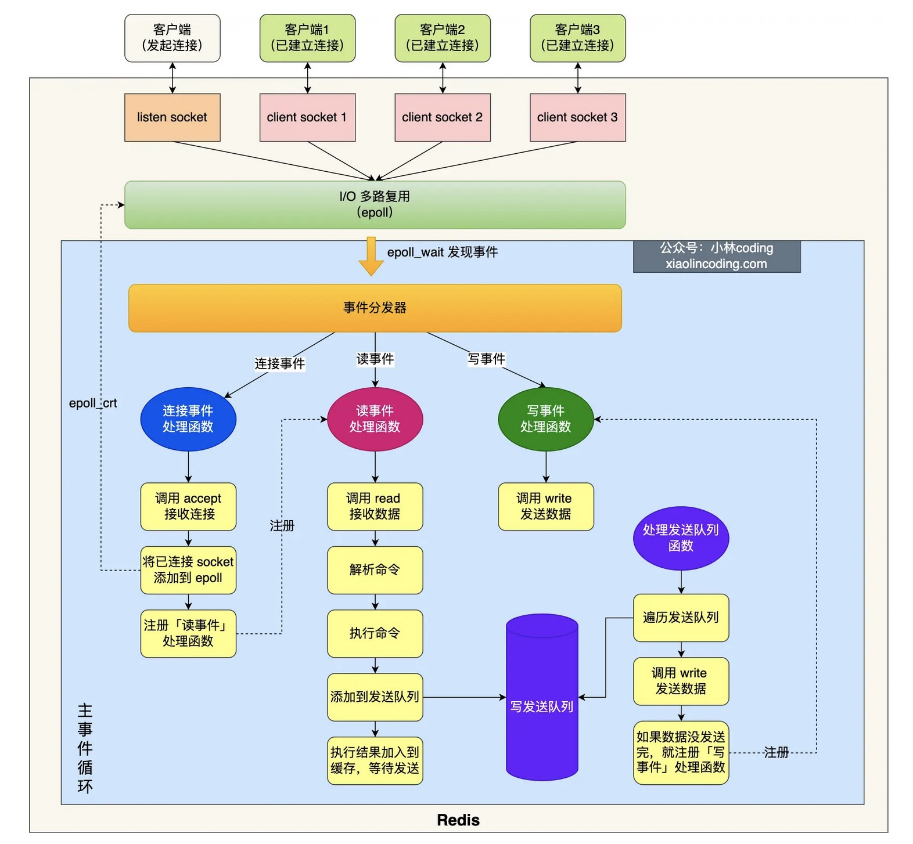

##### 单线程指的是什么

```
指的是 "接收客户端请求->解析请求 ->进行数据读写等操作->发送数据给客户端" 这个过程是由一个线程（主线程）来完成的.

但是，Redis 程序并不是单线程的，Redis 在启动的时候，是会启动后台线程（BIO）的, 用来处理耗时操作, 避免阻塞主线程：
    Redis 在 2.6 版本，会启动 2 个后台线程，分别处理关闭文件、AOF 刷盘这两个任务；
    Redis 在 4.0 版本之后，新增了一个新的后台线程，用来异步释放 Redis 内存，也就是 lazyfree 线程。例如执行 unlink key / flushdb async / flushall async 等命令，会把这些删除操作交给后台线程来执行，好处是不会导致 Redis 主线程卡顿。因此，当我们要删除一个大 key 的时候，不要使用 del 命令删除，因为 del 是在主线程处理的，这样会导致 Redis 主线程卡顿，因此我们应该使用 unlink 命令来异步删除大key。
```

##### 

```


```

##### 单线程事件模型



```
Redis 6.0 版本之前的单线模式

图中的蓝色部分是一个事件循环，是由主线程负责的，网络 I/O 和命令处理都是单线程。Redis 初始化的时候，会做下面这几件事情：
1. 调用 epoll_create() 创建一个 epoll 对象和调用 socket() 创建一个服务端 socket
2. 调用 bind() 绑定端口和调用 listen() 监听该 socket；
3. 调用 epoll_ctl() 将 listen socket 加入到 epoll，同时注册「连接事件」处理函数。

初始化完后，主线程就进入到一个事件循环函数，主要会做以下事情：
1. 先调用处理发送队列函数，看是发送队列里是否有任务，如果有发送任务，则通过 write 函数将客户端发送缓存区里的数据发送出去，如果这一轮数据没有发送完，就会注册写事件处理函数，等待 epoll_wait 发现可写后再处理 。
2. 调用 epoll_wait 函数等待事件的到来：
        如果是连接事件到来，则会调用连接事件处理函数，该函数会做这些事情：调用 accpet 获取已连接的 socket -> 调用 epoll_ctl 将已连接的 socket 加入到 epoll -> 注册「读事件」处理函数；
        如果是读事件到来，则会调用读事件处理函数，该函数会做这些事情：调用 read 获取客户端发送的数据 -> 解析命令 -> 处理命令 -> 将客户端对象添加到发送队列 -> 将执行结果写到发送缓存区等待发送；
        如果是写事件到来，则会调用写事件处理函数，该函数会做这些事情：通过 write 函数将客户端发送缓存区里的数据发送出去，如果这一轮数据没有发送完，就会继续注册写事件处理函数，等待 epoll_wait 发现可写后再处理 。
```

##### 为什么用单线程

```
1. CPU 并不是制约 Redis 性能表现的瓶颈所在，更多情况下是受到内存大小和网络I/O的限制
2. 单线程可维护性高，多线程模型虽然在某些方面表现优异，但是它却引入了程序执行顺序的不确定性，带来了并发读写的一系列问题，增加了系统复杂度、同时可能存在线程切换、甚至加锁解锁、死锁造成的性能损耗
```


##### 为什么快

> 官方使用基准测试的结果是，单线程的 Redis 吞吐量可以达到 10W/每秒

```
1. Redis 的大部分操作都在内存中完成，并且采用了高效的数据结构，因此 Redis 瓶颈可能是机器的内存或者网络带宽，而并非 CPU，既然 CPU 不是瓶颈，那么自然就采用单线程的解决方案了
2. Redis 采用单线程模型可以避免了多线程之间的竞争，省去了多线程切换带来的时间和性能上的开销，而且也不会导致死锁问题。
3. Redis 采用了 I/O 多路复用机制处理大量的客户端 Socket 请求，IO 多路复用机制是指一个线程处理多个 IO 流，采用 epoll 机制
简单来说，在 Redis 只运行单线程的情况下，该机制允许内核中，同时存在多个监听 Socket 和已连接 Socket。内核会一直监听这些 Socket 上的连接请求或数据请求。一旦有请求到达，就会交给 Redis 线程处理，这就实现了一个 Redis 线程处理多个 IO 流的效果。

```

##### 为什么引入多线程

```
Redis 6.0 之后引入了多线程


随着网络硬件的性能提升，Redis 的性能瓶颈有时会出现在网络 I/O 的处理上, 用了多个提升 I/O 线程来处理网络请求能力, .但是对于命令的执行，Redis 仍然使用单线程来处理.

Redis 官方表示，Redis 6.0 版本引入的多线程 I/O 特性对性能提升至少是一倍以上。

Redis 6.0 版本支持的 I/O 多线程特性，默认情况下 I/O 多线程只针对发送响应数据（write client socket），并不会以多线程的方式处理读请求（read client socket）。要想开启多线程处理客户端读请求，就需要把 Redis.conf 配置文件中的 io-threads-do-reads 配置项设为 yes。

//读请求也使用io多线程
io-threads-do-reads yes 

同时， Redis.conf 配置文件中提供了 IO 多线程个数的配置项。

// io-threads N，表示启用 N-1 个 I/O 多线程（主线程也算一个 I/O 线程）
io-threads 4 

关于线程数的设置，官方的建议是如果为 4 核的 CPU，建议线程数设置为 2 或 3，如果为 8 核 CPU 建议线程数设置为 6，线程数一定要小于机器核数，线程数并不是越大越好。

因此， Redis 6.0 版本之后，Redis 在启动的时候，默认情况下会额外创建 6 个线程（这里的线程数不包括主线程）：
    Redis-server ： Redis的主线程，主要负责执行命令；
    bio_close_file、bio_aof_fsync、bio_lazy_free：三个后台线程，分别异步处理关闭文件任务、AOF刷盘任务、释放内存任务；
    io_thd_1、io_thd_2、io_thd_3：三个 I/O 线程，io-threads 默认是 4 ，所以会启动 3（4-1）个 I/O 多线程，用来分担 Redis 网络 I/O 的压力。
```


