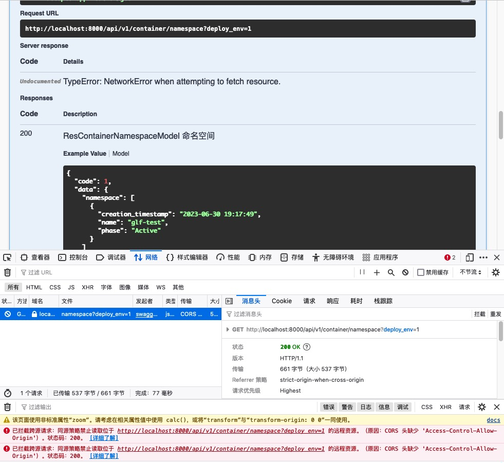

##### 参考

- [x] https://popwalker.github.io/article/6b03ec87/
- [x] https://bitbucket.org/rick-chang/user.service/src/master/ 上面的实例代码
- [x] https://www.lsdcloud.com/go/middleware/go-swagger.html#_4-swagger%E8%A7%84%E8%8C%83%E8%A7%A3%E9%87%8A%E8%AF%B4%E6%98%8E
- [ ] https://www.zadmei.com/gyyxmkfs-18.html
- [ ] https://air.googol.im/post/go-swagger-spec/
- [ ] https://blog.csdn.net/benben_2015/article/details/100538074 可用
- [ ] https://zhuanlan.zhihu.com/p/136521497 全
- [ ] https://zhuanlan.zhihu.com/p/563680819
- [ ] 

##### 文档

[官网文档](https://goswagger.io/usage/serve_ui.html)

[github](https://github.com/go-swagger/go-swagger) 8.9k

[请求参数文档](https://goswagger.io/generate/spec/params.html)

[githu 文档](https://github.com/go-swagger/go-swagger/blob/master/docs/faq/faq_spec.md)

[请求参数文档 - 定义好的校验规则](https://goswagger.io/use/spec/strfmt.html)

[请求方式文档](https://goswagger.io/generate/spec/route.html)

[返回值文档](https://goswagger.io/generate/spec/response.html)

[github 实例代码](https://github.com/go-swagger/go-swagger/tree/master/fixtures/goparsing/petstore)


### 安装

[安装文档](https://goswagger.io/install.html)

##### brew 安装

```bash
$ brew tap go-swagger/go-swagger
$ brew install go-swagger
```

##### go get 安装 (失败)

```bash
$ go get github.com/go-swagger/go-swagger
# 进入 go get 的包下载的目录 (GOPATH/src/pkg/github.com/go-swagger)
$ go install ./cmd/swagger
```

##### dnf 安装

```bash
$ dnf install -y yum-utils
$ rpm --import 'https://dl.cloudsmith.io/public/go-swagger/go-swagger/gpg.2F8CB673971B5C9E.key'
$ curl -1sLf 'https://dl.cloudsmith.io/public/go-swagger/go-swagger/config.rpm.txt?distro=fedora&codename=any-version' > /tmp/go-swagger-go-swagger.repo
$ dnf config-manager --add-repo '/tmp/go-swagger-go-swagger.repo'
$ dnf -q makecache -y --disablerepo='*' --enablerepo='go-swagger-go-swagger' --enablerepo='go-swagger-go-swagger-source'
$ dnf install -y swagger
```

##### yum 安装

```bash
$ yum install -y yum-utils
$ rpm --import 'https://dl.cloudsmith.io/public/go-swagger/go-swagger/gpg.2F8CB673971B5C9E.key'
$ curl -1sLf 'https://dl.cloudsmith.io/public/go-swagger/go-swagger/config.rpm.txt?distro=fedora&codename=any-version' > /tmp/go-swagger-go-swagger.repo
$ yum-config-manager --add-repo '/tmp/go-swagger-go-swagger.repo'
$ yum -q makecache -y --disablerepo='*' --enablerepo='go-swagger-go-swagger' --enablerepo='go-swagger-go-swagger-source'
$ yum install swagger
```

##### 二进制安装 (失败)

```bash
$ download_url=$(curl -s https://api.github.com/repos/go-swagger/go-swagger/releases/latest | \
  jq -r '.assets[] | select(.name | contains("'"$(uname | tr '[:upper:]' '[:lower:]')"'_amd64")) | .browser_download_url')
$ curl -o /usr/local/bin/swagger -L'#' "$download_url"
$ chmod +x /usr/local/bin/swagger
```

##### 源码安装 (失败)

```bash
$ git clone https://github.com/go-swagger/go-swagger
$ git clone https://github.com/go-swagger/go-swagger.git
$ cd go-swagger
$ go install ./cmd/swagger
```

### 使用

##### 基本命令

```
用法:
  swagger [选项] <命令>

应用选项:
  -q, --quiet                  不显示log
      --log-output=LOG-FILE    输出Log到文件

帮助选项:
  -h, --help                   显示帮助信息

可用命令:
  diff      显示swagger文件差异
  expand    在swagger文件中扩充 $ref 区域
  flatten   扁平化化整理swagger文件
  generate  生成代码
  init      初始化描述文件
  mixin     合并swagger文件
  serve     启动服务
  validate  校验swagger文件
  version   输出版本号
```

##### generate 命令

```
用法:
  swagger [选项] generate spec [命令]

应用选项:
  -q, --quiet                  不显示log
      --log-output=LOG-FILE    输出Log到文件

帮助选项:
  -h, --help                   显示帮助信息

[描述文件命令]
      -w, --work-dir=          基本工作路径 (默认: .)
      -t, --tags=              构建的标签
      -m, --scan-models        引入模型 'swagger:model'
          --compact            不格式化json
      -o, --output=            输出文件路径
      -i, --input=             添加需要合并的描述文件路径
      -c, --include=           添加外部包路径
      -x, --exclude=           不要引入的包路径
          --include-tag=       引入带有特定tag的路径文件 (可声明多个)
          --exclude-tag=       不要引入带有特定tag的路径文件 (可声明多个)
          --exclude-deps       不引人项目所有依赖
```

##### 运行 swagger server

```bash
# 服务器上如果想启动这个服务, 需要先安装 go-swagger 这个服务, 才能启动
# 不指定端口使用随机端口
$ swagger serve --no-open -F=swagger --port 36666 XXX.yml
$ swagger serve -F=swagger ./swagger.json --port 10469
$ swagger serve -F=redoc ./swagger.json --port 10469
	-o: 指定要输出的文件名。swagger 会根据文件名后缀.yaml 或者.json，决定生成的文件格式为 YAML 或 JSON。
  –no-open: 因为是在 Linux 服务器下执行命令，没有安装浏览器，所以使 –no-open 禁止调用浏览器打开 URL
  -F: 指定文档的风格，可选 swagger 和 redoc。我选用了 redoc，因为觉得 redoc 格式更加易读和清晰。
  –port: 端口
```

##### 命令

```bash
$ cd
$ swagger serve --help
# 生成 swagger.json 文件
# (此命令会找到 main.go 入口文件，然后遍历所有源码文件，解析然后生成 swagger.json 文件)
$ swagger generate spec -o ./swagger.json
$ swagger generate spec --output=./XXX.yml
  generate 生成
  spec 指规格的意思 
  -o -output即输出
  
# 合并文件
$ swagger mixin {spec1} {sepc2}
# 扩容 $ref
$ swagger expand {spec}
# 扁平化:  所有外部 $ref 都被导入到主文档中，并且内联模式被重新组织为定义
$ swagger flatten {spce}
# 生成 markdown
$ swagger generate markdown -f {spec} --output swagger.mode
```

##### 初始化

初始化后会生成一个 swagger.yml 文件

使用命令初始化

```bash
swagger init spec \
  --title "A Todo list application" \
  --description "From the todo list tutorial on goswagger.io" \
  --version 1.0.0 \
  --scheme http \
  --consumes application/io.goswagger.examples.todo-list.v1+json \
  --produces application/io.goswagger.examples.todo-list.v1+json
```

##### 注释格式说明

```go
// swagger:operaion [POST:请求方式(可以是GET\PUT\DELETE...)] [url:请求地址] [标签] [用于此端点的请求]  （你可以将最后两个理解为id 节点，用于标注地址）
// --- 这个部分下面是YAML格式的swagger规范.确保您的缩进是一致的和正确的
// summary: 标题
// description: 描述
// parametres:   下面是参数了
// - name: 参数名
    in: [header|body|query] 参数的位置
    description: 描述
    type: 类型
    required: 是否必须
// responses: 响应
```

```go
// swagger:operation POST /user/addUser user addUser
// ---
// summary: 新增用户信息
// description: 用于系统用户的新增
// parameters:
// - name: username
//   in: body
//   description: 用户名
//   type: string
//   required: true
// - name: password
//   in: body
//   description: 密码  
//   type: string
//   required: true
// responses:
//   200: repoResp
//   400: badReq
```

##### in

```
query: 出现在 URL 的查询字符串中
path: 参数出现在 URL 路径中
body: 出现在请求的主体（body）中
header: 出现在请求的头部信息中
```

##### swagger:allOf

> 没试出什么效果, 暂时不用

```
如果结构体中内嵌其他结构体作为元素, 需要使用 swagger:allOf 否则接口文档无法检测出来
```

实例

```go
// swagger:response validationError
type ValidationError struct {
	// The error message
	// in: body
	Body struct {
		// swagger:allOf
		SimpleOne
		// swagger:allOf
		mods.Notable
		CreatedAt strfmt.DateTime `json:"createdAt"`
	}
}
```

##### swagger.json

```bash
# 根据文档生成模型代码
$ swagger generate model -a ./models/ -f ./swagger.json
	-a参数用来定义你生成代码的包路径
	-f参数用来指定你接口文档路径
```

##### swagger:ignore

```
定义忽略的结构体
```

##### swagger:meta

```
定义接口的全局信息
```

| 标记             | 含义                                                         |
| ---------------- | ------------------------------------------------------------ |
| Terms Of Service | 描述使用接口服务的一些协议，比如免责等                       |
| Consumes         | 描述接口默认请求的mime类型值，如果有多个，每个类型占据一行。支持的MIME类型有json，yaml，xml，txt，bin，urlform，multipartform |
| Produces         | 描述接口默认响应的mime类型值，如果有多个，每个类型占据一行   |
| Schemes          | 描述接口默认支持的协议类型，可能的值有http，https，ws，wss   |
| Version          | 当前接口的版本                                               |
| Host             | 接口服务所在的域名                                           |
| Base path        | 接口默认的根路径                                             |
| Contact          | 通常来说是接口文档编写者的联系方式，格式：John Danjohn.dan@example.com |
| License          | 接口文档遵循的许可证名称                                     |

实例

```go
// Package classification testProject API.
//
// the purpose of this application is to provide an application
// that is using plain go code to define an API
//
// This should demonstrate all the possible comment annotations
// that are available to turn go code into a fully compliant swagger 2.0 spec
//
// Terms Of Service:
//
// there are no TOS at this moment, use at your own risk we take no responsibility
//
//     Schemes: http, https
//     Host: localhost
//     BasePath: /v1
//     Version: 0.0.1
//     Contact: Haojie.zhao<haojie.zhao@changhong.com>
//
//     Consumes:
//     - application/json
//     - application/xml
//
//     Produces:
//     - application/json
//     - application/xml
//
// swagger:meta
package user
```

##### swagger:model

```
定义可以复用的数据结构


```


##### swagger:route

```
定义路由信息
swagger:route [method] [path pattern] [?tag1 tag2 tag3] [operation id]
operation id 在各个位置用作方法名称
```

| 标记      | 含义                                                         |
| --------- | ------------------------------------------------------------ |
| Consumes  | 描述接口支持的特定的mime类型值，如果有多个，每个类型占据一行。支持的MIME类型有json，yaml，xml，txt，bin，urlform，multipartform |
| Produces  | 描述接口支持的特定的mime类型值，如果有多个，每个类型占据一行 |
| Schemes   | 描述接口支持的特定协议类型，可能的值有http，https，ws，wss   |
| Responses | 响应状态码字典                                               |

实例

```go
func (c *MainController) Get() {
	// swagger:route GET / users indexPage
	//
	// Show index page.
	//
	// This will show all available users by default.
	//
	//     Consumes:
	//     - application/json
	//
	//     Produces:
	//     - application/json
	//
	//     Schemes: http, https, ws, wss
	//
	//     Responses:
	//       default: Resp
	//	     422: validationError
}
```

##### swagger:response

```
定义响应
swagger:response [?response name]
	response name 是定义 swagger:route 时通过 Response 属性设置的名字
```

实例

```go
// swagger:response Resp
type Resp struct {
	// The response information
	// in: body
	//
	Body struct{
		// Required: true
		Status bool        `json:"status"`
		// Required: true
		Code   string      `json:"code"`
		// Required: true
		Msg    string      `json:"msg"`
		// An optional field name to which this validation applies
		Data   interface{} `json:"data,omitempty"`
	}
}
```

##### swagger:params

```

```

##### swagger:parameters

```
定义参数信息
swagger:parameters [operationid1 operationid2]
这里的operationid1，operationid2都是之前在定义router时确定的。例如某些接口可能会有相同的参数，我们就可以在这里使用它们operationid
```

实例

```go
// swagger:parameters indexPage
type RequestParam struct {
	// in: body
	//
	Body struct{
		// a Nickname is user nick name which is string
		// Required: true
		Nickname string `json:"nickname"`
		Password string `json:"password"`
		VerifyCode int `json:"verifyCode"`
	}
}
```


##### swagger:strfmt

```
定义格式化的字符串
swagger:strfmt [name]
默认的字符串格式名字有:
  uuid，uuid3，uuid4，uuid5
  email
  uri（absolute）
  hostname
  ipv4
  ipv6
  credit card
  isbn，isbn10，isbn13
  social security number
  hexcolor
  rgbcolor
  date
  date-time
  duration
  password
  custom string formats
```

### 错误

##### 错误 1

```
操作:
swagger generate spec -o ./swagger.json 


错误信息:
strconv.Atoi: parsing "446f1d86": invalid syntax
strconv.Atoi: parsing "JJYHH": invalid syntax
strconv.Atoi: parsing "2023-07-26 07:05:52": invalid syntax


原因:
字段的类型和 example 中的类型对不上


解决办法:
看看 example 的类型是否错了
```

##### 错误 2


```
操作:
编辑 go-swagger meta 信息
// Package main k8s service API
//
//     Schemes: http, https
//     Host: localhost:8080
//     Version: 0.0.1
//
//     Consumes:
//     - application/json
//
//     Produces:
//     - application/json
//
// swagger:meta


错误信息:
k8s service API 没有正常显示


错误原因:
缺少标点符号


解决办法:
// Package main k8s service API
改为
// Package main k8s service API.
```

##### 错误 3




```
swagger init
```

# UI 页面

#### swagger-ui

[github](https://github.com/swagger-api/swagger-ui)


