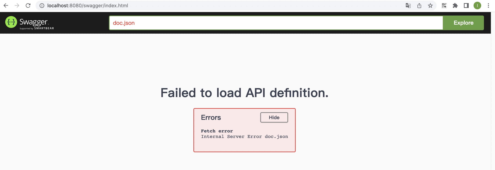

##### 参考

- [ ] https://wnanbei.github.io/post/gin-%E9%85%8D%E7%BD%AE-swagger-%E6%8E%A5%E5%8F%A3%E6%96%87%E6%A1%A3/ 1
- [ ] https://blog.csdn.net/ling1998/article/details/124205500 2
- [ ] https://blog.csdn.net/raoxiaoya/article/details/124187062
- [x] https://www.liwenzhou.com/posts/Go/gin-swagger/
- [x] https://blog.csdn.net/reachyu/article/details/106410421
- [ ] https://blog.csdn.net/qq_38371367/article/details/123005909
- [ ] https://blog.csdn.net/weixin_41182157/article/details/124729635?spm=1001.2101.3001.6650.18&utm_medium=distribute.pc_relevant.none-task-blog-2%7Edefault%7EBlogCommendFromBaidu%7ERate-18-124729635-blog-123005909.235%5Ev38%5Epc_relevant_sort_base2&depth_1-utm_source=distribute.pc_relevant.none-task-blog-2%7Edefault%7EBlogCommendFromBaidu%7ERate-18-124729635-blog-123005909.235%5Ev38%5Epc_relevant_sort_base2&utm_relevant_index=22
- [ ] https://cloud.tencent.com/developer/article/1678331

##### 文档

[github](https://github.com/swaggo/swag) 8.8k

[使用文档](https://github.com/swaggo/swag/blob/master/README_zh-CN.md)

### 安装

##### 安装 - swag

> 如果使用 go get 会导致 "zsh: command not found: swag"


```bash
$ go install github.com/swaggo/swag/cmd/swag@v1.16.1
或
$ go install github.com/swaggo/swag/cmd/swag@latest
```

##### 安装 - gin-swagger

[github](https://github.com/swaggo/gin-swagger)

```bash
$ go get -u github.com/swaggo/gin-swagger@v1.6.0
$ go get -u github.com/swaggo/files@v1.0.1
或
$ go get -u github.com/swaggo/gin-swagger@latest
$ go get -u github.com/swaggo/files@latest
```

##### 命令

```bash
# 写好注释后, 生成文档, 在项目中自动生成 docs 文件夹
$ swag init

# 格式化 SWAG 注释
$ swag fmt
```

##### 整体文档说明

此注释用于声明整个 API 文档的信息，注释的位置在项目的 main 函数位置

| 字段名                   | 说明                                                         | 示例                                            |
| :----------------------- | :----------------------------------------------------------- | :---------------------------------------------- |
| @title                   | **必填** 应用程序的名称                                      | Swagger Example API                             |
| @version                 | **必填** 提供应用程序API的版本                               | 1.0                                             |
| @description             | 应用程序的简短描述                                           | This is a sample server celler server.          |
| @tag.name                | 标签的名称                                                   | This is the name of the tag                     |
| @tag.description         | 标签的描述                                                   | Cool Description                                |
| @tag.docs.url            | 标签的外部文档的URL                                          | [https://example.com](https://example.com/)     |
| @tag.docs.description    | 标签的外部文档说明                                           | Best example documentation                      |
| @termsOfService          | API的服务条款                                                | http://swagger.io/terms/                        |
| @contact.name            | 公开的API的联系信息                                          | API Support                                     |
| @contact.url             | 联系信息的URL，必须采用网址格式                              | http://www.swagger.io/support                   |
| @contact.email           | 联系人/组织的电子邮件地址。 必须采用电子邮件地址的格式       | [support@swagger.io](mailto:support@swagger.io) |
| @license.name            | **必填** 用于API的许可证名称                                 | Apache 2.0                                      |
| @license.url             | 用于API的许可证的URL，必须采用网址格式                       | http://www.apache.org/licenses/LICENSE-2.0.html |
| @host                    | 运行API的主机（主机名或IP地址）                              | localhost:8080                                  |
| @BasePath                | 运行API的基本路径                                            | /api/v1                                         |
| @query.collection.format | 请求URI query里数组参数的默认格式: csv，multi，pipes，tsv，ssv。 如果未设置，则默认为csv | multi                                           |
| @schemes                 | 用空格分隔的请求的传输协议                                   | http https                                      |
| @x-name                  | 扩展的键必须以x-开头，并且只能使用json值                     | {“key”: “value”}                                |

##### API 文档说明

| **注释**             | **描述**                                                     |
| -------------------- | ------------------------------------------------------------ |
| description          | 操作行为的详细说明。                                         |
| description.markdown | 应用程序的简短描述。该描述将从名为endpointname.md的文件中读取。 |
| id                   | 用于标识操作的唯一字符串。在所有API操作中必须唯一。          |
| tags                 | 每个API操作的标签列表，以逗号分隔。                          |
| summary              | 该操作的简短摘要。                                           |
| accept               | API 可以使用的 MIME 类型列表。 请注意，Accept 仅影响具有请求正文的操作，例如 POST、PUT 和 PATCH。 值必须如“Mime类型”中所述。 |
| produce              | API可以生成的MIME类型的列表。值必须如“Mime类型”中所述。      |
| param                | 用空格分隔的参数。param name,param type,data type,is mandatory?,comment attribute(optional) |
| security             | 每个API操作的安全性。                                        |
| success              | 以空格分隔的成功响应。return code,{param type},data type,comment |
| failure              | 以空格分隔的故障响应。return code,{param type},data type,comment |
| response             | 与success、failure作用相同                                   |
| header               | 以空格分隔的头字段。 return code,{param type},data type,comment |
| router               | 以空格分隔的路径定义。 path,[httpMethod]                     |
| x-name               | 扩展字段必须以x-开头，并且只能使用json值。                   |

##### MIME 类型

| 别名                  | MIME 类型                         |
| :-------------------- | :-------------------------------- |
| json                  | application/json                  |
| xml                   | text/xml                          |
| plain                 | text/plain                        |
| html                  | text/html                         |
| mpfd                  | multipart/form-data               |
| x-www-form-urlencoded | application/x-www-form-urlencoded |
| json-api              | application/vnd.api+json          |
| json-stream           | application/x-json-stream         |
| octet-stream          | application/octet-stream          |
| png                   | image/png                         |
| jpeg                  | image/jpeg                        |
| gif                   | image/gif                         |

##### 例子 - 整体文档

```go
package main

import (
	"github.com/gin-gonic/gin"
	swaggerFiles "github.com/swaggo/files"
	ginSwagger "github.com/swaggo/gin-swagger"
	// 必选导入这个包, 否则 swagger 报错
	_ "k8s-service-gin/docs"
)

// @title			k8s-service
// @version		1.0
// @description	容器服务 API 文档
func main() {
	r := gin.New()
	// 开启文档
	// 注册 Swagger api 路由
	r.GET("/swagger/*any", ginSwagger.WrapHandler(swaggerFiles.Handler))
	// 关闭文档
	//r.GET("/swagger/*any", ginSwagger.DisablingWrapHandler(swaggerFiles.Handler, "NAME_OF_ENV_VARIABLE"))

	r.Run()
}
```

##### 例子 - API 文档 - 1

```go
package main

import (
	"github.com/gin-gonic/gin"
	swaggerFiles "github.com/swaggo/files"
	ginSwagger "github.com/swaggo/gin-swagger"
	// 必选导入这个包, 否则 swagger 报错
	_ "k8s-service-gin/docs"
)

// ListExp 测试 1
// @Summary 根据条件查询实例
// @Description 根据条件查询实例
// @Accept  json
// @Produce  json
// @Param   pageNum     path    int     true        "pageNum"
// @Param expName body string false "expName"
// @Param expType body string false "expType"
// @Param expTrade body string false "expTrade"
// @Param expScene body string false "expScene"
// @Param expRemark body string false "expRemark"
// @Param expDeg body int false "expDeg"
// @Param expCreateUser body string false "expCreateUser"
// @Success 200 {string} json "{"errcode":"200","data":"[{"expId":"111","expName":"TensorFlow","expType":"TensorFlow","expTrade":"制造业","expScene":"零售","expRemark":"零售零售零售零售","expDeg":"2","expCreateUser":"tfg"}]","msg":""}"
// @Failure 400 {string} json "{"errcode":"400","data":"","msg":"error......"}"
// @Router /api/v1/exp/list/{pageNum} [post]
func ListExp(c *gin.Context) {

}

// @title			k8s-service
// @version		1.0
// @description	容器服务 API 文档
func main() {
	r := gin.New()
	// 开启文档
	// 注册 Swagger api 路由
	r.GET("/swagger/*any", ginSwagger.WrapHandler(swaggerFiles.Handler))
	// 关闭文档
	//r.GET("/swagger/*any", ginSwagger.DisablingWrapHandler(swaggerFiles.Handler, "NAME_OF_ENV_VARIABLE"))

	r.GET("/index", ListExp)
	r.Run()
}
```

##### 例子 - API 文档  - 2

```
```


##### 查看文档

```
http://localhost:8080/swagger/index.html
```

### 报错

##### ??????

```
govendor
```

##### 错误 1



- 原因

  ```
  没有导入 swagger 自动生成的 docs 文件夹
  ```

- 解决办法

  ```go
  import (
  	_ "k8s-service-gin/docs"
  )
  ```

