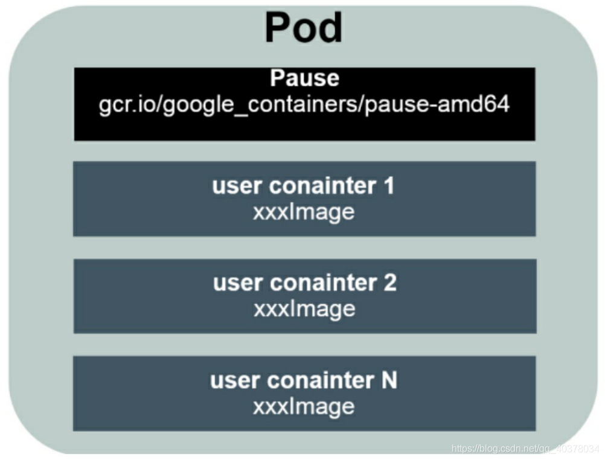
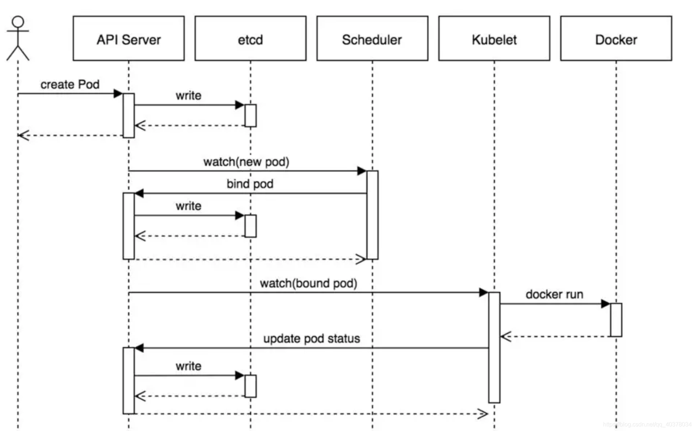

##### 参考

- [ ] [github 说明](https://github.com/kubernetes/enhancements/blob/master/keps/sig-node/2371-cri-pod-container-stats/README.md)  

##### 优点

```
k8s 是开源的容器集群管理系统
可以实现容器集群的自动化部署、自动扩缩容、故障迁移, 自动重启, 采用 docker 容器部署互相不影响.
高可用, 不宕机, 自动灾难恢复
灰度更新, 不影响业务正常运转
回滚历史版本
方便伸缩扩展
生态完善
```

# 组件


##### MasterNode

Master 是集群控制节点, 包含 3 个程序:

- kube-apiserver
  - 提供 HTTP Rest 接口, 是 K8S 里所有资源的增删改查等操作的唯一入口
  - 集群资源配额的统一入口
  - 提供了完备的集群安全机制

- kube-controller-manager
  - 实时管理和监控集群中各种资源的状态变化，不断尝试将它们的副本数量维持在一个期望的状态

- kube-scheduler
  - 负责调度功能，如：为Pod找到一个合适的宿主机器, 通过 API Server 的 Watch 接口监听新建 Pod 副本信息，并通过调度算法为该Pod选择一个最合适的Node
- etcd
  - K8S 里的所有资源对象以及状态的数据都被保存在etcd中


##### WorkerNode

WorkerNode 是集群中的工作负载节点，每个Node都会被Master分配一些工作负载，当某个Node宕机时，其上的工作负载会被Master自动转移到其他节点上, 在每个Node上都运行着以下关键进程:

- kubelet：
  - Pod 的创建、启停等任务，同时与Master密切协作，实现集群管理的基本功能
  - Node节点管理
  - 容器健康状态检查
- kube-proxy
  - 实现Kubernetes Service的通信与负载均衡机制的重要组件
  - 通过为Service资源的ClusterIP生成iptable或ipvs规则，实现将K8S内部的服务暴露到集群外面去
- Docker Engine
  - Docker引擎，负责本机的容器创建和管理工作

在默认情况下Kubelet会向Master注册自己，一旦Node被纳入集群管理范围，kubelet进程就会定时向Master汇报自身的信息（例如机器的CPU和内存情况以及有哪些Pod在运行等），这样Master就可以获知每个Node的资源使用情况，并实现高效均衡的资源调度策略。而某个Node在超过指定时间不上报信息时，会被Master判定为失败，Node的状态被标记为不可用，随后Master会触发工作负载转移的自动流程

##### pod



每个Pod都有一个根容器的Pause容器，还包含一个或多个紧密相关的用户业务容器

Pod里的多个业务容器共享Pause容器的IP，共享Pause容器挂接的Volume。在K8S里，一个Pod里的容器与另外主机上的Pod容器能够直接通信

在默认情况下，当Pod里的某个容器停止时，K8S会自动检测到这个问题并且重新启动这个Pod（重启Pod里的所有容器），如果Pod所在的Node宕机，就会将这个Node上的所有Pod重新调度到其他节点上

Pod有两种类型：

- 普通的Pod: 普通的Pod一旦被创建，就会被放入etcd中存储，随后会被K8S的Master调度到某个具体的Node上并进行绑定（Binding），随后该Pod被对应的Node上的kubelet进程实例化成一组相关的Docker容器并启动
- 静态Pod（Static Pod）:并没被存放在K8S的etcd存储里，而是被存放在某个具体的Node上的一个具体文件中，并且只在此Node上启动、运行

##### K8S创建一个Pod的流程



1. 用户提交创建Pod的请求，可以通过API Server的REST API，也可用Kubectl命令行工具
2. API Server处理用户请求，存储Pod数据到etcd
3. Schedule通过和API Server的watch机制，查看到新的Pod，尝试为Pod绑定Node
4. 过滤主机：调度器用一组规则过滤掉不符合要求的主机，比如Pod指定了所需要的资源，那么就要过滤掉资源不够的主机
5. 主机打分：对第一步筛选出的符合要求的主机进行打分，在主机打分阶段，调度器会考虑一些整体优化策略，比如把一个Replication Controller的副本分布到不同的主机上，使用最低负载的主机等
6. 选择主机：选择打分最高的主机，进行binding操作，结果存储到etcd中
7. Kubelet根据调度结果执行Pod创建操作： 绑定成功后，会启动container，Scheduler会调用API在数据库etcd中创建一个bound pod对象，描述在一个工作节点上绑定运行的所有Pod信息。运行在每个工作节点上的Kubelet也会定期与etcd同步bound pod信息，一旦发现应该在该工作节点上运行的bound pod对象没有更新，则调用Docker API创建并启动Pod内的容器

```
在这期间，Control Manager同时会根据K8S的mainfiles文件执行RC Pod的数量来保证指定的Pod副本数。而其他的组件，比如Scheduler负责Pod绑定的调度，从而完成整个Pod的创建
```

##### kubectl appley 执行过程

> 通过kubectl命令执行创建`kubectl apply -f rs.yaml`创建pod时，经历的流程如上图，大概流程为


1. apiserver接收kubectl的创建资源的请求
2. apiserver将创建请求写入ECTD
3. apiserver接收到etcd的回调事件
4. apiserver将回调事件发送给ControllerManager
5. controllerManager中的ReplicationController处理本次请求，创建RS，然后它会调控RS中的Pod的副本数量处于期望值，比期望值小就新创建Pod，于是它告诉ApiServer要创建Pod
6. apiserver将创建pod的请求写入etcd集群
7. apiserver接收etcd的创建pod的回调事件
8. apiserver将创建pod的回调事件发送给scheduler，由它为pod挑选一个合适的宿主node
9. scheduler告诉apiserver，这个pod可以调度到哪个node上
10. apiserver将scheduler告诉他的事件写入etcd
11. apiserver接收到etcd的回调，将更新pod的事件发送给对应node上的kubelet进程
12. kubelet通过CRI接口同容器运行时（Docker）交互，维护更新对应的容器。


```
限定 cpu 和 内存 端口

配置文件的 kind 字段(设置类型)
type

pod 的ip会变, 但是 名字不会变, 所以用名字连接

数据持久化: PV PVC

Ingress

配置文件 
dockerfile和deployment.yaml

```

> docker 快速上手

```
虚拟机: 虚拟机需要模拟硬件, 模拟整个操作系统, 体积大, 资源占用高, 影响程序性能

docker: 比虚拟机轻量, 不模拟底层硬件, 只给每个应用提供完全独立的运行环境, 互相不影响

dockerfile: 自动化脚本, 用来生成快照 

image: 虚拟机快照

容器 Container: 运行起来的虚拟机
```

### apiserver

```
当我们安装完K8S集群后，在default命名空间中会有个默认的叫kubernetes的Service，这个service使用的service网段的第一个地址，而且这个service是ApiServer的service，换句话说，通过这个service可以访问到apiserver
```

##### SAN 证书

> SAN（Subject Alternative Name）
>
> 修改SAN的过程会导致API Server的短暂重启
>
> [阿里 SAN 文档](https://help.aliyun.com/document_detail/209730.html?spm=5176.2020520152.help.dexternal.1a8516dd1wSkQ4)

```
Kubernetes APIServer 使用数字证书来加密 APIServer 的相关流量以及验证到 APIServer 的连接
所以如果我们想使用命令行客户端（比如 kubectl）连接到 APIServer，并且使用的主机名或者 IP 地址不包括在证书的 subject 的备选名称（SAN）列表中的话，访问的时候可能会出错，会提示对指定的 IP 地址或者主机名访问证书无效。
要解决这个问题就需要更新证书，使 SAN 列表中包含所有你将用来访问 APIServer 的 IP 地址或者主机名


```


### ApiProxy

```
# 查询指定节点上所有的pod信息
/api/v1/nodes/{nodename}/proxy/pods
# 查询指定节点上物理资源的统计信息
/api/v1/nodes/{nodename}/proxy/stats
# 查询指定节点上的摘要信息
/api/v1/nodes/{nodename}/proxy/spec
# 访问pod
/api/v1/namespace/{namespace-name}/pods/{name}/proxy
# 访问pod指定路径
/api/v1/namespace/{namespace-name}/pods/{name}/{path:*}
```

### ControllerManager

```
```


# 问题

```
svc 是什么


```

