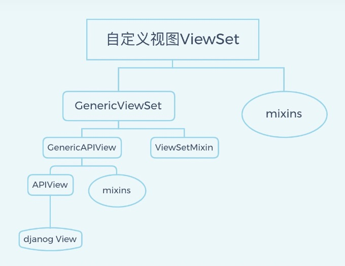
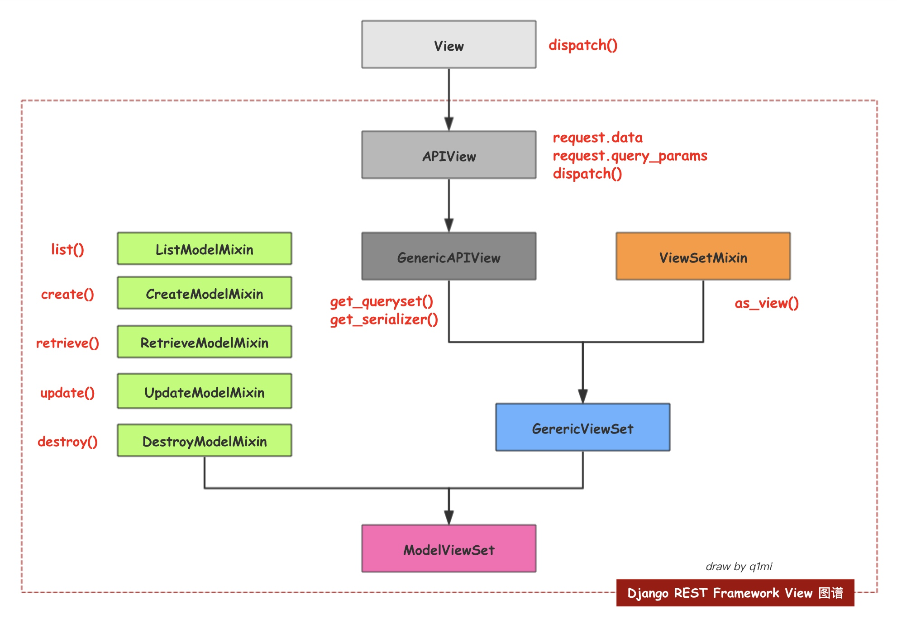

##### 参考

- [ ] https://zhuanlan.zhihu.com/p/350081375 继承关系
- [ ] https://www.cnblogs.com/echo1937/p/11387753.html
- [ ] https://zhuanlan.zhihu.com/p/72527077
- [ ] https://blog.51cto.com/u_15349841/6178819
- [ ] 

### 概念

##### FBV

Function Base View, 基于函数开发视图

##### CBV

Class Base View, 基于对象开发视图

APIView、GenericAPIView、ViewSet

# 继承关系





```
GenericViewSet(ViewSetMixin, generics.GenericAPIView)       ---DRF
    GenericAPIView(views.APIView)                           ---DRF
        APIView(View)                                       ---DRF
            View                                            ---Django
```


| mixins             | 实现方法 | 绑定的请求方法 |
| ------------------ | -------- | -------------- |
| RetrieveModelMixin | retrieve | get (1 个)     |
| ListModelMixin     | list     | get (列表)     |
| CreateModelMixin   | create   | post           |
| UpdateModelMixin   | update   | put            |
| DestroyModelMixin  | destroy  | delete         |

| generics中的view             | 继承的mixins                                         | 继承的View     | 实现的请求方法          |
| ---------------------------- | ---------------------------------------------------- | -------------- | ----------------------- |
| GenericAPIView               | -                                                    | APIView        | -                       |
| CreateAPIView                | CreateModelMixin                                     | GenericAPIView | post                    |
| ListAPIView                  | ListModelMixin                                       | GenericAPIView | get                     |
| RetrieveAPIView              | RetrieveModelMixin                                   | GenericAPIView | get                     |
| DestroyAPIView               | DestroyModelMixin                                    | GenericAPIView | get                     |
| UpdateAPIView                | UpdateModelMixin                                     | GenericAPIView | put、patch              |
| ListCreateAPIView            | ListModelMixin CreateModelMixin                      | GenericAPIView | get、post               |
| RetrieveUpdateAPIView        | RetrieveModelMixinUpdateModelMixin                   | GenericAPIView | get、put、patch         |
| RetrieveDestroyAPIView       | RetrieveModelMixin DestroyModelMixin                 | GenericAPIView | get、delete             |
| RetrieveUpdateDestroyAPIView | RetrieveModelMixin UpdateModelMixinDestroyModelMixin | GenericAPIView | get、put、patch、delete |

# Django View

```python
# 使用Django自身的模块，返回application/json的数据，可以返回HttpResponse，也可以是其子类JsonResponse
# 在Django中也有serializers，不同于DRF的serializers，它只能对基本类型进行JSON序列化、反序列化

import json
from django.core import serializers
from django.http import JsonResponse
from django.views.generic.base import View
from .models import Course


class CourseListView(View):
    def get(self, request):
        """
        通过Django的View实现课程列表页
        """
        courses = Course.objects.all()[:10]
        json_data = serializers.serialize('json', Courses)
        json_data = json.loads(json_data)
        return JsonResponse(json_data, safe=False)
```

# APIView

```

APIView与Django的View类似，我们的业务类只需要继承APIView，在URL传递过程，我们只需要调用APIView的as_view()方法，然后URL就会调用业务类对应的HTTP方法，如get，post，put，delete（对应查 增 改 删）方法，我们在业务代码中只需要实现三个功能即可实现get方法

ORM调用
序列化
返回数据
```

##### 例子

```python
# 在APIView这个例子中，调用了drf本身的serializer和Response

from rest_framework.views import APIView
from rest_framework.response import Response
from .serializers import CourseSerializer

class CourseListView(APIView):
    def get(self, request, format=None):
        courses = Course.objects.all()
        serializer = CourseSerializer(courses, many=True)
        return Response(serializer.data)
```

##### APIView 与 View 不同

```
1. 请求和返回使用的DRF的Request、Response，而不是Django的HttpRequest、HttpResponse；
2. 任何APIException异常都会被捕获到，并且处理成合适的响应信息；
3. 在进行dispatch()分发前，会对请求进行身份认证、权限检查、流量控制。
	authentication_classes  列表或元组，身份认证类
	permissoin_classes       列表或元组，权限检查类
	throttle_classes            列表或元组，流量控制类
```

# GenericAPIView

```
然后get方法可以调用父类的ListModelMixin方法的list()方法，而post方法可以调用父类CreateModelMixin的方法，其他URL分发等与之前的APIView类似
```

##### 例子 1

```python
# url(r'^books/(?P<pk>\d+)/$', views.BookDetailView.as_view()),

class BookDetailView(GenericAPIView):
    # 继承 GenericAPIView, 属性赋值 queryset与serializer_class
    queryset = BookInfo.objects.all()
    serializer_class = BookInfoSerializer
 
    def get(self, request, pk):
        book = self.get_object()
        serializer = self.get_serializer(book)
        return Response(serializer.data)
```

##### 例子 2

```python
from rest_framework import mixins
from rest_framework import generics

class CourseListView(mixins.ListModelMixin, generics.GenericAPIView):
     queryset = Course.objects.all()
     serialize_class = CourseSerializer

     def get(self, request, *args, **kwargs):
         return self.list(request, *args, **kwargs)
```

##### 例子 3

```python
# 继承 ListAPIView(mixins.ListModelMixin, GenericAPIView), 那么 def get(...)方法都可以不写
class CourseListView(ListAPIView):
     queryset = Course.objects.all()
     serialize_class = CourseSerializer
```

# GenericViewSet

```

```

