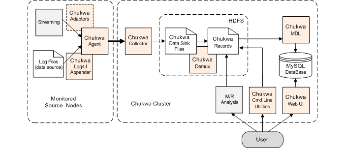

##### chukwa概述

- 开源的用于监控大型分布式系统的数据收集系统
- 构建在 hadoop 基础上的分布式日志处理系统
- 分析数据是分钟级, 不是一个实时错误监控系统
- 提供了一个对大数据量日志类数据采集、存储、分析和展示的全套解决方案和框架
- Chukwa使用MapReduce来生成报告，他还包括一个用于监测和分析结果显示的web-portal工具，通过web-portal工具使这个收集数据的更佳具有灵活性

##### 架构



```
1. agents : 负责采集最原始的数据,并发送给 collectors
2. adaptor : 直接采集数据的接口和工具,一个 agent 可以管理多个 adaptor 的数据采集
3. collectors 负责收集 agents 收送来的数据,并定时写入集群中
4. map/reduce jobs 定时启动,负责把集群中的数据分类、排序、去重和合并
5. HICC 负责数据的展示
```

##### agents

- 在每个数据的产生端, chukwa 使用一个 agent 来采集需要的数据,每一类数据通过一个 adaptor 来实现, 数据的类型在相应的配置中指定
  - 命令行输出
  - log 文件
- 这些 adaptor 会定期运行(比如每分钟读一次 df 的结果)或事件驱动地执行(比如 kernel 打了一条错误日志).
-  如果这些 adaptor 还不够用，可以自己实现一个 adaptor 来满足需求
- 为防止数据采集端的 agent 出现故障，chukwa 的 agent 采用了所谓的 ‘watchdog’ 机制，会自动重启终止的数据采集进程，防止原始数据的丢失。
- 对于重复采集的数据, 在 chukwa 的数据处理过程中,会自动对它们进行去重. 这样,就可以对于关键的数据在多台机器上部署相同的 agent,从而实现容错的功能.

##### collectors

- agents 采集到的数据,是存储到 hadoop 集群上的. hadoop 集群擅长于处理少量大文件，而对于大量小文件的处理则不是它的强项，针对这一点，chukwa 设计了 collector 这个角色，用于把数据先进行部分合并，再写入集群，防止大量小文件的写入。
- 为防止 collector 成为性能瓶颈或产生故障, chukwa 允许和鼓励设置多个 collector, agents 随机地从 collectors 列表中选择一个 collector 传输数据,如果一个 collector 失败或繁忙,就换下一个 collector. 从而可以实现负载的均衡

##### demux 和 archive

- 放在集群上的数据,是通过 map/reduce 作业来实现数据分析的. 在 map/reduce 阶段， chukwa 提供了 demux 和 archive 任务两种内置的作业类型.
  - demux 作业负责对数据的分类、排序和去重. 由 collector 写入集群中的数据,都有自己的类型. demux 作业在执行过程中,通过数据类型和配置文件中指定的数据处理类,执行相应的数据分析工作,一般是把非结构化的数据结构化,抽取中其中的数据属性.由于 demux 的本质是一个 map/reduce 作业,所以我们可以根据自己的需求制定自己的 demux 作业,进行各种复杂的逻辑分析. chukwa 提供的 demux interface 可以用 java 语言来方便地扩展.
  - archive 作业则负责把同类型的数据文件合并，一方面保证了同一类的数据都在一起，便于进一步分析, 另一方面减少文件数量, 减轻 hadoop 集群的存储压力。

##### dbadmin

- 放在集群上的数据,虽然可以满足数据的长期存储和大数据量计算需求,但是不便于展示.为此, chukwa 做了两方面的努力
  - 使用 mdl 语言,把集群上的数据抽取到 mysql 数据库中,对近一周的数据,完整保存,超过一周的数据,按数据离现在的时间长短作稀释,离现在越久的数据,所保存的数据时间间隔越长.通过 mysql 来作数据源,展示数据
  - 使用 hbase 或类似的技术,直接把索引化的数据在存储在集群上
    到 chukwa 0.4.0 版本为止, chukwa 都是用的第一种方法,但是第二种方法更优雅也更方便一些.

##### hicc

- 可以使用“列表”、“曲线图”、“多曲线图”、“柱状图”、“面积图”展示一类或多类数据，给用户直观的数据趋势展示。
- hicc 是用 jetty 来实现的一个 web 服务端,内部用的是 jsp  技术和 javascript 技术.各种需要展示的数据类型和页面的局都可以通过简直地拖拽方式来实现,更复杂的数据展示方式,可以使用 sql  语言组合出各种需要的数据.如果这样还不能满足需求,可以手修改它的 jsp 代码


