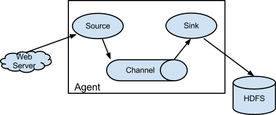
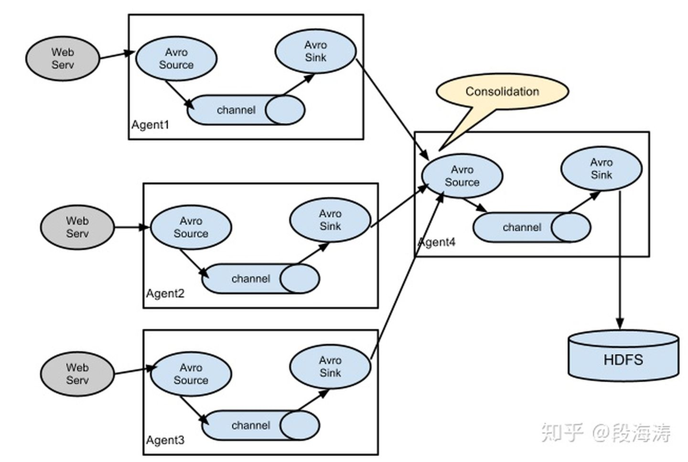
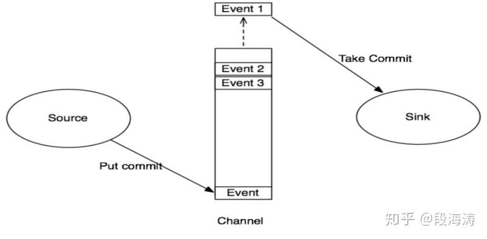
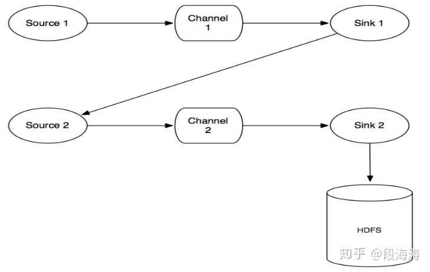

## 概述

##### Flume 是什么

- Flume是一个分布式、可靠、和高可用的海量日志采集、汇聚和传输的系统。
- Flume可以采集文件，socket数据包、文件夹、kafka等各种形式源数据，又可以将采集到的数据(下沉sink)输出到HDFS、hbase、hive、kafka等众多外部存储系统中

##### 单个agent采集数据



##### 多级agent之间级联




##### 多路复用流（多级流）


##### agent

- Flume中最核心的角色是agent

- 对于每一个Agent来说,它就是一个独立的守护进程(JVM),它负责从数据源接收数据，并发往下一个目的地
  每一个agent相当于一个数据(被封装成Event对象)传递员，内部有三个组件, 类似生成者和消费者的架构，他们之间通过 channel 传输，解耦
- Source: 完成对日志数据的收集，分成 transtion 和 event 打入到channel之中
  
- Channel: 缓存通道组件，用于从source将数据传递到sink
  - Sink: 取出Channel中的数据，用于往下一级agent传递数据或者向最终存储系统传递数据

```
Source
	接收网络消息
	读取日志文件
	读取kafka中消息
	
channel	
	缓存在内存中
	缓存在本地磁盘文件中
	缓存在kafka集群中

sink
	写入hdfs
	kafka
	mysql
	
interceptor拦截器
	拦截器工作在source组件之后，source产生的event会被传入拦截器根据需要进行拦截处理
```

##### Event

- 数据在Agent内部中各模块间的传输，以Event(JaveBean)的形式存在。Source组件在获取到原始数据后，需要封装成Event放入channel；Sink组件从channel中取出Event后，需要根据配置要求，转成其他形式的数据输出
- Event封装对象主要有两部分组成： Headers 和 Body
  - headers: 是一个集合Map[String,String]，用于携带一些KV形式的元数据（标志、描述等）
  - boby： 就是一个字节数组；装载具体的数据内容

## 可靠性

对日志收集系统来说，可靠性(reliability)是指Flume在数据流的传输过程中，保证events的可靠传递

##### Transaction

- Transaction 是 Flume的事务机制, 保证可靠性
- 在任何时刻，Event至少在一个Channel中是完整有效的
- flume的事务，可以保证数据的可靠性（不会丢失），但无法避免数据重复！
- Flume使用两个独立的事务分别负责从Soucrce到Channel，以及从Channel到Sink的event传递。
  - 比如spooling directory source 为文件的每一个event batch创建一个事务，一旦事务中所有event全部传递到Channel且提交成功，那么Soucrce就将该文件标记为完成。
  - 同理，事务以类似的方式处理从Channel到Sink的传递过程，如果因为某种原因使得事务无法记录，那么事务将会回滚。且所有的事件都会保持到Channel中，等待重新传递。



- Flume提供了三种级别的可靠性保障，从强到弱依次分别为：
  - end-to-end（收到数据agent首先将event写到磁盘上，当数据传送成功后，再删除；如果数据发送失败，可以重新发送。）
  - Store on failure（这也是scribe采用的策略，当数据接收方crash时，将数据写到本地，待恢复后，继续发送）
  - Besteffort（数据发送到接收方后，不会进行确认）。

##### agnet间事务



```
1．source 1产生Event，通过“put”、“commit”操作将Event放到Channel 1中
2．sink 1通过“take”操作从Channel 1中取出Event，并把它发送到Source 2中
3．source 2通过“put”、“commit”操作将Event放到Channel 2中
4．source 2向sink 1发送成功信号，sink 1“commit”步骤2中的“take”操作（其实就是删除Channel 1中的Event）
```

## 提高可用方案

对日志收集系统来说，可用性(availablity)指固定周期内系统无故障运行总时间。要想提高系统的可用性，就需要消除系统的单点，提高系统的冗余度。

##### Agent死掉

- Agent死掉分为机器死机或者Agent进程死掉
- 所有的Agent在supervise的方式下启动，如果进程死掉会被系统立即重启
- 对所有的Agent进行存活监控，发现Agent死掉立即报警。
- 对于非常重要的日志，建议应用直接将日志写磁盘，Agent使用spooldir的方式获得最新的日志

##### Collector死掉

由于中心服务器提供的是对等的且无差别的服务，且Agent访问Collector做了LoadBalance和重试机制。所以当某个Collector无法提供服务时，Agent的重试策略会将数据发送到其它可用的Collector上面。所以整个服务不受影响。

##### Hdfs正常停机

在Collector的HdfsSink中提供了开关选项，可以控制Collector停止写Hdfs，并且将所有的events缓存到FileChannel的功能。

##### Hdfs异常停机或不可访问

此时Collector无法写Hdfs, Collector可以将所收到的events缓存到FileChannel，保存在磁盘上，继续提供服务。当Hdfs恢复服务以后，再将FileChannel中缓存的events再发送到Hdfs上，可以提供较好的容错性。

##### Collector变慢或者Agent/Collector网络变慢

可能导致Agent发送到Collector的速度变慢, Agent可以将收到的events缓存到FileChannel，保存在磁盘上，继续提供服务。当Collector恢复服务以后，再将FileChannel中缓存的events再发送给Collector。

##### Hdfs变慢

当Hadoop上的任务较多且有大量的读写操作时，Hdfs的读写数据往往变的很慢。由于每天，每周都有高峰使用期，所以这种情况非常普遍。当Hdfs写入较快时，所有的events只经过MemChannel传递数据，减少磁盘IO，获得较高性能。当Hdfs写入较慢时，所有的events只经过FileChannel传递数据，有一个较大的数据缓存空间

## 可扩展性

对日志收集系统来说，可扩展性(scalability)是指系统能够线性扩展。当日志量增大时，系统能够以简单的增加机器来达到线性扩容的目的。

##### Agent层

每个机器部署一个Agent，可以水平扩展，不受限制。一个方面，Agent收集日志的能力受限于机器的性能，正常情况下一个 Agent可以为单机提供足够服务。另一方面，如果机器比较多，可能受限于后端Collector提供的服务，但Agent到Collector是有 Load Balance机制，使得Collector可以线性扩展提高能力。

##### Collector层

对于Collector这一层，Agent到Collector是有Load Balance机制，并且Collector提供无差别服务，所以可以线性扩展。其性能主要受限于Store层提供的能力。

##### Store层

对于Store这一层来说，Hdfs和Kafka都是分布式系统，可以做到线性扩展

##### Channel的选择

Flume1.4.0中，其官方提供常用的MemoryChannel和FileChannel

- MemoryChannel: 所有的events被保存在内存中。优点是高吞吐。缺点是容量有限并且Agent死掉时会丢失内存中的数据
- FileChannel: 所有的events被保存在文件中。优点是容量较大且死掉时数据可恢复。缺点是速度较慢。

## 系统监控

- flume写hfds状态的监控
- 日志大小异常监控


