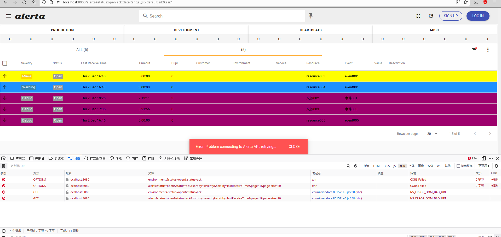

## document

> [官网](https://alerta.io/)
>
> [文档 - home](https://docs.alerta.io/)
>
> [文档 - pdf](https://buildmedia.readthedocs.org/media/pdf/alerta/latest/alerta.pdf)

说明

> Alerta monitoring system 和 Alerta Web UI 是单独的两个服务
>
> Alerta monitoring system 提供服务接口, 端口 8080. 
>
> Alerta Web UI 提供页面, 端口 8000. 
>
> 命令 python3 -m http.server 8000 提供一个可以访问文件的服务, 并指定一个接口
>
> 

## alerta monitoring system

> [v8.6.4](https://github.com/alerta/alerta/releases/tag/v8.6.4)
>
> 需要安装 MongoDB

##### installation

```
$ git clone https://github.com/alerta/alerta.git
$ pip install -r requirements.txt
$ pip install python-dotenv
```

##### psycopg2 包安装失败

```
需要安装环境依赖
$ aptitude install libpq-dev python-dev
```

##### run

```bash
$ python wsgi.py
```

## alerta Web UI

> [v8.6.1](https://github.com/alerta/alerta-webui/releases/tag/v8.6.1)
>
> http.server 需要在 dist 目录下
>
> Alerta Web UI 会调用 Alerta monitoring system

##### installation

```bash
# 将项目下载到 Alerta monitoring system 的目录下

$ wget https://github.com/alerta/alerta-webui/releases/latest/download/alerta-webui.tar.gz
$ tar zxvf alerta-webui.tar.gz
```

##### run
python 启动服务, 下载文件(python 文件下载服务器)

```bash
$ cd dist
$ python -m http.server 8000
```

##### web ui

```
http://localhost:8000
```

## Configuration

> [文档 - Configuration](https://docs.alerta.io/configuration.html)

##### alerta config

```bash
$ alerta config
```

##### alerta 服务配置文件优先级

```
低到高, 高的覆盖低的
    1. alerta/settings.py 文件 (最好不改这个文件)
    2. /etc/alertad.conf
    3. 环境变量指定的文件 .conf (推荐)
```

##### 环境变量设置配置

```bash
$ export ALERTA_SVR_CONF_FILE=~/.alertad.conf
$ echo "BLACKOUT_DURATION = 86400" >$ALERTA_SVR_CONF_FILE
```

##### 

```
创建 alerta/alertad.conf
```


