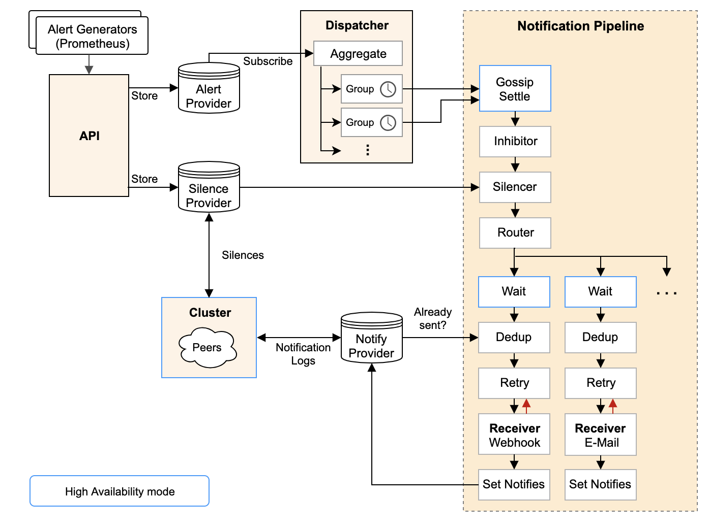
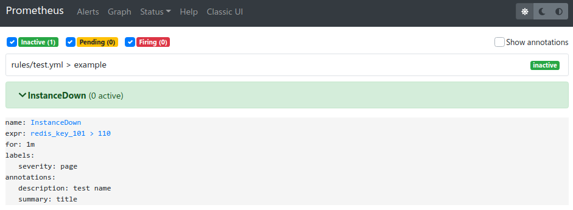
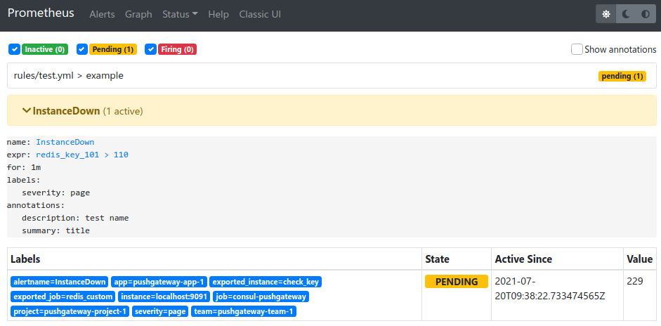
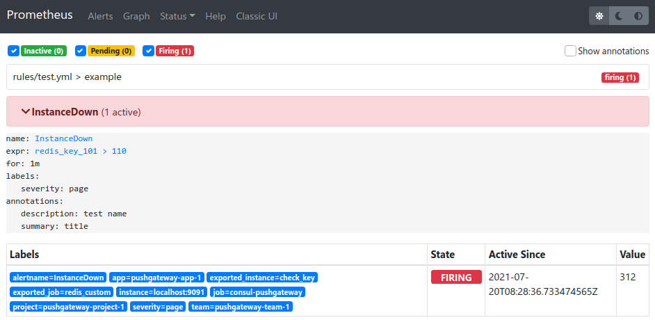

##### 参考

```
https://www.cnblogs.com/xiaobaozi-95/p/10740511.html

https://www.cnblogs.com/longcnblogs/p/9620733.html

https://zhuanlan.zhihu.com/p/179294441

https://zhuanlan.zhihu.com/p/179292686

https://zhuanlan.zhihu.com/p/74932366

文档
https://yunlzheng.gitbook.io/prometheus-book/parti-prometheus-ji-chu/alert/prometheus-alert-manager-overview

webhook
https://cloud.tencent.com/developer/article/1782471
```
##### 是什么

```
Prometheus监控系统中，采集与警报是分离的。警报规则在 Prometheus 定义，警报规则触发以后，才会将信息转发到给独立的组件 Alertmanager ，经过 Alertmanager 对警报的信息处理后，最终通过接收器发送给指定用户
```

##### 架构



```
从左上开始，Prometheus 发送的警报到 Alertmanager;
警报会被存储到 AlertProvider 中，Alertmanager 的内置实现就是包了一个 map，也就是存放在本机内存中，这里可以很容易地扩展其它 Provider;
Dispatcher 是一个单独的 goroutine，它会不断到 AlertProvider 拉新的警报，并且根据 YAML 配置的 Routing Tree 将警报路由到一个分组中;
分组会定时进行 flush (间隔为配置参数中的 group_interval), flush 后这组警报会走一个 Notification Pipeline 链式处理;
Notification Pipeline 为这组警报确定发送目标，并执行抑制逻辑，静默逻辑，去重逻辑，发送与重试逻辑，实现警报的最终投递;
```

##### 特性

```
1. 分组
分组机制可以将详细的告警信息合并成一个通知. 
例如，比如由于系统宕机导致大量的告警被同时触发，在这种情况下分组机制可以将这些被触发的告警合并为一个告警通知，避免一次性接受大量的告警通知

2. 抑制
当某一告警发出后，可以停止重复发送由此告警引发的其它告警的机制

3. 静默
如果接收到的告警符合静默的配置，Alertmanager则不会发送告警通知
```

##### alertmanager 的 webhook 功能

```
在prometheus监控中时常会用到alertmanager软件进行告警信息发送，常见的可以使用邮件或对接企业微信等应用实现提示信息的推送。在某些特殊情况下alertmanager无法对接生产环境中的已存在的api，需要自定一个中间层连接alertmanager和用户的应用实现特定数据的推送。

通过使用alertmanager软件的webhook功能把信息推送到python编写的api中，然后把接收到的数据进行清理筛选出有用的数据，按照其他api的数据格式重新整理数据格式并推送给指定的api
```

##### 安装

```
github
https://github.com/prometheus/alertmanager/releases

$ wget https://github.com/prometheus/alertmanager/releases/download/v0.22.2/alertmanager-0.22.2.linux-amd64.tar.gz
```

##### 运行

```bash
./alertmanager --version

# 检测配置文件是否正确
$ ./amtool check-config alertmanager.yml

# 启动
$ ./alertmanager --config.file=alertmanager.yml
$ /opt/alertmanager-0.22.2.linux-amd64/alertmanager --config.file=/opt/alertmanager-0.22.2.linux-amd64/alertmanager.yml


(未使用)
$ ./alertmanager --web.listen-address=":9093" --cluster.listen-address="0.0.0.0:9094"
```

##### alertmanager_conf.conf

```
[program:alertmanager]
directory=/opt/alertmanager-0.22.2.linux-amd64
command=/opt/alertmanager-0.22.2.linux-amd64/alertmanager --config.file=/opt/alertmanager-0.22.2.linux-amd64/alertmanager.yml
autostart=false
autorestart=false
user=glfadd
log_stdout=true
log_stderr=true
redirect_stderr = true
stdout_logfile_maxbytes = 20MB
stdout_logfile_backups = 20     
stdout_logfile = /opt/logs/supervisord_alertmanager.log
```

##### web UI

```
http://localhost:9093

prometheus 查看配置
http://localhost:9090/alerts
```

##### alert status

```
1. 结合 rule 文件的 for 参数设置的时间判断状态

pending 或 firing 的告警，Prometheus也会将它们存储到时间序列ALERTS{}中

可以通过表达式，查询告警实例：
ALERTS{alertname="<alert name>", alertstate="pending|firing", <additional alert labels>}

样本值为1表示当前告警处于活动状态（pending或者firing），当告警从活动状态转换为非活动状态时，样本值则为0。
```


| 状态     | 说明                                                         |
| -------- | ------------------------------------------------------------ |
| inactive | 未达到告警的条件                                             |
| pending  | 达到了告警的条件，但是持续时间小于设定的阈值时间（取决于有没有for语句，如果没有将直接从inactive跳到firing状态） |
| firing   | 达到了告警的条件，且持续时间大于设定的时间阈值               |







##### 发送报警的规则

```
1. 如果一条报警的状态是 FIRING 这个报警会一直发送
2. 


```

##### 支持报警类型

```
shell
command
脚本
发送 post 请求
```

## setting - prometheus

##### 示例 - prometheus.yml

```yml
# Prometheus全局配置项
global:
  # 设定抓取数据的周期，默认 1min
  scrape_interval: 10s
  # 设定更新rules文件的周期，默认 1min
  evaluation_interval: 10s
  # 抓取数据超时时间，默认 10s
  scrape_timeout: 10s
  external_labels: # 额外的属性，会添加到拉取得数据并存到数据库中
    monitor: 'codelab_monitor'

# Alertmanager 配置
alerting:
  alertmanagers:
    - static_configs:
        - targets:
          # 设定 alertmanager 和 prometheus 交互的接口
          "localhost:9093"


# rule 配置
rule_files:
  - 'rules/*.yml'


# scape配置
scrape_configs:
  - job_name: blackbox_get
    metrics_path: /probe
    params:
      module:
        - http_2xx
    file_sd_configs:
      # 刷新间隔
      - refresh_interval: 1m
        files:
          - /opt/prometheus-2.28.0.linux-amd64/config/blackbox*.yml
    relabel_configs:
      - source_labels:
          - __address__
        target_label: __param_target
      - source_labels:
          - __param_target
        target_label: instance
      - target_label: __address__
        replacement: '127.0.0.1:9115'
```

## setting - alertmanager

##### 参数

| 参数            | 说明                                                         |
| --------------- | ------------------------------------------------------------ |
| global          | 全局配置                                                     |
| resolve_timeout | 当Alertmanager持续多长时间未接收到告警后标记告警状态为resolved（已解决） |
| group_by        | 采用哪个标签来作为分组依据                                   |
| group_wait      | 组告警等待时间。也就是告警产生后等待10s，如果有同组告警一起发出 |
| group_interval  | 两组告警的间隔时间                                           |
| repeat_interval | 重复告警的间隔时间，减少相同邮件的发送频率                   |
| receiver        | 设置默认接收人                                               |

##### route 与 receivers

> group_by 是 alertname 的报警由 name 是 web.hook 的 receiver处理

```yml
global:
  resolve_timeout: 5m # 处理超时时间，默认为5min
  
# 告警路由的匹配规则
route:
  group_by:
    - 'alertname'
  receiver: 'web.hook'

# receiver 匹配规则
receivers:
  - name: 'web.hook'
    webhook_configs:
      - url: 'http://127.0.0.1:5001/'
```

```
route 匹配结果将告警发送给 receiver
匹配规则有 match、match_re

```

##### 示例 - alertmanager.yml

> routes 设置了 2 个报警, 用 alert_type 标签匹配, 分别发送给不同的 receivers 处理

```yml
# 全局配置项
global:
  resolve_timeout: 2m


# 定义模板信息
templates:
  - 'template/*.tmpl'


# 定义路由指定接收者
route:
  # 组告警等待时间。也就是告警产生后等待10s，如果有同组告警一起发出
  group_wait: 10s
  # 两组告警的间隔时间
  group_interval: 10s
  # 重复告警的间隔时间，减少相同邮件的发送频率
  repeat_interval: 10s
  # 默认接收者, 不设置报错
  receiver: api_status
  routes:
    - match:
        alert_type: api_status
      group_by:
        - api_status
      receiver: api_status

    - match:
        alert_type: node_status
      group_by:
        - node_status
      receiver: node_status


# 定义警报接收者
receivers:
  - name: api_status
    webhook_configs:
      - url: 'http://localhost:10421/alert/error/api/status'
        # 报警恢复时发送数据到 webhook
        send_resolved: true

  - name: node_status
    webhook_configs:
      - url: 'http://localhost:10421/alert/error/node/status'
        send_resolved: true

```

## setting - rules

 ##### 参数

| 参数                | 说明                                                         |
| ------------------- | ------------------------------------------------------------ |
| group               |                                                              |
| name                | rule 名称                                                    |
| alert               | 告警名称                                                     |
| expr                | PromQL 语句定义触发告警的条件                                |
| for                 | 定义告警从产生到发送的等待时间. 在等待期间新产生告警的状态为 pending |
| labels              | 自定义标签                                                   |
| annotations         | 附加描述信息                                                 |
| summary             | 告警的概要信息                                               |
| description         | 告警的详细信息                                               |
|                     |                                                              |
| $labels.<labelname> | 访问当前告警实例中指定标签的值                               |
| $value              | 获取当前PromQL表达式计算的样本值                             |

##### 示例 - rules

```yml
groups:
  - name: api_status
    rules:
      - alert: api_status
        expr: probe_http_status_code != 200
        for: 15s
        labels:
          source: 'api_http_status_code'
        annotations:
          summary: '接口/主机/端口 {{ $labels.instance }}  无法联通'
          description: 请尽快检测
          # 使用 $value 获取 PromQL 表达式的值
          http_status_code2: '{{ $value }}'

```

## webhook

```
https://www.jianshu.com/p/9829986b4363

https://segmentfault.com/a/1190000020249988
```

