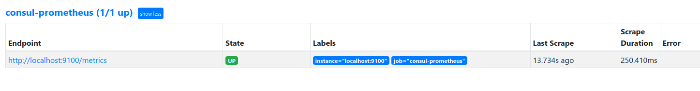
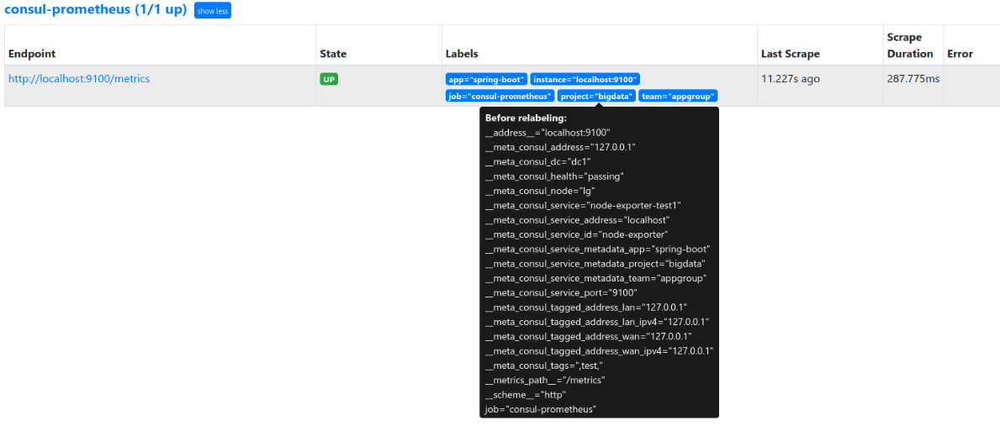
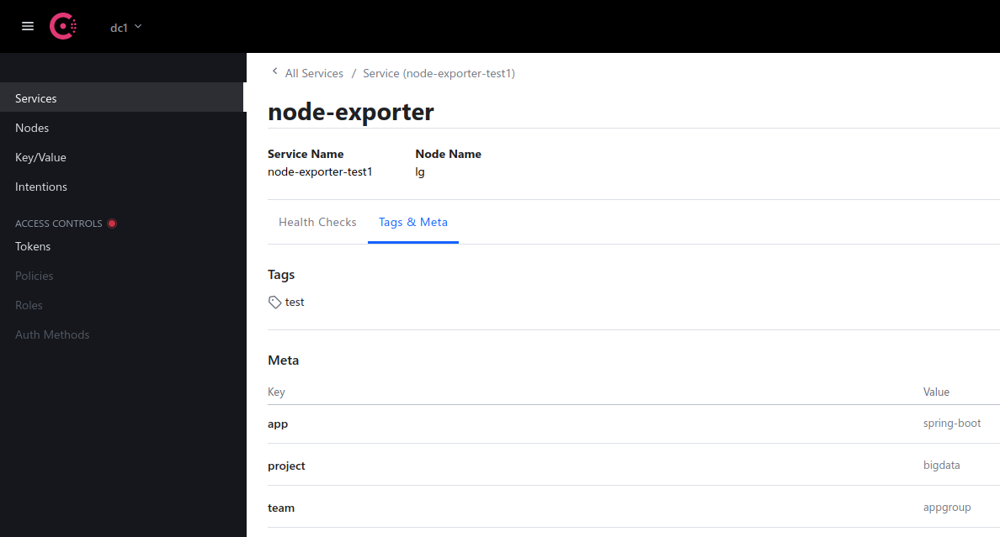
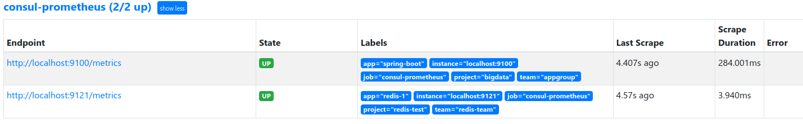
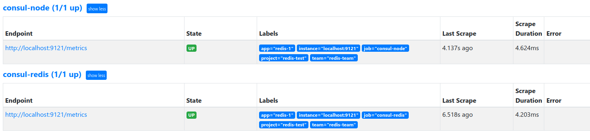

## 安装

##### 参考

```
https://blog.csdn.net/aixiaoyang168/article/details/103022342#3Consul__17
https://blog.csdn.net/aixiaoyang168/article/details/105233955/
https://cloud.tencent.com/developer/article/1692817
https://cloud.tencent.com/developer/article/1695997
https://www.cnblogs.com/whuanle/p/14015189.html
```

##### 是什么

```
Consul 是基于 GO 语言开发的开源工具，主要面向分布式，服务化的系统提供服务注册、服务发现和配置管理的功能。
Consul 提供服务注册/发现、健康检查、Key/Value存储、多数据中心和分布式一致性保证等功能。Prometheus 通过 Consul 可以很方便的实现服务自动发现和维护，同时 Consul 支持分布式集群部署，将大大提高了稳定性，通过 Prometheus 跟 Consul 集群二者结合起来，能够高效的进行数据维护同时保证系统稳定。
```

##### 安装

> [官网](https://www.consul.io/downloads)
>
> [github](https://github.com/hashicorp/consul)

```bash
$ wget https://releases.hashicorp.com/consul/1.10.0/consul_1.10.0_linux_amd64.zip
```

##### 命令

| 命令                                             | 说明                              |
| ------------------------------------------------ | --------------------------------- |
| ./consul -v                                      |                                   |
| ./consul agent --help                            |                                   |
| ./consul members -detailed                       | 查看 consul 成员更详细            |
| ./consul members                                 | 列出consul cluster集群中的members |
| ./consul join IP                                 | 将agent加入到consul集群           |
| ./consul leave                                   | 将节点移除所在集群                |
| ./consul catalog datacenters                     | 数据中心 list                     |
| ./consul catalog nodes                           | 节点 list                         |
| ./consul catalog nodes -service=name-pushgateway | 查看服务在哪些节点上              |
| ./consul catalog services                        | 查看所有 service                  |
| ./consul catalog services -node=worker-01        | 某个节点上的服务                  |

##### 运行

```bash
# 查看服务器状态
$ curl localhost:8500/v1/catalog/nodes

# 只能本地可以访问
$ /opt/consul/consul agent -dev  

# 持久化 外网访问
/opt/consul/consul agent -server -ui -client 0.0.0.0 -bootstrap-expect=1 -data-dir=/opt/consul/data -node=consul_01 -datacenter SH-TMP -bind=0.0.0.0 -client=0.0.0.0 -log-file=/opt/logs/consul.log
    # agent  -server 表示已 server 模式启动服务
    # -ui 参数提供一个 web ui 界面
    # -bootstrap-expect=1 意思是以集群的方式启动，只不过集群中只有当前这个节点
    # -data-dir 目录会用来存放 consul 的数据信息，如服务注册、是否健康等
    # -node=consul-01 节点名称
    # 对安全性没有要求的情况下其余都可以照抄
```


| 参数              | 说明                                                         |
| ----------------- | ------------------------------------------------------------ |
| -data-dir         | agent 储存状态的数据目录                                     |
| -config-dir       | 配置文件目录, 里面所有以 .json 结尾的文件都会被加载          |
| -config-file      | 指定一个要装载的配置文件. 该选项可以配置多次，后边的会合并前边的，相同的值覆盖 |
| -dev              | 创建一个开发环境下的server节点, 不会有任何数据写入到磁盘     |
| -bootstrap        | 此模式下，节点可以选举自己为leader，一个数据中心只能有一个此模式启动的节点。机群启动后，新启动的节点不建议使用这种模式 |
| -bootstrap-expect | 设定一个数据中心需要的服务节点数, consul会等待直到数据中心下的服务节点满足设定才会启动集群服务 |
| -node             | 节点在集群中的名称, 集群中必须唯一, 默认是主机名             |
| -bind             | 指定节点的IP地址                                             |
| -server           | 指定节点为server. 若不指定为 -server, 其实就是 -client       |
| -client           | 指定节点为client, 指定客户端接口的绑定地址, 默认是 127.0.0.1 |
| -join             | 将节点加入到集群                                             |
| -datacenter       | 指定机器加入到哪一个数据中心                                 |
| - ui              | 开启 consul 的界面                                           |

##### consul_conf.conf

```
[program:consul]
directory=/opt/consul
command=/opt/consul/consul agent -server -ui -client 0.0.0.0 -bootstrap-expect=1 -data-dir=/opt/consul/data -node=consul_01 -datacenter SH-TMP -bind=0.0.0.0 -client=0.0.0.0 -log-file=/opt/logs/consul.log 
autostart=false
autorestart=false
user=glfadd
log_stdout=true
log_stderr=true
redirect_stderr = true
stdout_logfile_maxbytes = 20MB
stdout_logfile_backups = 20     
stdout_logfile = /opt/logs/supervisord_consul.log
```

##### web UI

```
http://localhost:8500
```

## 配置

##### api 注册服务

```
curl -X PUT -d '{"id": "node-exporter","name": "node-exporter-1","address": "localhost","port": 9100,"tags": ["test"],"checks": [{"http": "http://localhost:9100/metrics", "interval": "5s"}]}'  http://localhost:8500/v1/agent/service/register
```

##### api 注销服务

```
http://ip:port/v1/agent/service/deregister/实例id

curl -X PUT http://localhost:8500/v1/agent/service/deregister/node-exporter
```

##### prometheus 去掉默认节点 consul 

> 例如: 默认节点 consul 没用, 去掉
>
> 配置 relabel_configs 标签过滤筛选需要的 target. 通过过滤 __meta_consul_tags 只加载标签为 test 的服务
>
> 默认 consul 服务 __meta_consul_tags 标签没有值
>
> 服务的 tags 在 api 导入的时候设置了

```yml
scrape_configs:
  - job_name: consul-prometheus
    consul_sd_configs:
      - server: 'localhost:8500'
    relabel_configs:
      - source_labels:
          - __meta_consul_tags
        regex: .*test.*
        action: keep
```

##### 服务自定义标签

```
只能在注册服务时才能自定义标签

Meta 设置3个自定义标签，系统会自动添加3个标签 
    __meta_consul_service_metadata_app=spring-boot
    __meta_consul_service_metadata_team=appgroup
    __meta_consul_service_metadata_project=bigdata 

经过 relabel 后，Prometheus 将会新增3个标签
    app=spring-boot
    team=appgroup
    project=bigdata
```

- 添加前. 默认只显示 job 及 instance 两个标签, 其他标签都默认属于 before relabeling, 需要自定义其他标签

  

- 添加后

  

- 创建 node.json 文件

  ```json
  # 要添加的标签写在 Meta 中
  
  
  {
    "ID": "node-exporter",
    "Name": "node-exporter-test1",
    "Tags": [
      "test"
    ],
    "Address": "localhost",
    "Port": 9100,
    "Meta": {
      "app": "spring-boot",
      "team": "appgroup",
      "project": "bigdata"
    },
    "EnableTagOverride": false,
    "Check": {
      "HTTP": "http://localhost:9100/metrics",
      "Interval": "10s"
    },
    "Weights": {
      "Passing": 10,
      "Warning": 1
    }
  }
  ```

- api 注册服务

  ```
  curl --request PUT --data @node.json http://localhost:8500/v1/agent/service/register?replace-existing-checks=1
  ```

- 通过 Consul Web 管理页面可以查看到已注册成功

  

- 修改 prometheus.yml

  ```yml
  # 匹配 __meta_consul_service_metadata_ 开头的标签，将捕获到的内容作为新的标签名称，匹配到标签的的值作为新标签的值
  
  
  scrape_configs:
    - job_name: consul-prometheus
      consul_sd_configs:
        - server: 'localhost:8500'
      relabel_configs:
        - source_labels:
            - __meta_consul_tags
          regex: .*test.*
          action: keep
        - regex: __meta_consul_service_metadata_(.+)
          action: labelmap
  ```

##### 设置 exporter 分组

- 分组方案

  ```
  每种 exporter 一个分组, 分别创建一个 job. 通过 __meta_consul_tags 匹配来创建不同的类型 exporter 进行分组
  ```

- 分组之前

  

- 分组之后

  

- consul 注册

  - node.json

    ```json
    {
      "ID": "node-test",
      "Name": "name-node",
      "Tags": [
        "node"
      ],
      "Address": "localhost",
      "Port": 9100,
      "Meta": {
        "app": "node-app-1",
        "team": "node-team-1",
        "project": "node-project-1"
      },
      "EnableTagOverride": false,
      "Check": {
        "HTTP": "http://localhost:9100/metrics",
        "Interval": "10s"
      },
      "Weights": {
        "Passing": 10,
        "Warning": 1
      }
    }
    ```

  - redis.json

    ```json
    {
      "ID": "redis-test",
      "Name": "name-redis",
      "Tags": [
        "redis"
      ],
      "Address": "localhost",
      "Port": 9121,
      "Meta": {
        "app": "redis-app-1",
        "team": "redis-team-1",
        "project": "redis-project-1"
      },
      "EnableTagOverride": false,
      "Check": {
        "HTTP": "http://localhost:9121/metrics",
        "Interval": "10s"
      },
      "Weights": {
        "Passing": 10,
        "Warning": 1
      }
    }
    ```

  - pushgateway.json

    ```json
    {
      "ID": "pushgateway-test",
      "Name": "name-pushgateway",
      "Tags": [
        "pushgateway"
      ],
      "Address": "localhost",
      "Port": 9091,
      "Meta": {
        "app": "pushgateway-app-1",
        "team": "pushgateway-team-1",
        "project": "pushgateway-project-1"
      },
      "EnableTagOverride": false,
      "Check": {
        "HTTP": "http://localhost:9091/metrics",
        "Interval": "10s"
      },
      "Weights": {
        "Passing": 10,
        "Warning": 1
      }
    }
    ```
    
  - 请求 api

    ```
    curl --request PUT --data @node.json http://localhost:8500/v1/agent/service/register?replace-existing-checks=1
    curl --request PUT --data @redis.json http://localhost:8500/v1/agent/service/register?replace-existing-checks=1
    curl --request PUT --data @pushgateway.json http://localhost:8500/v1/agent/service/register?replace-existing-checks=1
    ```
  
- prometheus.yml 中每个 exporter 创建一个 job

  ```yml
  scrape_configs:
    - job_name: consul-node
      consul_sd_configs:
        - server: 'localhost:8500'
      relabel_configs:
        - source_labels:
            - __meta_consul_tags
          regex: .*node.*
          action: keep
        - regex: __meta_consul_service_metadata_(.+)
          action: labelmap
    - job_name: consul-redis
      consul_sd_configs:
        - server: 'localhost:8500'
      relabel_configs:
        - source_labels:
            - __meta_consul_tags
          regex: .*redis.*
          action: keep
        - regex: __meta_consul_service_metadata_(.+)
          action: labelmap
    - job_name: consul-pushgateway
      consul_sd_configs:
        - server: 'localhost:8500'
      relabel_configs:
        - source_labels:
            - __meta_consul_tags
          regex: .*pushgateway.*
          action: keep
        - regex: __meta_consul_service_metadata_(.+)
          action: labelmap
  ```

## node_exporter

### 参考

```
https://www.jianshu.com/p/7bec152d1a1f
```


##### 修改 Grafana 中主机的名字

在 *.json 文件中 Meta 下添加 nodename

```json
{
  "ID": "node_id_localhost",
  "Name": "node_name_localhost",
  "Tags": [
    "node"
  ],
  "Address": "localhost",
  "Port": 9100,
  "Meta": {
    "owner": "宫龙飞",
    "app": "node_status_elk",
    "team": "node_status",
    "host": "localhost",
    "nodename": "123123aaaa"
  },
  "EnableTagOverride": false,
  "Check": {
    "HTTP": "http://localhost:9100/metrics",
    "Interval": "10s"
  },
  "Weights": {
    "Passing": 10,
    "Warning": 1
  }
}
```

##### 判断节点是否可用

```
prometheus rule 筛选条件

up{job="node_status"}==0
```

##### cpu 百分比(1, 5, 15 分钟平均值)

```
node_load1{job="node_status"} > 1
node_load5{job="node_status"} > 1
node_load15{job="node_status"} > 1
```

##### 内存百分比(大于80%)

```
((node_memory_MemTotal_bytes - node_memory_MemFree_bytes - node_memory_Buffers_bytes - node_memory_Cached_bytes) / (node_memory_MemTotal_bytes )) * 100 > 95
```

##### 磁盘可用百分比(小于 5%)

```
((node_filesystem_avail_bytes{job="node_status",mountpoint=~".*"} * 100) / node_filesystem_size_bytes {job="node_status",mountpoint=~".*",fstype=~"ext4|xfs|ext2|ext3"}) < 5
```

## blackbox_exporter

##### 接口

```


```


##### 端口

```


```

## process-exporter

> 参考 https://www.jianshu.com/p/6a7511004766


```


process.json


```


```
curl --request PUT --data @process.json http://127.0.0.1:8500/v1/agent/service/register\?replace-existing-checks\=1

```


##### 指标

```
https://www.cnblogs.com/huandada/p/10431667.html

namedprocess_namegroup_states


sum(namedprocess_namegroup_states)

总僵尸进程数
sum(namedprocess_namegroup_states{state="Zombie"})

sum(namedprocess_namegroup_states{state="Other"} or namedprocess_namegroup_states{state="Running"} or namedprocess_namegroup_states{state="Sleeping"} or namedprocess_namegroup_states{state="Waiting"}) 


Grafana
249
```


## 实例

> Check - > HTTP 直接访问这个地址可以判断是否正确或者直接到http://10.10.167.37:8500/看输出的日志

##### prometheus.yml

```yml
global:
  scrape_interval: 15s
  evaluation_interval: 15s

scrape_configs:
  - job_name: node_status
    consul_sd_configs:
      - server: 'localhost:8500'
    relabel_configs:
      - source_labels:
          - __meta_consul_tags
        regex: .*node.*
        action: keep
      - regex: __meta_consul_service_metadata_(.+)
        action: labelmap
  - job_name: redis_status
    consul_sd_configs:
      - server: 'localhost:8500'
    relabel_configs:
      - source_labels:
          - __meta_consul_tags
        regex: .*redis.*
        action: keep
      - regex: __meta_consul_service_metadata_(.+)
        action: labelmap
  - job_name: pushgateway_server
    consul_sd_configs:
      - server: 'localhost:8500'
    relabel_configs:
      - source_labels:
          - __meta_consul_tags
        regex: .*pushgateway.*
        action: keep
      - regex: __meta_consul_service_metadata_(.+)
        action: labelmap
  - job_name: blackbox_living
    metrics_path: /probe
    consul_sd_configs:
      - server: 'localhost:8500'
    relabel_configs:
      - source_labels:
          - __meta_consul_tags
        regex: .*blackbox_lving.*
        action: keep
      - regex: __meta_consul_service_metadata_(.+)
        action: labelmap
      - source_labels:
          - __address__
        target_label: __param_target
  - job_name: blackbox_port
    metrics_path: /probe
    consul_sd_configs:
      - server: 'localhost:8500'
    relabel_configs:
      - source_labels:
          - __meta_consul_tags
        regex: .*blackbox_port.*
        action: keep
      - regex: __meta_consul_service_metadata_(.+)
        action: labelmap
      - source_labels:
          - __address__
        target_label: __param_target
  - job_name: blackbox_api
    metrics_path: /probe
    consul_sd_configs:
      - server: 'localhost:8500'
    relabel_configs:
      - source_labels:
          - __meta_consul_tags
        regex: .*blackbox_api.*
        action: keep
      - regex: __meta_consul_service_metadata_(.+)
        action: labelmap
      - source_labels:
          - __address__
        target_label: __param_target
      - target_label: __address__
        replacement: 'localhost:9115'

```

##### prometheus.yml (临时)

```yml
global:
  scrape_interval: 15s
  evaluation_interval: 15s
alerting:
  alertmanagers:
    - static_configs:
        - targets: null
rule_files: null
scrape_configs:
  - job_name: node_status
    consul_sd_configs:
      - server: 'localhost:8500'
    relabel_configs:
      - source_labels:
          - __meta_consul_tags
        regex: .*node.*
        action: keep
      - regex: __meta_consul_service_metadata_(.+)
        action: labelmap
  - job_name: redis_status
    consul_sd_configs:
      - server: 'localhost:8500'
    relabel_configs:
      - source_labels:
          - __meta_consul_tags
        regex: .*redis.*
        action: keep
      - regex: __meta_consul_service_metadata_(.+)
        action: labelmap
  - job_name: pushgateway_server
    consul_sd_configs:
      - server: 'localhost:8500'
    relabel_configs:
      - source_labels:
          - __meta_consul_tags
        regex: .*pushgateway.*
        action: keep
      - regex: __meta_consul_service_metadata_(.+)
        action: labelmap
  - job_name: blackbox_living
    metrics_path: /probe
    consul_sd_configs:
      - server: 'localhost:8500'
    relabel_configs:
      - source_labels:
          - __meta_consul_tags
        regex: .*blackbox_lving.*
        action: keep
      - regex: __meta_consul_service_metadata_(.+)
        action: labelmap
      - source_labels:
          - __address__
        target_label: __param_target
  - job_name: blackbox_port
    metrics_path: /probe
    consul_sd_configs:
      - server: 'localhost:8500'
    relabel_configs:
      - source_labels:
          - __meta_consul_tags
        regex: .*blackbox_port.*
        action: keep
      - regex: __meta_consul_service_metadata_(.+)
        action: labelmap
      - source_labels:
          - __address__
        target_label: __param_target
  - job_name: blackbox_api
    metrics_path: /probe
    consul_sd_configs:
      - server: 'localhost:8500'
    relabel_configs:
      - source_labels:
          - __meta_consul_tags
        regex: .*blackbox_api.*
        action: keep
      - regex: __meta_consul_service_metadata_(.+)
        action: labelmap
      - source_labels:
          - __address__
        target_label: __param_target
      - target_label: __address__
        replacement: 'localhost:9115'

```

##### node

- node_10.10.167.37.json 

  > curl --request PUT --data @node_10.10.167.37.json http://10.10.167.37:8500/v1/agent/service/register\?replace-existing-checks\=1

  ```json
  {
    "ID": "node_id_10.10.167.37",
    "Name": "node_name_10.10.167.37",
    "Tags": [
      "node"
    ],
    "Address": "localhost",
    "Port": 9100,
    "Meta": {
      "app": "node_status_elk",
      "team": "node_status",
      "host": "10.10.167.37"
    },
    "EnableTagOverride": false,
    "Check": {
      "HTTP": "http://10.10.167.37:9100/metrics",
      "Interval": "10s"
    },
    "Weights": {
      "Passing": 10,
      "Warning": 1
    }
  }
  ```

- node_10.42.131.101.json

  > curl --request PUT --data @node_10.42.131.101.json http://10.10.167.37:8500/v1/agent/service/register\?replace-existing-checks\=1

  ```json
  {
    "ID": "node-id-10.42.131.101",
    "Name": "node-name-10.42.131.101",
    "Tags": [
      "node"
    ],
    "Address": "10.42.131.101",
    "Port": 9100,
    "Meta": {
      "app": "node-app-2",
      "team": "node-team-2",
      "project": "node-project-2"
    },
    "EnableTagOverride": false,
    "Check": {
      "HTTP": "http://10.42.131.101:9100/metrics",
      "Interval": "10s"
    },
    "Weights": {
      "Passing": 10,
      "Warning": 1
    }
  }
  ```

##### redis

> curl --request PUT --data @redis_10.10.167.37.json http://10.10.167.37:8500/v1/agent/service/register\?replace-existing-checks\=1

```
{
  "ID": "redis_id_10.10.167.37",
  "Name": "redis_name_10.10.167.37",
  "Tags": [
    "redis"
  ],
  "Address": "localhost",
  "Port": 9121,
  "Meta": {
    "app": "redis_elk",
    "team": "redis_elk",
    "host": "10.10.167.37"
  },
  "EnableTagOverride": false,
  "Check": {
    "HTTP": "http://localhost:9121/metrics",
    "Interval": "10s"
  },
  "Weights": {
    "Passing": 10,
    "Warning": 1
  }
}
```

##### blackbox

- 服务是否存活

  > curl --request PUT --data @blackbox_living_10.10.167.37.json http://10.10.167.37:8500/v1/agent/service/register\?replace-existing-checks\=1

  ```
  {
    "ID": "blackbox_living_id_10.10.167.37",
    "Name": "blackbox_lving_name_10.10.167.37",
    "Tags": [
      "blackbox_lving"
    ],
    "Address": "localhost",
    "Port": 9115,
    "Meta": {
      "app": "blackbox_living_elk",
      "team": "blackbox_living",
      "host": "10.10.167.37"
    },
    "EnableTagOverride": false,
    "Check": {
      "HTTP": "http://localhost:9115/probe?module=icmp&target=localhost",
      "Interval": "10s"
    },
    "Weights": {
      "Passing": 10,
      "Warning": 1
    }
  }
  
  ```

- 端口是否可用

  > curl --request PUT --data @blackbox_port_10.10.167.37.json http://10.10.167.37:8500/v1/agent/service/register\?replace-existing-checks\=1

  ```
  {
    "ID": "blackbox_port_id_10.10.167.37",
    "Name": "blackbox_port_name_10.10.167.37",
    "Tags": [
      "blackbox_port"
    ],
    "Address": "localhost",
    "Port": 9115,
    "Meta": {
      "app": "blackbox_port_elk",
      "team": "blackbox_port",
      "host": "10.10.167.37"
    },
    "EnableTagOverride": false,
    "Check": {
      "HTTP": "http://localhost:9115/probe?module=tcp_connect&target=localhost:5000",
      "Interval": "10s"
    },
    "Weights": {
      "Passing": 10,
      "Warning": 1
    }
  }
  ```

  ```
  # kafka 
  {
    "ID": "blackbox_port_id_10.10.167.37",
    "Name": "blackbox_port_name_10.10.167.37",
    "Tags": [
      "blackbox_port"
    ],
    "Address": "localhost",
    "Port": 9115,
    "Meta": {
      "app": "blackbox_port_elk",
      "team": "blackbox_port",
      "host": "10.10.167.37"
    },
    "EnableTagOverride": false,
    "Check": {
      "HTTP": "http://localhost:9115/probe?module=tcp_connect&target=localhost:5000",
      "Interval": "10s"
    },
    "Weights": {
      "Passing": 10,
      "Warning": 1
    }
  }
  ```

  

- api是否可以访问

  > curl --request PUT --data @blackbox_api_agent.json http://10.10.167.37:8500/v1/agent/service/register\?replace-existing-checks\=1

  ```json
  {
  	"ID": "blackbox_api_id_10.10.167.37",
  	"Name": "blackbox_api_name_10.10.167.37",
  	"Tags": [
  		"blackbox_api"
  	],
  	"Address": "localhost",
  	"Port": 9115,
  	"Meta": {
  		"app": "blackbox_api",
  		"team": "blackbox_api"
  	},
  	"EnableTagOverride": false,
  	"checks": [{
  		"HTTP": "http://www.baidu.com",
  		"Interval": "10s"
  	}, {
  		"HTTP": "http://news.baidu.com/",
  		"Interval": "10s"
  
  	}],
  	"Weights": {
  		"Passing": 10,
  		"Warning": 1
  	}
  }
  
  ```

##### 监控 API 返回状态(基于配置文件)

- 修改 prometheus.yml 基于文件

  ```
  global:
    scrape_interval: 15s
    evaluation_interval: 15s
  alerting:
    alertmanagers:
      - static_configs:
          - targets:
              - '127.0.0.1:9093'
  rule_files:
    - rules/*.yml
  scrape_configs:
    - job_name: blackbox_get
      metrics_path: /probe
      params:
        module:
          - http_2xx
      file_sd_configs:
        - refresh_interval: 1m
          files:
            - /opt/prometheus-2.28.0.linux-amd64/config/blackbox_get*.yml
      relabel_configs:
        - source_labels:
            - __address__
          target_label: __param_target
        - source_labels:
            - __param_target
          target_label: instance
        - target_label: __address__
          replacement: '10.10.167.37:9115'
    - job_name: node_status
      consul_sd_configs:
        - server: 'localhost:8500'
      relabel_configs:
        - source_labels:
            - __meta_consul_tags
          regex: .*node.*
          action: keep
        - regex: __meta_consul_service_metadata_(.+)
          action: labelmap
    - job_name: redis_status
      consul_sd_configs:
        - server: 'localhost:8500'
      relabel_configs:
        - source_labels:
            - __meta_consul_tags
          regex: .*redis.*
          action: keep
        - regex: __meta_consul_service_metadata_(.+)
          action: labelmap
    - job_name: pushgateway_server
      consul_sd_configs:
        - server: 'localhost:8500'
      relabel_configs:
        - source_labels:
            - __meta_consul_tags
          regex: .*pushgateway.*
          action: keep
        - regex: __meta_consul_service_metadata_(.+)
          action: labelmap
    - job_name: blackbox_living
      metrics_path: /probe
      consul_sd_configs:
        - server: 'localhost:8500'
      relabel_configs:
        - source_labels:
            - __meta_consul_tags
          regex: .*blackbox_lving.*
          action: keep
        - regex: __meta_consul_service_metadata_(.+)
          action: labelmap
        - source_labels:
            - __address__
          target_label: __param_target
    - job_name: blackbox_port
      metrics_path: /probe
      consul_sd_configs:
        - server: 'localhost:8500'
      relabel_configs:
        - source_labels:
            - __meta_consul_tags
          regex: .*blackbox_port.*
          action: keep
        - regex: __meta_consul_service_metadata_(.+)
          action: labelmap
        - source_labels:
            - __address__
          target_label: __param_target
  ```

  

- 创建需要的文件夹

  ```
  $ mkdir config
  ```

- 创建文件 blackbox_api_status.yml 里面是需要用 get 请求监控的 url

  ```
  - targets:
    - http://localhost:11469/test
    - http://localhost:11469/home
    - http://localhost:11469/home2
    - http://www.baidu.com
    - https://eeapi.sensorsdata.cn/api/www/v1/industries
    labels:
      group: 'api_test_url'
  ```

- 测试

  ```bash
  $ curl http://localhost:9115/probe\?module\=http_2xx\&target\=http://localhost:11469/home
  ```

##### 监控 API 返回状态(基于consul)

- 修改 prometheus.yml 基于文件

  ```
  
  ```

- consul 注册

  > curl --request PUT --data @blackbox_api_agent.json http://10.10.167.37:8500/v1/agent/service/register\?replace-existing-checks\=1

  ```
  
  ```

##### kafka

- consul json 文件

  > curl --request PUT --data @kafka_10.10.167.37.json http://10.10.167.37:8500/v1/agent/service/register\?replace-existing-checks\=1

  ```yml
  {
    "ID": "kafka_id_10.10.167.37",
    "Name": "kafka_name_10.10.167.37",
    "Tags": [
      "kafka"
    ],
    "Address": "10.10.167.37",
    "Port": 9308,
    "Meta": {
      "app": "kafka_elk",
      "team": "kafka_elk",
      "host": "10.10.167.37"
    },
    "EnableTagOverride": false,
    "Check": {
      "HTTP": "http://10.10.167.37:9308/metrics",
      "Interval": "10s"
    },
    "Weights": {
      "Passing": 10,
      "Warning": 1
    }
  }
  ```

- prometheus.yml

  ```yml
    - job_name: kafka_exporter
      metrics_path: /metrics
      consul_sd_configs:
        - server: 'localhost:8500'
      relabel_configs:
        - source_labels:
            - __meta_consul_tags
          regex: .*kafka.*
          action: keep
        - regex: __meta_consul_service_metadata_(.+)
          action: labelmap
        - source_labels:
            - __address__
          target_label: __param_target
        - target_label: __address__
          replacement: 'localhost:9115'
  ```

  


