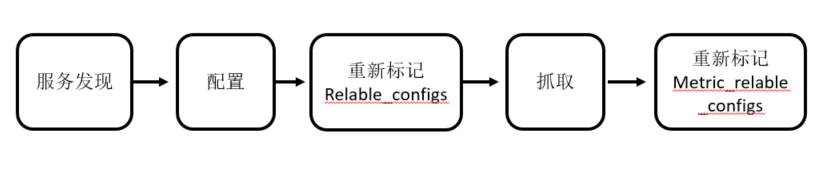

## 文档

> [官网文档](https://prometheus.io/docs/prometheus/latest/configuration/configuration/#relabel_config)

##### 作用

```
自定义标签，通过标签可以进行查询过滤
当 Prometheus 加载 Target 实例完成后, 这些 Target 时候都会包含一些默认的标签
	instance: __address__
```

##### 标签

```
__address__			当前Target实例的访问地址<host>:<port>
__scheme__			采集目标服务访问地址的HTTP Scheme，HTTP或者HTTPS
__metrics_path__	采集目标服务访问地址的访问路径
__param_<name>		采集任务目标服务的中包含的请求参数
__name__			此标签是标识指标名称的预留标签。
```

## 数据抓取过程



##### 服务发现

```
1. 在每个 scrape_interval 期间, Prometheus 都会检测执行的作业, 生成目标列表, 其中包含一组称为"元数据"的标签, 这些标签以 __meta__ 为前缀, 每个服务发现的机制都有不同的元数据

2. 服务发现还会根据目标的配置来设置其他的标签, 这些标签都以__为前缀和后缀，包括__scheme__, __address__ 和 __metric_path__. 

3. 有些标签在 Prometheus 界面中看不到, 因为在生命周期的后期被删除.
```

##### 抓取过程

```

```

##### 标签

```

```

##### 默认标签

```
```


## relabel_configs

##### 关键字

| 字段          | 类型           | 说明                                   |
| ------------- | -------------- | -------------------------------------- |
| action        |                | 执行的动作                             |
| source_labels | [<labelname>,] | 需要进行匹配的原标签, 多个用分隔符分割 |
| regex         |                | 使用正则去匹配 source_labels 中的标签  |
| replacement   |                | 对某一部分进行操作                     |
| target_label  |                | regex 规则匹配到的标签放到这里         |
| labels        |                | 自定义标签, key: value                 |

##### action 关键字选项

| relabel_action | 说明                                                         |
| -------------- | ------------------------------------------------------------ |
| replace        | 默认. <br />根据 regex 的配置匹配 source_labels 标签的值, 匹配到的值写入 target_label. 如果有多个匹配组，则可以使用 ${1}, ${2} 确定写入的内容。如果没匹配到任何内容则不对 target_label 进行重写 |
| keep           | 对 Target 实例过滤, 保留 source_labels 符合 regex 的实例     |
| drop           | 对 Target 实例过滤, 丢弃 source_labels 符合 regex 的实例     |
| labelkeep      | 对 Target 的标签进行过滤，保留 source_labels 符合 regex 的标签 |
| labeldrop      | 对 Target 的标签进行过滤，丢弃 source_labels 符合 regex 的标签 |
| hashmod        | 将 target_label 设置为关联的 source_label 的哈希模块删除指标. 如不想监控某个target可以用drop删除 |
| labelmap       | 改标签名称                                                   |

##### 示例 - 直接配置

```yml
global:
  scrape_interval: 2s
  evaluation_interval: 2s

alerting:
  alertmanagers:
    - static_configs:
        - targets:
            - '127.0.0.1:9093'
rule_files:
  - 'rules/*.yml'

scrape_configs:
  - job_name: 'gonglongfei'
    metrics_path: '/metrics'
    static_configs:
      - targets:
          - 'localhost:9100'
        labels:
          my_name: 'name001'
          owner: '宫龙飞'
          nodename: '哈哈11111'

```

##### 示例 - consul

```yml
global:
  scrape_interval: 2s
  evaluation_interval: 2s

alerting:
  alertmanagers:
    - static_configs:
        - targets:
            - '127.0.0.1:9093'
rule_files:
  - 'rules/*.yml'

scrape_configs:
  - job_name: node_status
    consul_sd_configs:
      - server: 'localhost:8500'
    relabel_configs:
      - source_labels:
          - __meta_consul_tags
        regex: .*node.*
        action: keep
      - regex: __meta_consul_service_metadata_(.+)
        action: labelmap

```


```yml
scrape_configs:
  - job_name: web_node
    metrics_path: /metrics
    scheme: http
    static_configs:
      - targets:
          - '10.160.2.107:9100'
          - '192.168.1.100:9100'     
        labels: # 自定义标签
          server: nginx # 将上面2个主机打上 server 标签，值为 nginx
          
  - job_name: mysql_node
    static_configs:
      - targets:
          - '10.160.2.110:9100'
          - '192.168.1.111:9100'
    metric_relable_configs: #声明要重命名标签
      - action: replace #指定动作，replace代表替换标签，也是默认动作
        source_labels: #指定需要被action所操作的原标签
          - job
        regex: (.*) #原标签里的匹配条件，符合条件的原标签才会被匹配，支持正则
        replacement: $1 #原标签需要被替换的部分，$1代表regex正则的第一个分组
        target_label: idc #将$1内容赋值给idc标签
      - action: drop #正则匹配要删除标签
        regex: 192.168.100.* #正则匹配标签值
        source_labels: #需要进行正则匹配的原标签
          - __address__
      - action: labeldrop #直接删除标签
        regex: job #直接写标签名即可
```

## metric_relabel_configs

> target 指标采集前和采集中的筛选

##### 功能

```
metric_relabel_configs是针对指标采集后的筛选

存储数据之前可以使用 metric_relabel_configs 重新标记
```

