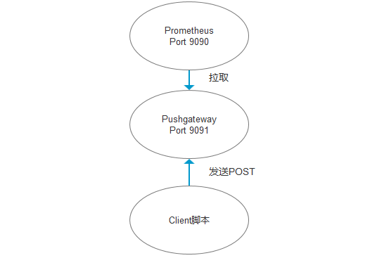
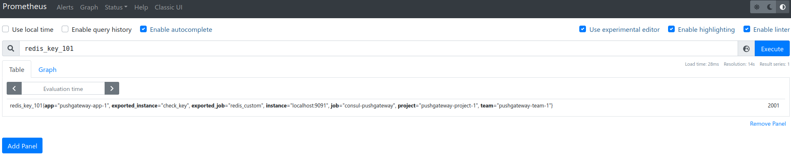

##### 参考

```
https://www.cnblogs.com/zqj-blog/p/11024834.html
https://www.cnblogs.com/zqj-blog/p/11106724.html

Prometheus+Consul服务自动发现监控
https://zhuanlan.zhihu.com/p/92454378
```

## 概述



##### pushgateway 作用

```
1. grafana 结合 prometheus 提供了大量的模板, 但是有些特殊的指标还是没能提供, 需要自定义监控项
2. prometheus 默认采用 pull 模式，由于不在一个网络或者防火墙的问题，导致 prometheus 无法拉取各个节点的数据
3. 监控业务数据时，需要将不同数据汇总，然后由 prometheus 统一收集
```

##### pushgateway 缺陷

```
1. 多个节点的数据汇总到pushgateway，当它宕机后影响很大
2. pushgateway可以持续化推送所有的监控数据，即使监控已经下线，还会获取旧的监控数据。需手动清理不需要的数据
3. 重启后数据丢失
```

##### 特点

```
1. pushgateway 并不是将 Prometheus 的 pull 改成了 push, 它只是允许用户向他推送指标信息, 作为一个中间组件收集外部 push 来的数据指标，prometheus会定时从 pushgateway 上pull数据. 
2. Prometheus 每次从 pushgateway拉取的数据并不是期间用户推送上来的所有数据，而是client端最后一次push上来的数据。
3. 如果client一直没有推送新的指标到 pushgateway，那么Prometheus获取到的数据是client最后一次push的数据，直到指标消失（默认5分钟）
4. pushgateway 默认不持久化数据, 重启后数据丢失. 可以设置为持久化一段时间


注意:
    如果使用相同的job名 ，后面插入的数据会覆盖掉之前的
    指标值只能是数字类型，非数字类型报错
    指标值支持最大长度为 16 位，超过16 位后默认置为 0
```

## 安装

##### 安装

```bash
github
https://github.com/prometheus/pushgateway/releases

$ wget https://github.com/prometheus/pushgateway/releases/download/v1.4.1/pushgateway-1.4.1.linux-amd64.tar.gz
```

##### 启动

```
./pushgateway

./pushgateway --persistence.file="pg_file" --persistence.interval=1m
    --persistence.file 持久化文件, 默认不持久化
    --persistence.interval 数据保存的时间, 默认5m
    
    
./pushgateway --persistence.file="pg_file" --persistence.interval=1m --log.level=debug 
```

##### pushgateway_conf.conf

````
[program:pushgateway]
directory=/opt/pushgateway-1.4.1.linux-amd64
command=/opt/pushgateway-1.4.1.linux-amd64/pushgateway --persistence.file=/opt/pushgateway-1.4.1.linux-amd64/pg_file --persistence.interval=1m
autostart=false
autorestart=false
user=glfadd
log_stdout=true
log_stderr=true
redirect_stderr = true
stdout_logfile_maxbytes = 20MB
stdout_logfile_backups = 20     
stdout_logfile = /opt/logs/supervisord_pushgateway.log
````

##### web UI

```
http://localhost:9091/
```

## 配置

##### prometheus.yml

```
scrape_configs:
  - job_name: pushgateway
    scrape_interval: 30s
    honor_labels: true
    static_configs:
      - targets:
          - 'localhost:9091'
        labels:
          instance: pushgateway
```

##### curl 添加数据

- url 格式

  ```
  http://localhost:9091/metrics/job/<JOBNAME>/<LABEL_NAME>/<LABEL_VALUE>
  ```

- 在被监控的机器上向 pushgateway 发送一条消息, "test 123", 名称 test, 指标 123

  ```
  echo "each_lab 222.2" | curl --data-binary @- http://localhost:9091/metrics/job/each_job11
  ```
  
- 发送的数据设置标签

  ```
  echo "test3 123" | curl --data-binary @- http://localhost:9091/metrics/job/test30/abc/lable30
  
  echo "find001 123" | curl --data-binary @- http://localhost:9091/metrics/job/find1/abc/find_lable
  ```
  
- 发送 counter 类型

  ```
  cat <<EOF | curl --data-binary @- http://localhost:9091/metrics/job/test4/instance/label4
      # TYPE test4 counter
      test4{name="cadvisor"} 33.41
      test4{name="nginx"} 331
      test4{name="abc"} 332
  EOF
  ```

- 发送 gauage 类型

  ```
  cat <<EOF | curl --data-binary @- http://localhost:9091/metrics/job/test5/instance/label5
      # TYPE test5 gauge
      # HELP test5 time sec
      test5{name="nginx"} 22
      test5{name="cadvisor"} 22
      test5{name="bbc"} 22
  EOF
  ```

- 发送写在文件中的数据

  - aaa 文件

    ```
    # TYPE test6 gauge
    # HELP test6 time sec
    test6{name="nginx"} 22
    test6{name="cadvisor"} 22
    test6{name="bbc"} 22
    ```

  - 命令

    ```
    curl --data-binary "@aaa" http://localhost:9091/metrics/job/test6/instance/label6
    ```

##### 删除数据

```
curl -X DELETE http://localhost:9091/metrics/job/test5/instance/label5


????? 这个没效果, 以后找原因
curl -X DELETE http://localhost:9091/metrics/job/test6
```

##### python 脚本

- 依赖库

  ```
  pip install prometheus_client
  ```

- push_to_gateway 发送数据

  ```python
  from prometheus_client import CollectorRegistry, Gauge, push_to_gateway
  
  # 指标收集器, 将多个指标收集到这里, 发送的消息的时候发送这个指标收集器
  registry = CollectorRegistry()
  
  # 指标名称, 注释, 标签, 指标收集器
  g = Gauge('ping', '检测最大响应时间', ['dst_ip', 'city'], registry=registry)
  g.labels('192.168.1.10', 'shenzhen').set(42.2)  # set设定值
  g.labels('192.168.1.11', 'shenzhen').dec(2)  # dec递减2
  g.labels('192.168.1.12', 'shenzhen').inc()  # inc递增，默认增1
  push_to_gateway('localhost:9091', job='ping_status', registry=registry)
  ```
  
- requests 调用 api 发送

  ```python
  import requests
  from prometheus_client import CollectorRegistry, Gauge, generate_latest
  
  # 自定义指标必须利用CollectorRegistry进行注册, 可以注册多个指标
  REGISTRY = CollectorRegistry(auto_describe=False)
  
  # 注册指标
  num1 = Gauge("num1_kou", "指标1", ["l1", 'l2', 'instance'], registry=REGISTRY)
  num2 = Gauge("num2_kou", "指标2", ["l1", 'l2', 'instance'], registry=REGISTRY)
  
  # 设置指标的值
  num1.labels(l1="label1", l2="label2", instance="windows1").inc(3)
  num2.labels(l1="label1", l2="label2", instance="windows1").inc(5)
  
  # 发送消息
  requests.post("http://localhost:9091/metrics/job/test8/", data=generate_latest(REGISTRY))
  ```

## 实例

##### redis 自定义 python 脚本 shell

```python
import os

key = 'key_1'

command = """
cat <<EOF | curl --data-binary @- http://localhost:9091/metrics/job/redis_custom/instance/check_key
    # HELP redis_key_101 监控 redis key 的长度
    # TYPE redis_key_101 gauge
    redis_key_101 2001
EOF
"""
os.system(command)
```



