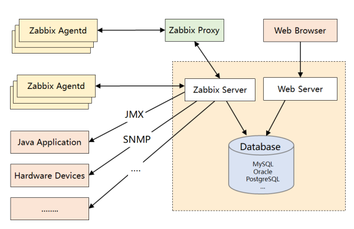

```
下面是 Zabbix 的优势：

产品成熟：由于诞生时间长且使用广泛，拥有丰富的文档资料以及各种开源的数据采集插件，能覆盖绝大部分监控场景。
采集方式丰富：支持 Agent、SNMP、JMX、SSH 等多种采集方式，以及主动和被动的数据传输方式。
较强的扩展性：支持 Proxy 分布式监控，有 Agent 自动发现功能，插件式架构支持用户自定义数据采集脚本。
配置管理方便：能通过 Web 界面进行监控和告警配置，操作方便，上手简单。
下面是 Zabbix 的劣势：

性能瓶颈：机器量或者业务量大了后，关系型数据库的写入一定是瓶颈，官方给出的单机上限是 5000 台，个人感觉达不到，尤其现在应用层的指标越来越多。虽然最新版已经开始支持时序数据库，不过成熟度还不高。
应用层监控支持有限：如果想对应用程序做侵入式的埋点和采集(比如监控线程池或者接口性能)，Zabbix 没有提供对应的 SDK，通过插件式的脚本也能曲线实现此功能，个人感觉 Zabbix 就不是做这个事的。
数据模型不强大：不支持 Tag，因此没法按多维度进行聚合统计和告警配置，使用起来不灵活。
方便二次开发难度大：Zabbix 采用的是 C 语言，二次开发往往需要熟悉它的数据表结构，基于它提供的 API 更多只能做展示层的定制。
```


##### 监控流程

```
1.数据采集:Zabbix通过SNMP、Agent、ICMP、SSH、IPMI等对系统进行数据采集
2.数据存储:Zabbix存储在MySQL上，也可以存储在其他数据库服务
3.数据分析:当我们事后需要复盘分析故障时，zabbix能给我们提供图形以及时间等相关信息，方面我们确定故障所在。
4.数据展示:web界面展示、(移动APP、java_php开发一个web界面也可以)
5.监控报警:电话报警、邮件报警、微信报警、短信报警、报警升级机制等
6.报警处理:当接收到报警，我们需要根据故障的级别进行处理，比如:重要紧急、重要不紧急，等。根据故障的级别，配合相关的人员进行快速处理。
```

##### 优点

```
产品成熟：由于诞生时间长且使用广泛，拥有丰富的文档资料以及各种开源的数据采集插件，能覆盖绝大部分监控场景。
采集方式丰富：支持 Agent、SNMP、JMX、SSH 等多种采集方式，以及主动和被动的数据传输方式。
较强的扩展性：支持 Proxy 分布式监控，有 Agent 自动发现功能，插件式架构支持用户自定义数据采集脚本。
配置管理方便：能通过 Web 界面进行监控和告警配置，操作方便，上手简单。
```

##### 缺点

```
性能瓶颈：机器量或者业务量大了后，关系型数据库的写入一定是瓶颈，官方给出的单机上限是 5000 台，个人感觉达不到，尤其现在应用层的指标越来越多。虽然最新版已经开始支持时序数据库，不过成熟度还不高。
应用层监控支持有限：如果想对应用程序做侵入式的埋点和采集(比如监控线程池或者接口性能)，Zabbix 没有提供对应的 SDK，通过插件式的脚本也能曲线实现此功能，个人感觉 Zabbix 就不是做这个事的。
数据模型不强大：不支持 Tag，因此没法按多维度进行聚合统计和告警配置，使用起来不灵活。
方便二次开发难度大：Zabbix 采用的是 C 语言，二次开发往往需要熟悉它的数据表结构，基于它提供的 API 更多只能做展示层的定制。
```

##### 适用场景

```
可以监控服务器，路由器，交换机
```

## 组件

##### 架构图



##### Zabbix Server

```
由C语言编写，主要负责接收Agent发送的监控信息，并进行汇总存储, 将收集的监控数据存储到 Zabbix Database 中

作用
    1. 设备注册: 手动配置Agent地址, 自动发现机制
    2. 数据收集: 主动收集和被动接收, 采集到数据首先会被放置在内存中，然后被批量保存在数据库中
    3. 定期的数据清理和告警触发。
```

##### Zabbix Database

```
用于存储配置信息以及收集的监控数据, 后端数据库支持MySQL，PostgreSQL，Oracle等
并提供Zabbix Web页面的数据查询方式
由于采用关系型数据库存储时序数据，所以Zabbix在监控大规模集群时常常在数据存储方面捉襟见肘 (什么时候开始支持时序数据库)
```

##### Web Server

```
Zabbix的GUI组件，由PHP编写. 通常于Server运行在同一台主机上。提供监控数据的展现和系统配置，主要配置包括监控模板，告警等。
```

##### Zabbix Proxy

```
主要解决两个问题
	Server和Agent之间网络不通。
	大规模部署时减轻Server的压力。
```

##### Zabbix Agent

```
部署在被监控主机上，主动或被动收集本地数据并发往Server端或Proxy端，Agent端会启动一个Agentd的守护进程。
```


