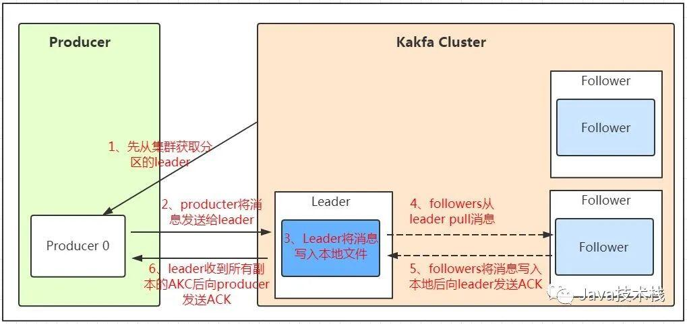

>Peer-to-Peer (Queue): 简称PTP队列模式，也可以理解为点到点
>
>P-T-P模式和发布/订阅模式

##### 作用

```
消息中间件: 解耦消息的生产和消费, 缓冲, 异步
```

## 组件


```
1. 每个消费者都一个消费者组
2. 一条消息每个消费者组只能消费一次, 可以被不同消费者组消费
```

##### Broker

```
安装了 kafka 服务的机器可以看做是一个 broker
```

##### 偏移量

```
由消费自由者控制的, 如重置之前的偏移量来处理之前的数据, 或者从最新的偏移量开始消费
```

##### topic

```
消息主题
每个 topic 可以拆分成多个 partition
```

##### partitions 分区

```
1. 分区的副本中的记录每个都按顺序的分配一个ID号，称之为偏移量，在整个Partition中具有唯一性
2. 分区的设计使得 Kafka 消息的读写性能可以突破单台 broker 的 I/O 性能瓶颈
3. 分区的副本分为 leader 副本(只有一个)和 follower (多个)副本, 如果一个分区的 leader 副本不可用, Kafka 会从 follower 副本中选举出一个新的 leader 副本. 一般把不同分区的 leader 副本均匀地分配到集群的不同 broker 节点上
4. 只有 leader 副本对外提供读写服务, follower 副本只提供数据的可恢复性 
5. 可以在创建主题的时候指定分区数, 也可以在主题创建完成之后去修改分区数, 通过增加分区数可以实现水平扩展. 但是要注意，分区数也不是越多越好，一般达到某一个阈值之后，再增加分区数性能反而会下降，具体阈值需要对Kafka集群进行压测才能确定
6. 生产者在指定主题发送消息的时候, Kafka 会将消息分发至不同的分区, 如果这些分区不在同一个 broker 上, 就相当于并发的写入多台broker, 性能比写入单台 broker 高
7. 消费组里起多个消费者，每个消费者消费一个分区，这样就提高了消费者的性能
```


- 生产者在向kafka集群发送消息的时候，可以通过指定分区来发送到指定的分区中. 也可以通过指定均衡策略来将消息发送到不同的分区中. 如果不指定，就会采用默认的随机均衡策略，将消息随机的存储到不同的分区中
- 单一主题中的分区有序，但是无法保证主题中所有的分区有序


- partition会实际存储在系统的摸个目录
- 为了做到均匀分布，通常partition的数量通常是Broker Server数量的整数倍.
- 分区的作用是做负载，提高kafka的吞吐量。同一个topic在不同的分区的数据是不重复的，partition的表现形式就是一个一个的文件夹

Kafka实现单播和广播两种消息模型的手段。


##### Consumer Offset

```
是一个不断递增的整数值，用来记录消费者发生重平衡时的位置，以便用来恢复数据
```

##### User group

```
所有 usergroup 中的 consumer 使用一套 offset
```

##### Message

```
每一条发送的消息主体
```

##### 消息队列通信的模式

- 点对点模式

- 发布订阅模式
  - 这个模式的问题: 

##### 发布订阅模式推送速度问题


- 由于是消费者被动接收推送，所以无需感知消息队列是否有待消费的消息. 但是consumer1、consumer2、consumer3由于机器性能不一样，所以处理消息的能力也会不一样，但消息队列却无法感知消费者消费的速度
  - 假设三个消费者处理速度分别是8M/s、5M/s、2M/s，如果队列推送的速度为5M/s，则consumer3无法承受. 如果队列推送的速度为2M/s，则consumer1、consumer2会出现资源的极大浪费

## 发送数据过程



##### 如何不丢数据

```
通过ACK应答机制, 在生产者向队列写入数据的时候可以设置参数来确定是否确认kafka接收到数据，这个参数可设置的值为0、1、all。

0代表producer往集群发送数据不需要等到集群的返回，不确保消息发送成功。安全性最低但是效率最高。

1代表producer往集群发送数据只要leader应答就可以发送下一条，只确保leader发送成功。

all代表producer往集群发送数据需要所有的follower都完成从leader的同步才会发送下一条，确保leader发送成功和所有的副本都完成备份。安全性最高，但是效率最低。

如果往不存在的topic写数据, kafka会自动创建topic，分区和副本的数量根据默认配置都是1
```

## 数据保存

##### Partition 结构

- Partition 在服务器上的表现形式就是一个一个的文件夹
- 每个 partition 的文件夹下面会有多组 segment 文件
- 每组 segment 三个文件: 
  - log 文件实际是存储message,
  - index  偏移量索引文件
  - timeindex 时间戳索引文件
- 每个log文件的大小是一样的
- 文件的命名是以该 segment 最小 offset 来命名的
- kafka 利用 分段 + 索引 的方式来提高查找效率


##### LogSegment 分段日志

- 为了防止 log 过大, 将日志切分成多个日志分段
- 向日志中追加消息是顺序写入
- 只有最后一个日志分段才能执行写入操作，之前所有的日志分段都不能写入数据
- 每个日志分段都有一个基准偏移量 baseOffset 用来表示当前日志分段中第一条消息的 offset
- index 文件中的偏移量和 timeindex 文件中的时间戳都是单调递增的, 查询使用二分查找. 

##### message 结构

```
1. offset：offset是一个占8byte的有序id号，它可以唯一确定每条消息在parition内的位置
2. 消息大小：消息大小占用4byte，用于描述消息的大小。
3. 消息体：消息体存放的是实际的消息数据（被压缩过），占用的空间根据具体的消
4. Kafka 消息持久化到硬盘, 无论该消息是否被消费，发布记录都会被Kafka保留到硬盘当中，可以设置保留期限
```

##### 消息删除策略

```
1. 基于时间，默认配置是168小时（7天）。
2. 基于大小，默认配置是1073741824. 
3. kafka读取特定消息的时间复杂度是O(1)，所以这里删除过期的文件并不会提高kafka的性能
```

## 消费数据

- 消费者在拉取消息的时候也是找leader去拉取
- 多个消费者可以组成一个消费者组, 每个消费者组都有一个组id, 同一个消费组者的消费者可以消费同一topic下不同分区的数据，但是不会组内多个消费者消费同一分区的数据
- 多出来的消费者不消费任何partition的数据。所以在实际的应用中，建议消费者组的consumer的数量与partition的数量一致

```
查找一个offset为368801的message是什么样的过程呢
作者：D糊涂小天才z
https://www.bilibili.com/read/cv8517619/
出处： bilibili
```

##### 查找offset为368801的message过程


```
这套机制是建立在offset为有序的基础上，利用segment+有序offset+稀疏索引+二分查找+顺序查找等多种手段来高效的查找数据

1. 利用二分法查找找到offset的368801message所在的segment文件(这里找到的就是在第二个segment文件)

2. 打开找到的segment中的.index文件（也就是368796.index文件，该文件起始偏移量为368796+1，我们要查找的offset为368801的message在该index内的偏移量为368796+5=368801，所以这里要查找的相对offset为5）。由于该文件采用的是稀疏索引的方式存储着相对offset及对应message物理偏移量的关系，所以直接找相对offset为5的索引找不到，这里同样利用二分法查找相对offset小于或者等于指定的相对offset的索引条目中最大的那个相对offset，所以找到的是相对offset为4的这个索引。

3. 根据找到的相对offset为4的索引确定message存储的物理偏移位置为256。打开数据文件，从位置为256的那个地方开始顺序扫描直到找到offset为368801的那条Message
```

##### 消费者记录各自消费的位置

```
在早期的版本中，消费者将消费到的offset维护zookeeper中，consumer每间隔一段时间上报一次，这里容易导致重复消费，且性能不好

在新的版本中消费者消费到的offset已经直接维护在kafk集群的_consumeroffsets这个topic中
```


```
主题, 消息
主题, key, 消息
主题, 分区, key, 消息
```

