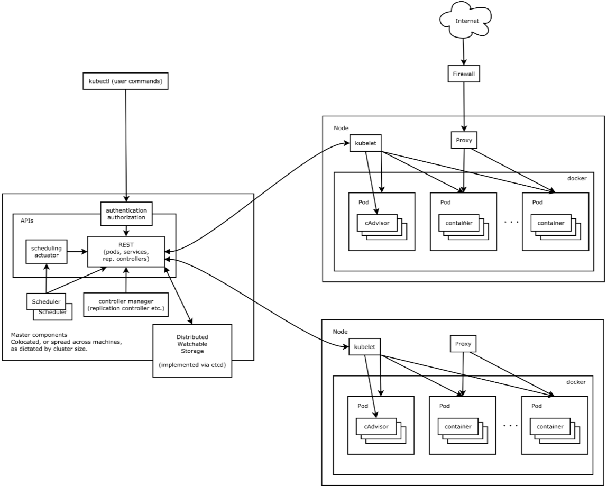
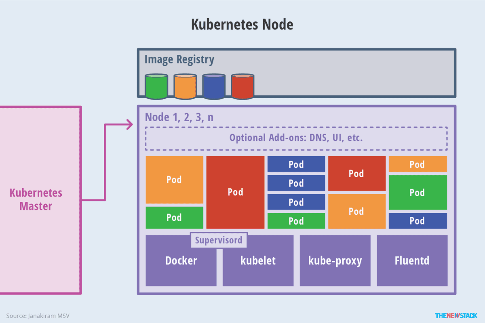

```
https://blog.csdn.net/zzq900503/article/details/80668686

https://zhuanlan.zhihu.com/p/96908130
https://www.cnblogs.com/wwchihiro/p/9261607.html
```

##### 是什么

```
Kubernetes 是一个docker集群的管理工具, 在Docker技术的基础上，为容器化的应用提供部署运行、资源调度、服务发现和动态伸缩、高可用等一系列完整功能，提高了大规模容器集群管理的便捷性
```

##### 特点

```
1、可移植: 支持公有云，私有云，混合云，多重云（multi-cloud）
2、可扩展: 模块化, 插件化, 可挂载, 可组合
3、自动化: 自动部署，自动重启，自动复制，自动伸缩/扩展
4、快速部署应用，快速扩展应用
5、无缝对接新的应用功能
6、节省资源，优化硬件资源的使用
```

##### 架构图



##### k8s node



| 组件               | 说明                                                         |
| ------------------ | ------------------------------------------------------------ |
| etcd               | 存储集群状态                                                 |
| apiserver          | 提供了资源操作的唯一入口，并提供认证、授权、访问控制、API注册和发现等机制 |
| controller manager | 负责维护集群的状态，比如故障检测、自动扩展、滚动更新等       |
| scheduler          | 负责资源的调度，按照预定的调度策略将Pod调度到相应的机器上    |
| kubelet            | 负责维护容器的生命周期，同时也负责Volume（CVI）和网络（CNI）的管理 |
| Container runtime  | 负责镜像管理以及Pod和容器的真正运行（CRI）                   |
| kube-proxy         | 负责为Service提供cluster内部的服务发现和负载均衡             |
| node               | 职责是运行容器应用。Node 由 Master 管理，Node 负责监控并汇报容器的状态，并根据 Master 的要求管理容器的生命周期。Node 运行在 Linux 操作系统，可以是物理机或者是虚拟机 |
| pod                | 是 Kubernetes 的最小工作单元。每个 Pod 包含一个或多个容器。Pod 中的容器会作为一个整体被 Master 调度到一个 Node 上运行。pod为docker创建的一个容器 |
| kubectl            | 用于对 Kubernetes 下命令, 它通过 APIServer 去调用各个进程来完成对 Node 的部署和控制 |
| Add-on             | 是对Kubernetes核心功能的扩展                                 |
| endpoint           | 用于管理网络请求                                             |
| repliceation       | 用于伸缩副本数量                                             |

##### Add-ons

| 插件                  | 说明                         |
| --------------------- | ---------------------------- |
| kube-dns              | 负责为整个集群提供DNS服务    |
| Ingress Controller    | 为服务提供外网入口           |
| Heapster              | 提供资源监控                 |
| Dashboard             | 提供GUI                      |
| Federation            | 提供跨可用区的集群           |
| Fluentd-elasticsearch | 提供集群日志采集、存储与查询 |


## kubernetes 相关概念

```
每个 Kubernetes 集群都由一个 Master 负责管理和控制集群节点, 通过 Master 对每个节点 Node 发送命令
Node 可以是一台机器或者一台虚拟机。
在 Node 上面可以运行多个 Pod，
Pod 是 Kubernetes 管理的最小单位，
每个 Pod 可以包含多个容器（Docker）


```

##### Kubernetes Master

```
1. 集群控制节点, 每个 K8s 集群里需要有一个 master 节点负责整个集群的管理和控制


```


##### Pod

```
Pod是最小部署单元，一个Pod由一个或多个容器组成，Pod中容器共享存储和网络，在同一台Docker主机上运行。
每个Pod都会包含一个 “根容器”，还会包含一个或者多个紧密相连的业务容器。 
```

##### 标签和选择器

```
Kubernetes 客户端将称为“标签”的键值对附加到系统中的任何API对象，如pod和节点。相应地，“标签选择器”是针对匹配对象的标签的查询。

标签和选择器是Kubernetes中的主要分组机制，用于确定操作适用的组件。

例如，如果应用程序的Pods具有系统的标签 tier ("front-end", "back-end", for example) 和一个 release_track ("canary", "production", for example)，那么对所有"back-end" 和 "canary" 节点的操作可以使用如下所示的标签选择器：
tier=back-end AND release_track=canary 
```

##### 控制器

```
控制器是将实际集群状态转移到所需集群状态的对帐循环。它通过管理一组pod来实现。一种控制器是一个“复制控制器”，它通过在集群中运行指定数量的pod副本来处理复制和缩放。如果基础节点出现故障，它还可以处理创建替换pod。

其它控制器，是核心Kubernetes系统的一部分包括一个“DaemonSet控制器”为每一台机器（或机器的一些子集）上运行的恰好一个pod，和一个“作业控制器”用于运行pod运行到完成，例如作为批处理作业的一部分。控制器管理的一组pod由作为控制器定义的一部分的标签选择器确定。
```

## 核心组件

