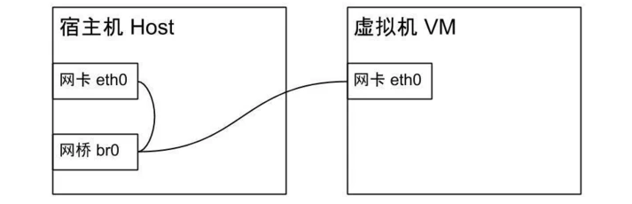
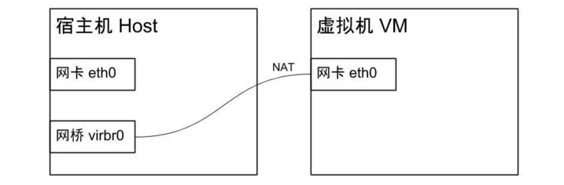

##### 参考

```
https://www.cnblogs.com/spec-dog/p/11178181.html
```

##### 桥接模式



- 在桥接模式下，宿主机和虚拟机共享同一个物理网络设备，虚拟机中的网卡和物理机中的网卡是平行关系，所以虚拟机可以直接接入外部网络，虚拟机和宿主机有平级的IP
- 原本宿主机是通过网卡eth0连接外部网络的，网桥模式会新创建一个网桥br0，接管eth0来连接外部网络，然后将宿主机和虚拟机的网卡eth0都绑定到网桥上

##### NAT模式



- NAT模式 (Network Address Translation) 是 KVM 默认的网络模式，KVM会创建一个名为 virbr0 的虚拟网桥，但是宿主机和虚拟机对于网桥来说不是平等的了，网桥会把虚拟机藏在背后，虚拟机会被分配一个内网 IP，而从外网访问不到虚拟机

##### 安装 - ubuntu

- 安装 kvm-ok 工具

  ```bash
  $ apt-get install cpu-checker
  ```

- 确定服务器是否能够运行硬件加速的 KVM 虚拟机, 如果处理器虚拟化能力没有在 BIOS 中被禁用, 则有如下输出

  ```bash
  $ kvm-ok
  INFO: /dev/kvm exists
  KVM acceleration can be used
  ```

- 验证处理器支持硬件虚拟化, 如果CPU支持硬件虚拟化, 0表示CPU不支持硬件虚拟化, 重启进入BIOS设置中启用VT技术

  ```bash
  $ grep -Eoc '(vmx|svm)' /proc/cpuinfo
  16
  ```

- 安装

  ```bash
  $ apt-get install qemu-kvm libvirt-daemon-system libvirt-clients bridge-utils virtinst virt-manager
      qemu-kvm: KVM管理程序提供硬件仿真的软件。
      libvirt-daemon-system: libvirt守护程序作为系统服务运行的配置文件。
      libvirt-clients: 管理虚拟化平台的软件。
      bridge-utils: 配置以太网桥的命令行工具。
      virtinst: 创建虚拟机的命令行工具。
      virt-manager: GUI界面和支持命令行工具，用于通过libvirt管理虚拟机。
  ```

- 验证安装是否成功

  ```bash
  $ systemctl is-active libvirtd
  active
  ```

- 普通用户添加到 libvirt 和 kvm 组中

  ```bash
  $ sudo usermod -aG libvirt $USER
  $ sudo usermod -aG kvm $USER
  ```

- 命令

  ```bash
  $ systemctl start libvirtd.service
  $ systemctl enable libvirtd.service
  ```

##### 安装 - centos

- 安装

  ```bash
  $ yum install qemu-kvm libvirt virt-install bridge-utils
  ```

- 查看安装状态

  ```bash
  $ lsmod |grep kvm
  kvm_intel             299008  0
  kvm                   892928  1 kvm_intel
  irqbypass              16384  1 kvm
  ```

- 启动服务

  ```bash
  $ systemctl start libvirtd
  $ systemctl status libvirtd
  ```

##### 网络设置

```bash
列出当前网桥及其连接的接口
 $ brctl show
bridge name	bridge id		STP enabled	interfaces
br-631c35d5c67a		8000.0242d978c102	no		
docker0		8000.0242cd9cb658	no		
virbr0		8000.525400ff5975	yes
```

##### 安装虚拟机

```bash
$ virt-install --name=centos101 --memory=1000,maxmemory=1000 --vcpus=1,maxvcpus=1 --os-type=linux --os-variant=rhel7 --location=/home/glfadd/software/CentOS-7-x86_64-DVD-2009.iso --disk path=/opt/kvm/centos101_image.img,size=15 --bridge=virbr0 --graphics=none --console=pty,target_type=serial --extra-args="console=tty0 console=ttyS0"


–name指定虚机名称
–memory=16384,maxmemory=16384配置了16G内存
–vcpus=4,maxvcpus=4配置了4个CPU内核
centos7需要制定–os-variant=rhel7；–disk path=xx,size=300制定了磁盘路径与大小，这里是300G。
```

##### 命令

- 列出当前运行的虚拟机

  ```bash
  $ virsh list --all
   Id    Name                           State
  ----------------------------------------------------
   -     centos101                      shut off
  ```

- 开始虚拟机

  ```bash
  $ virsh start centos101
  $ virsh shutdown centos101
  $ virsh edit centos101
  ```

- 删除

  ```bash
  $ virsh undefine centos101
  $ virsh undefine centos101 --managed-save
  ```

  


