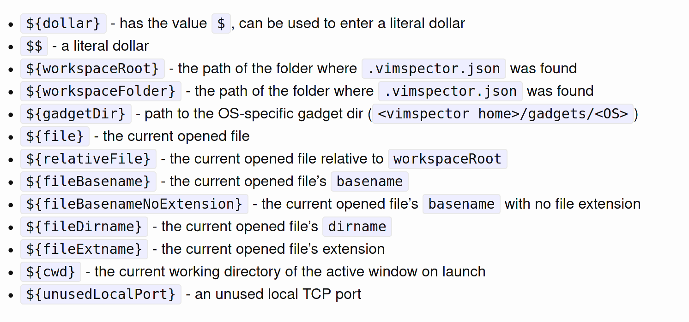

# vim plug

> [github](https://github.com/junegunn/vim-plug)

##### install

```bash
$ sh -c 'curl -fLo "${XDG_DATA_HOME:-$HOME/.local/share}"/nvim/site/autoload/plug.vim --create-dirs https://raw.githubusercontent.com/junegunn/vim-plug/master/plug.vim'
```

##### setting

```
call plug#begin('~/.vim/plugged')

call plug#end()
```

##### 命令

| Command                             | Description                                                  |
| ----------------------------------- | ------------------------------------------------------------ |
| `PlugInstall [name ...] [#threads]` | Install plugins                                              |
| `PlugUpdate [name ...] [#threads]`  | Install or update plugins                                    |
| `PlugClean[!]`                      | Remove unlisted plugins (bang version will clean without prompt) |
| `PlugUpgrade`                       | Upgrade vim-plug itself                                      |
| `PlugStatus`                        | Check the status of plugins                                  |
| `PlugDiff`                          | Examine changes from the previous update and the pending changes |
| `PlugSnapshot[!] [output path]`     | Generate script for restoring the current snapshot of the plugins |

##### PlugInstall 安装失败

```
修改 /home/glfadd/.vim/autoload/plug.vim

1. 将
let fmt = get(g:, 'plug_url_format', 'https://git::@github.com/%s.git')
改为
let fmt = get(g:, 'plug_url_format', 'https://git::@github.com.cnpmjs.org/%s.git')


2. 将
\ '^https://git::@github\.com', 'https://github.com', '')
改为
\ '^https://git::@github.com.cnpmjs\.org', 'https://github.com.cnpmjs.org', '')
```

# packer.nvim

> [github](https://github.com/wbthomason/packer.nvim)

##### install

```bash
$ git clone --depth 1 https://github.com/wbthomason/packer.nvim ~/.local/share/nvim/site/pack/packer/start/packer.nvim
```

##### setting

创建文件 `/.config/nvim/lua/plugins.lua`

```
return require('packer').startup(function()
  -- Packer can manage itself
  use 'wbthomason/packer.nvim'
end)
```

##### 命令

```
-- Regenerate compiled loader file
:PackerCompile

-- Remove any disabled or unused plugins
:PackerClean

-- Clean, then install missing plugins
:PackerInstall

-- Clean, then update and install plugins
:PackerUpdate

-- Perform `PackerUpdate` and then `PackerCompile` ( 安装 / 更新)
:PackerSync

-- Loads opt plugin immediately
:PackerLoad completion-nvim ale
```

# 依赖

> [homepage](https://www.nerdfonts.com/)
>
> [devicons](https://github.com/vorillaz/devicons)

##### devicons 字体

- mac

  ```bash
  $ brew tap homebrew/cask-fonts
  $ brew install --cask font-hack-nerd-font
  
  
  在终端中选择安装的字体, 字体的名字包含 "Nerd"
  ```

- ubuntu

  ```
  
  ```

- Centos / fedora

  ```
  
  ```

```
https://github.com/webinstall/webi-installers/tree/main/nerdfont


https://webinstall.dev/nerdfont/


```


##### node.js 支持

- 安装 yarn

  - fedora / centos

    ```bash
    $ curl -sL https://dl.yarnpkg.com/rpm/yarn.repo -o /etc/yum.repos.d/yarn.repo
    $ dnf install yarn
    ```

  - ubuntu

    ```bash
    $ aptitude install dnf
    ```

- 设置

  ```bash
  $ npm install -g neovim
  ```

##### clipboard 支持

Vim 与系统共用剪切板

查看帮助信息

```
:help clipboard
```

安装

```bash
$ aptiotude install xsel
```

# coc

> [github](https://github.com/neoclide/coc.nvim)
>
> [文档](https://github.com/neoclide/coc.nvim/wiki/Language-servers)

```
查看是否由其他快捷键使用 tab
:verbose imap <tab>


[coc.nvim]: Error on "jumpImplementation": implementation provider not found for current buffer, your language server
 doesn't support it.
 
 
 
 [coc.nvim]: Error on "rangeSelect": selectionRange provider not found for current buffer, your language server doesn
't support it.


[coc.nvim]: Error on "doQuickfix": No quickfix action available
```


coc.nvim 是针对 neovim 的智能感知插件, 基于微软的  LSP (Language Server Protocol) 协议

##### 安装

> 必须安装 nodejs >= 12.12 才能使用

```
Plug 'neoclide/coc.nvim', {'branch': 'release'}
```

##### 命令

```
:CocInfo
:CocConfig
:CocInstall 插件名
:CocUninstall 插件名
:CocList extensions		查看已安装
:CocUpdate				更新命令
```

##### cos-settings.json

> ~/.config/nvim/coc-settings.json 目录

```json
{
    "python.linting.flake8Enabled": false,
    "python.linting.pylintEnabled": true,
    "coc.preferences.colorSupport": true,
    "highlight.document.enable": true,
    "highlight.colorNames.enable": true
}
```

##### 面板

```
# 安装面板
:CocInstall coc-marketplace

# 打开面板
:CocList marketplace

# 搜索python 相关子插件
:CocList marketplace python
```

##### install - 参数补全 / 片段补全

> [github](https://github.com/neoclide/coc-snippets)

- 需要先安装  honza/vim-snippets

  > [github](https://github.com/honza/vim-snippets)

  ```
  Plug 'honza/vim-snippets'
  ```

- 安装

  ```
  :CocInstall coc-snippets
  ```

##### install - python

> [github](https://github.com/fannheyward/coc-pyright)

- 安装补全插件  

  ```
  :CocInstall coc-pyright
  或
  :CocInstall coc-python (停止更新了)
  ```

- 编辑 coc-setting.json(未使用)

  ```json
  
  ```

- pip 包. 会使用当前的 python 环境

  ```
  pip install autopep8 flake8 pylint
  ```

##### install - java

> [github](https://github.com/neoclide/coc-java)
>
> 要求:
>
> ​	安装 jdk 或 openjdk, jdk >= 1.8

```
:CocInstall coc-java
```

##### install - makrdown

> [github](https://github.com/fannheyward/coc-markdownlint)

```
:CocInstall coc-markdownlint


 [markdownlint] [W] MD012/no-multiple-blanks: Multiple consecutive blank lines  
~    [Expected: 1; Actual: 2] 
```

##### install - json

> [github](https://github.com/fannheyward/coc-markdownlint)

```

```

##### install - highlight

> [github](https://github.com/neoclide/coc-highlight)

```

```

##### 配置文件

```
保存在 /home/glfadd/.config/nvim/coc-settings.json 中

:CocConfig


https://github.com/fannheyward/coc-pyright/blob/master/package.json
https://github.com/microsoft/pyright/blob/main/docs/configuration.md
```

##### 安装问题 1

- 问题描述

  ```
  [coc.nvim] build/index.js not found, please install dependencies and compile coc.nvim by: yarn install
  ```

- 解决办法

  ```bash
  $ cd ~/.vim/plugged/coc.nvim
  $ yarn install
  $ yarn build
  ```

- 验证

  ```
  安装成功后再次进入 nvim 显示如下消息
  
  [coc.nvim] creating data directory: /home/gong/.config/coc
  ```

##### 安装问题 2

- 问题描述

  ```
  [defx] Vim(call):E117: Unknown function: _defx_init                                                                                                                                                                                
  [defx] function defx#util#call_defx[2]..defx#start[10]..defx#initialize[1]..defx#init#_initialize[5]..defx#init#_channel, line 26
  Error detected while processing function defx#util#call_defx[2]..defx#start[10]..defx#initialize[1]..defx#init#_initialize[5]..defx#init#_channel[32]..defx#init#_python_version_check:
  line    9:
  E121: Undefined variable: g:defx#_python_version_check
  
  ```

- 解决办法

  ```
  :UpdateRemotePlugins
  ```
  

# lsp

##### 参考

[学习 Neovim 全配置， 逃离 VSCode](https://zhuanlan.zhihu.com/p/434727338) - [github](https://github.com/nshen/learn-neovim-lua)

##### dashboard-nvim 启动页面

> dashboard
>
> [github](https://github.com/glepnir/dashboard-nvim)
>
> [开始画面顶部图片](https://github.com/glepnir/dashboard-nvim/wiki/Ascii-Header-Text)

```

```


#####  lualine.nvim

> 状态栏
>
> [github](https://github.com/nvim-lualine/lualine.nvim)

```

```


##### nvim-tree.lua

> 文件管理
>
> [github](https://github.com/kyazdani42/nvim-tree.lua)

```
nnoremap <C-n> :NvimTreeToggle<CR>
nnoremap <leader>r :NvimTreeRefresh<CR>
nnoremap <leader>n :NvimTreeFindFile<CR>
```

```
o 打开关闭文件夹
a 创建文件
r 重命名
x 剪切
c 拷贝
p 粘贴
d 删除
```

##### bufferline

> [github](https://github.com/akinsho/bufferline.nvim)

```

```


##### which-key.nvim

> [github](https://github.com/folke/which-key.nvim)

```

```

##### nvim-treesitter

> 语法高亮
>
> [github](https://github.com/nvim-treesitter/nvim-treesitter)

```bash
# 查看已安装的 Language parser
:TSInstallInfo

# 手动安装 Language parser
:TSInstall python

# 显示/隐藏 高亮
:TSBufToggle highlight
```

##### telescope

> 历史文件搜索
>
> [github](https://github.com/nvim-telescope/telescope.nvim)

```


```

##### Comment.nvim

> 注释
>
> [github](https://github.com/numToStr/Comment.nvim)

```
另一个没使用的, 不知道好不好用
https://github.com/terrortylor/nvim-comment

VISUAL mode
`gc` - Toggles the region using linewise comment
`gb` - Toggles the region using blockwise comment

```

- normal

  `gcc` - Toggles the current line using linewise comment
  `gbc` - Toggles the current line using blockwise comment
  `[count]gcc` - Toggles the number of line given as a prefix-count using linewise
  `[count]gbc` - Toggles the number of line given as a prefix-count using blockwise
  `gc[count]{motion}` - (Op-pending) Toggles the region using linewise comment
  `gb[count]{motion}` - (Op-pending) Toggles the region using linewise comment

- visual

  `gc` - Toggles the region using linewise comment
  `gb` - Toggles the region using blockwise comment

- 

##### windwp/nvim-autopairs

> 符号配对 []{}()''""
>
> [github](https://github.com/windwp/nvim-autopairs)

```

```

##### lsp

> [github](https://github.com/williamboman/nvim-lsp-installer#available-lsps)
>
> 参考 https://zhuanlan.zhihu.com/p/444836713?utm_source=wechat_session&utm_medium=social&utm_oi=1269928803658530816

命令 

```
:LspInstallInfo						打开您的语言服务器的图形概览
:LspInstall [--sync] [server] ...	安装/重新安装语言服务器。如果传递参数，则以阻塞方式运行--sync（仅推荐用于脚本目的）。
:LspUninstall [--sync] <server> ...	卸载语言服务器。如果传递参数，则以阻塞方式运行--sync（仅推荐用于脚本目的）。
:LspUninstallAll [--no-confirm]		卸载所有语言服务器
:LspInstallLog						在新选项卡窗口中打开日志文件
:LspPrintInstalled					打印所有已安装的语言服务器


:LspInstall pyright				python
:LspInstall jdtls					java
:LspInstall jsonls				json
:LspInstall yamlls				yaml
:LspInstall lemminx				xml

```

```
安装语言服务器


语言对应的语言服务器
https://github.com/williamboman/nvim-lsp-installer#available-lsps

使用上面的命令安装, 例如 python
:LspInstall pyright
```


##### nvim-cmp

> [github](https://github.com/hrsh7th/nvim-cmp)

```

https://github.com/nvim-telescope/telescope.nvim


```


# plugin

##### gruvbox 配色

> [github](https://github.com/morhetz/gruvbox)
>
> [详细设置](https://github.com/morhetz/gruvbox/wiki/Configuration#ggruvbox_contrast_dark)

- install

  ```
  Plug 'morhetz/gruvbox'
  ```

##### shell 命令补全

```
https://github.com/Shougo/neocomplete.vim
```

##### vim-airline 状态栏

> [vim-airline](https://github.com/vim-airline/vim-airline)
>
> [vim-airline-themes](https://github.com/vim-airline/vim-airline-themes)
>
> [文档](https://github.com/vim-airline/vim-airline/blob/master/doc/airline.txt)

- install

  ```
  Plug 'vim-airline/vim-airline'
  Plug 'vim-airline/vim-airline-themes'
  ```

##### fzf 模糊查询

> [github](https://github.com/junegunn/fzf.vim)

- install

  ```
  Plug 'junegunn/fzf', { 'do': { -> fzf#install() } }
  Plug 'junegunn/fzf.vim'
  ```

- use

  ```
  :Files			当前目录下搜索
  :Files /opt		指定目录
  
  :Buffer			打开 buffer
  
  
  Files 模式下使用 tab 多选文件
  
  ```

- 命令

  参考 https://blog.csdn.net/weixin_33982670/article/details/88742016

  | Command          | List                                                         |
  | ---------------- | ------------------------------------------------------------ |
  | `Files [PATH]`   | 普通文件查找 (similar to `:FZF`)                             |
  | `GFiles [OPTS]`  | git文件查找 (`git ls-files`)                                 |
  | `GFiles?`        | git文件查找 (`git status`)                                   |
  | `Buffers`        | buffer文件切换                                               |
  | `Colors`         | Color schemes                                                |
  | `Ag [PATTERN]`   | ag search result (`ALT-A` to select all, `ALT-D` to deselect all) |
  | `Lines [QUERY]`  | 在buffer里的文件中寻找含有某个关键词的行                     |
  | `BLines [QUERY]` | 在当前buffer里查找包含某关键词的行                           |
  | `Tags [QUERY]`   | 以Tag查找 (`ctags -R`)                                       |
  | `BTags [QUERY]`  | Tags in the current buffer                                   |
  | `Marks`          | Marks                                                        |
  | `Windows`        | Windows                                                      |
  | `Locate PATTERN` | `locate` command output                                      |
  | `History`        | `v:oldfiles` and open buffers                                |
  | `History:`       | 命令历史查找                                                 |
  | `History/`       | Search history                                               |
  | `Snippets`       | Snippets (UltiSnips)                                         |
  | `Commits`        | Git commits (requires fugitive.vim)                          |
  | `BCommits`       | Git commits for the current buffer                           |
  | `Commands`       | Commands                                                     |
  | `Maps`           | Normal mode mappings                                         |
  | `Helptags`       | Help tags [1](https://blog.csdn.net/weixin_33982670/article/details/88742016#helptags) |
  | `Filetypes`      | File types                                                   |

##### dashboard-nvim 启动页面

> [github](https://github.com/glepnir/dashboard-nvim)
>
> [开始画面顶部图片](https://github.com/glepnir/dashboard-nvim/wiki/Ascii-Header-Text)

- 依赖: 3 个必须安装一个 (用 fzf)

  > [vim-clap](https://github.com/liuchengxu/vim-clap)
  >
  > [fzf.vim](https://github.com/junegunn/fzf.vim)
  >
  > [telescope.nvim](https://github.com/nvim-lua/telescope.nvim)

- install

  ```
  Plug 'glepnir/dashboard-nvim'
  ```

- setting

  ```
  let g:dashboard_default_executive ='fzf'
  ```

##### 开始页面

```

https://github.com/mhinz/vim-startify
```


##### vista.vim 函数和变量查看

> [github](https://github.com/liuchengxu/vista.vim) 
>
> [文档](https://github.com/liuchengxu/vista.vim/blob/master/doc/vista.txt)
>
> 依赖: 需要插件 coc.vim

- install

  ```
  Plug 'liuchengxu/vista.vim'
  ```

- use

  ```
  Vista 打开
  Vista! 关闭
  Vista!! 打开/关闭
  ```

##### defx.nvim 文件树

> [github](https://github.com/Shougo/defx.nvim)
>
> https://blog.csdn.net/Marshall001/article/details/115494459

- 依赖

  ```
  Neovim 0.4.0 or Vim8.2+
  Python3.6.1+
  coc.vim
  
  $ pip3 install --user pynvim
  ```

- install

  ```
  if has('nvim')
    Plug 'Shougo/defx.nvim', { 'do': ':UpdateRemotePlugins' }
  else
    Plug 'Shougo/defx.nvim'
    Plug 'roxma/nvim-yarp'
    Plug 'roxma/vim-hug-neovim-rpc'
  endif
  ```

- setting

  ```
  
  ```
  
- use

  ```
  删除/复制等文件操作时提示:
  E21: Cannot make changes, 'Modifiable' is off
  
  :set ma
  :set noma
  
  ```

- 问题1

  ```
  描述: 
  remote/host: python3 host registered plugins ['defx']
  remote/host: generated rplugin manifest: /home/glfadd/.local/share/nvim/rplugin.vim
  
  
  :checkhealth
  ```

  

```

```


##### vim-easy-align 文本对齐

> [github](https://github.com/junegunn/vim-easy-align)

- install

  ```
  Plug 'junegunn/vim-easy-align'
  ```

- setting

  ```
  
  ```

- use

  ```bash
  # 原文本
  abc   |    1901 |2300000
  histort |19012021 |   C001H2
  PersonAction    |2201        |             HHKI!HA
  
  
  # ga|
  abc          | 1901 |2300000
  histort      | 19012021 |   C001H2
  PersonAction | 2201        |             HHKI!HA
  
  
  # ga2|
  abc          | 1901     | 2300000
  histort      | 19012021 | C001H2
  PersonAction | 2201     | HHKI!HA
  ```

  

  ```bash
  # 原文本
  abc,       1901
  histort   ,19012021,     C001H2
  PersonAction  ,    2201                     ,HHKI!HA
  
  
  # ga*,
  abc,          1901
  histort,      19012021, C001H2
  PersonAction, 2201,     HHKI!HA
  
  
  # ga向右的箭头*,
  abc          , 1901
  histort      , 19012021 , C001H2
  PersonAction , 2201     , HHKI!HA
  ```

  

  ```
  
```
  
  

##### bufexplorer 列表切换 buffer

> [github](https://github.com/jlanzarotta/bufexplorer)

- install

  ```
  Plug 'jlanzarotta/bufexplorer'
  ```

- setting

  ```
  nmap <Leader>bl :BufExplorer<CR> 普通打开
  <Leader>bt 切换打开/关闭
  <Leader>bs 强制水平拆分打开
  <Leader>bv 强制垂直劈开
  ```

##### nerdcommenter 代码注释

> [github](https://github.com/preservim/nerdcommenter)

- install

  ```
  Plug 'preservim/nerdcommenter'
  ```

- setting

  ```
  " 注释和文字中间额外增加 1 个空格
  let g:NERDSpaceDelims = 1m
  
  " 将行注释符左对齐, 不是按照代码缩进注释
  let g:NERDDefaultAlign = 'left'
  
  " 注释对末尾空白符修剪
  let g:NERDTrimTrailingWhitespace = 1
  ```

- use

  ```
  <leader>cc   加注释
  <leader>cu   解开注释
  <leader>c<space>  加上/解开注释, 智能判断
  <leader>cy   先复制, 再注解(p可以进行黏贴)
  ```

##### vim-translator 词典

> [github](https://github.com/voldikss/vim-translator):

- install

  ```
  Plug 'voldikss/vim-translator'
  ```


- 翻译句子

  ```
  
  ```

##### vim-fugitive git工具

> [github](https://github.com/tpope/vim-fugitive)

- install

  ```
  Plug 'tpope/vim-fugitive'
  ```
  
- use

  ```
  :Git status
  :Git diff
  ```

- 查看文件历史版本

  ```
  :Gdiff
  :Gdiff HEAD
  :Gdiff aaffdfds (版本号)
  :h :Gdiff
  ```

##### markdown

> [github](https://github.com/plasticboy/vim-markdown)

- install

  ```
  
  ```

- use

  ```
  
```
  
  

```

```

##### preview - markdown 实时预览

> [github](https://github.com/iamcco/markdown-preview.nvim)

- install

  ```
  Plug 'iamcco/markdown-preview.nvim', {'do': 'cd app & yarn install'}
  ```

- use

  ```
  web:
  http://127.0.0.1:8151/page/1
  
  打开预览
  :MarkdownPreview
  
  停止预览
  :MarkDownPreviewStop
  ```

- 问题 1

  - 问题描述

    ```
    安装失败
    ```

  - 解决办法

    ```bash
    进入插件 app 目录
    $ ~/.vim/plugged/markdown-preview.nvim/app
    
    执行 install.sh 脚本
    $ ./install.sh
    ```

- 问题 2

  - 描述

    ```
    执行 MarkdownPreview 时报错: 
    E492: Not an editor command: MarkdownPreview
    ```

  - 原因

    ```
    打开的文件不是 .md
    ```

##### vim-floaterm 内置终端

```
https://blog.csdn.net/weixin_39795268/article/details/111344410
```

> [github](https://github.com/voldikss/vim-floaterm)
>
> [文档](https://github.com/voldikss/vim-floaterm/blob/master/doc/floaterm.txt)

- install

  ```
  Plug 'voldikss/vim-floaterm'
  ```

- setting

  ```
  - g:floaterm_keymap_new 打开
  - g:floaterm_keymap_prev
  - g:floaterm_keymap_next
  - g:floaterm_keymap_first
  - g:floaterm_keymap_last
  - g:floaterm_keymap_hide
  - g:floaterm_keymap_show
  - g:floaterm_keymap_kill
  - g:floaterm_keymap_toggle 隐藏/重新打开该窗口
  ```

- use

  ```
  
  ```

##### toggleterm.nvim - 终端

> [github](https://github.com/akinsho/toggleterm.nvim)

- install

  ```
  
  ```

- setting

  ```
  
  ```

- use

  ```
  
```
  
  

#####  undotree

> [github](https://github.com/mbbill/undotree)

- install

  ```
  Plug 'mbbill/undotree'
  ```

- setting

  ```
  
  ```

- use

  ```
  
  ```

### 未使用

[代码运行](https://github.com/skywind3000/asyncrun.vim)


# 断点调试

> [github](https://github.com/puremourning/vimspector)
>
> https://www.5axxw.com/wiki/content/jifl0q
>
> Vimpector 有两类配置: 调试适配器配置 和 调试会话配置
>
> 示例代码 `~/.vim/plugged/vimspector/support/test`

##### 调试适配器配置

优先级由低到高, 高优先级覆盖低优先级的 adapters

- 由 `install_gadget.py` 自动生成的 `our-path-to-vimspector/gadgets/<os>/.gadgets.json`, 用户不应该修改
- 在 `your-path-to-vimspector/gadgets/<os>/.gadgets.d/*.json` 用户自定义目录, 需要自己创建
- 在 vim 工作目录向父目录递归搜索到的第一个 `.gadgets.json`
- `.vimspector.json` 中定义的 adapters

##### 调试会话配置

- 每当打开一个新的调试会话时，vimspector 都会在当前目录向父目录递归搜索，如果查找到了 `.vimspector.json`，则使用其中的配置，并将其所在的目录设定为项目根目录. 
- 如果未查找到, 则使用 `<your-path-to-vimspector>/configurations/<os>/<filetype>/*.json` 的配置文件, 将打开的文件的目录设置为项目根目录

##### install

```
Plug 'puremourning/vimspector'
```

##### 命令

```bash
# 查看日志
:VimspectorToggleLog

# 查看信息
:VimspectorDebugInfo

:VimspectorUpdate

# 关闭调试模式
:VimspectorReset
或
:call vimspector#Reset()

# 清除所有断点
:call vimspector#ClearBreakpoints()
```

##### 语言支持

自动下载文件到 `~/.vim/plugged/vimspector/gadgets/linux/download` 目录下

自动生成 `~/.vim/plugged/vimspector/gadgets/linux/.gadgets.json`文件

- 方式 1

```bash
$ cd /home/glfadd/.vim/plugged/vimspector
$ ./install_gadget.py --help
$ ./install_gadget.py --enable-python

# 会自动生成 ~/.vim/plugged/vimspector/gadgets/linux/.gadgets.json
# ${gadgetDir} 代表着存放.gadgets.json的目录
```

- 方式 2

```
:VimspectorInstall debugpy
```

- 方式 3 (推荐)

```
let g:vimspector_install_gadgets = ['debugpy']

执行
:VimspectorInstall
:VimspectorUpdate
```

##### 语言支持 - 指定版本(启动失败)

```
1. 到 github 上下载 zip 的文件

2. 使用命令计算 sha256
$ sha256sum debugpy-1.5.1.zip

3. 修改 ~/.vim/plugged/vimspector/python3/vimspector/gadgets.py 文件中的 version 和 checksum
1.5.1
00cf8235b88880bc2d8f59e8f6585208a43e6f14017cdf11d3a0bb2aeb4fff79
4. 重新安装


Downloading https://github.com/microsoft/debugpy/archive/v1.5.1.zip to /home/glfadd/.vim/plugged/vimspector/gadgets/linux/download/debugpy/1.5.1/v1.5.1.zip
```

##### .vimspector.json 文件参数

| 参数           | 说明                                                        | 是否必填 |
| -------------- | :---------------------------------------------------------- | -------- |
| adapters       | 调试适配器配置，如果不是进行远程调试，一般不需要设置        |          |
| configurations | 配置字段字典                                                |          |
| adapter        | 使用的调试配置器名称                                        | 是       |
| variables      | 用户定义的变量                                              |          |
| configuration  | 配置名字                                                    | 是       |
| remote-request | 远程调试使用                                                |          |
| remote-cmdLine | 远程调试使用                                                |          |
| request        | 调试的类型，launch（启动程序） 或 attach（连接进程）        |          |
| type           | cppdgb(GDB/LLDB)或cppvsdbg(Visutal Studio Windows debugger) |          |

##### 自定义变量

```
可以在variable中定义变量。

    {
      "configurations": {
        "some-configuration": {
          "variables": {
            "gdbserver-version": {
              "shell": [ "/path/to/my/scripts/get-gdbserver-version" ],
              "env": {
                "SOME_ENV_VAR": "Value used when running above command"
              }
            },
            "some-other-variable": "some value"
          }
        }
      }
    }

其中gdbserver-version和some-other-variable都是用户定义的变量，可以像预定义变量一样使用。

可以调用外部命令，将外部命令的输出赋给变量。gdbserver-version的值就是/path/to/my/scripts/get-gdbserver-version的输出。

还可以在运行vimspector时输入变量的值。最典型的运例子是程序参数的传递，vimspector调试的程序的参数以数组的形式传递，在配置文件中将args设置为一个在运行时用户输入的变量，就可以模拟命令行的效果。

用户输入值的变量用"*${variable-neme}表示，比如以下配置：

      "args": [ "*${CommandLineArgs}" ]

在运行时vimspector会要求用户输入值，如果用户输入1、2、3,args就会被拓展成["1", "2", "3"]传递给程序。

```

##### 预定义变量



```
${workspaceFolder} 			当前工作目录(根目录)
${workspaceFolderBasename}	当前文件的父目录
${file}						当前打开的文件名(完整路径)
${relativeFile} 			当前根目录到当前打开文件的相对路径(包括文件名)
${relativeFileDirname} 		当前根目录到当前打开文件的相对路径(不包括文件名)
${fileBasename} 			当前打开的文件名(包括扩展名)
${fileBasenameNoExtension}	当前打开的文件名(不包括扩展名)
${fileDirname} 				当前打开文件的目录
${fileExtname} 				当前打开文件的扩展名
${cwd} 						启动时task工作的目录
${lineNumber} 				当前激活文件所选行
${selectedText} 			当前激活文件中所选择的文本
${execPath} 				vscode执行文件所在的目录
${defaultBuildTask} 		默认编译任务(build task)的名字
```

##### 自定义按键

```
nmap <F5> <Plug>VimspectorContinue
```

##### HUMAN

| Key          | Function                     | API                                                          |
| ------------ | ---------------------------- | ------------------------------------------------------------ |
| `F5`         | 调试时，继续。否则启动调试。 | `vimspector#Continue()`                                      |
| `F3`         | Stop debugging.              | `vimspector#Stop()`                                          |
| `F4`         | 使用相同的配置重新启动调试。 | `vimspector#Restart()`                                       |
| `F6`         | Pause debugee.               | `vimspector#Pause()`                                         |
| `F9`         | 切换当前行上的行断点。       | `vimspector#ToggleBreakpoint()`                              |
| `<leader>F9` | 切换当前行上的条件行断点。   | `vimspector#ToggleBreakpoint( { trigger expr, hit count expr } )` |
| `F8`         | 为游标下的表达式添加函数断点 | `vimspector#AddFunctionBreakpoint( '<cexpr>' )`              |
| `F10`        | Step Over                    | `vimspector#StepOver()`                                      |
| `F11`        | Step Into                    | `vimspector#StepInto()`                                      |
| `F12`        | 跳出当前功能范围             | `vimspector#StepOut()`                                       |

##### VISUAL_STUDIO

| Key             | Function                     | API                                             |
| --------------- | ---------------------------- | ----------------------------------------------- |
| `F5`            | 调试时，继续。否则启动调试。 | `vimspector#Continue()`                         |
| `Shift F5`      | Stop debugging.              | `vimspector#Stop()`                             |
| `Ctrl Shift F5` | 使用相同的配置重新启动调试。 | `vimspector#Restart()`                          |
| `F6`            | Pause debugee.               | `vimspector#Pause()`                            |
| `F9`            | 切换当前行上的行断点。       | `vimspector#ToggleBreakpoint()`                 |
| `Shift F9`      | 为游标下的表达式添加函数断点 | `vimspector#AddFunctionBreakpoint( '<cexpr>' )` |
| `F10`           | Step Over                    | `vimspector#StepOver()`                         |
| `F11`           | Step Into                    | `vimspector#StepInto()`                         |
| `Shift F11`     | 跳出当前功能范围             | `vimspector#StepOut()`                          |

##### 窗口

- vimspector.Variables

  ```
  变量
  ```

- vimspector.Variables

  ```
  监视窗口 (想看哪个变量在这里打印)
  
  insert 模式输入变量, <CR> 确定
  <CR>展开/折叠
  <DEL>删除
  ```

- vimspector.StackTrace 

  ```
  线程
  <CR>展开/折叠
  ```

- 终端输出

  ```bash
  # 切换模式
  :VimspectorShowOutput <TAB> 
  
  
  # 有4中模式
      vimspector.Output:stderr		
      vimspector.Console				交互模式也是控制台输出命令的模式
      _vimspector_log_Vimspector
      vimspector.Output:server
  
  
  # Console 模式
  	insert 模式输入变量, <CR> 确定
  ```

### python

> 配置文件路径 `~/.vim/plugged/vimspector/configurations/linux/python/`
>
> [python debug 完整参数](https://github.com/microsoft/debugpy/wiki/Debug-configuration-settings)
>
> JSON配置文件允许C-style注释
>
> ​	`// comment to end of line ...`
>
> ​	`/* inline comment ... */` 

##### python-flask.json

```
"console": "integratedTerminal"		是否在屏幕右侧插入外部终端

"console": "externalTerminal"	
"stopOnEntry": false				是否在程序入口点暂停
```


- 方式1 : 没有指定 python 的环境变量, 默认使用系统的

  ```json
  {
      "configurations":{
          "run":{
              "adapter":"debugpy",
              "default":true,
              "configuration":{
                  "request":"launch",
                  "program":"${file}",
                  "cwd":"${workspaceRoot}",
                  "stopOnEntry":true,
                  "logging":{
                      "engineLogging":true
                  }
              },
              "breakpoints":{
                  "exception":{
                      "raised":"N",
                      "uncaught":"",
                      "userUnhandled":""
                  }
              }
          }
      }
  }
  ```

- 方式 2: 在 `configurations` 外面使用 `variables` 自定义变量指定 python 环境变量, 开始调试的时候需要输入参数

  ```json
  {
      "variables" : {
          "MyPythonPath": "python"
      },
      "configurations":{
          "run":{
              "adapter":"debugpy",
              "default":true,
              "configuration":{
                  "python": "${MyPythonPath}",
                  "request":"launch",
                  "program":"${file}",
                  "cwd":"${workspaceRoot}",
                  "stopOnEntry":true,
                  "logging":{
                      "engineLogging":true
                  }
              },
              "breakpoints":{
                  "exception":{
                      "raised":"N",
                      "uncaught":"",
                      "userUnhandled":""
                  }
              }
          }
      }
  }
  ```

- 方式 3 (推荐): 与 `adapter` 同级使用 `variables` 执行 `shell` 命令获取当前的 python 环境变量

  ```json
  {
      "configurations": {
          "my-python-run": {
              "adapter": "debugpy", 
              "variables": {
                  "MyPythonPath": {
                      "shell": "which python"
                  }
              },
              "default": true,
              "configuration": {
                  "python": "${MyPythonPath}",
                  "request": "launch",
                  "cwd": "${workspaceRoot}",
                  "stopOnEntry": false,
                  "console": "externalTerminal",
                  "logging": {
                      "engineLogging": true
                  },
                  "name": "Python: Flask",
                  "type": "python",
                  "module": "flask",
                  "env": {
                      "FLASK_APP": "aaaa.py",
                      "FLASK_ENV": "development",
                      "FLASK_DEBUG": "0"
                  },
                  "args": [
                      "run",
                      "--no-debugger"
                  ],
                  "jinja": true,
                  "host": "127.0.0.1"
                  }, 
              "breakpoints": {
                  "exception": {
                      "raised": "N", 
                      "uncaught": "", 
                      "userUnhandled": ""
                  }
              }
          }
      }
  }
  
  ```

##### python-flask.json

```json
{
    "configurations": [
        {
            "name": "Python: Current File",
            "type": "python",
            "request": "launch",
            "program": "${file}",
            "console": "integratedTerminal"
        }
    ]
}
```


### java

##### 示例 - java.json

路径 `~/.vim/plugged/vimspector/configurations/linux/java/java.json`

```json


```

##### 远程调试

```
用debugpy启动应用程序，指定--listen参数。有关详细信息，请参阅debugpy文档。
```

##### 启动时指定参数

```
:call vimspector#LaunchWithSettings( dict )
参数是带有以下键的dict：

configuration：（可选）要启动的调试配置的名称
<anything else>：（可选）要设置的变量的名称
这使得一些集成和自动化。例如，如果您有一个名为Run Test的配置，其中包含一个名为${Test}的替换变量，则可以编写一个映射，该映射最终执行：

vimspector#LaunchWithSettings( #{ configuration: 'Run Test'
                                \Test: 'Name of the test' } )
这将启动Run Test配置，并将${Test}设置为'Name of the test'，而vispector不会提示用户输入或确认这些内容。
```

##### 问题 1

```
flask 断点不停止
https://github.com/puremourning/vimspector/discussions/412
https://github.com/puremourning/vimspector/discussions/482


原因, 不支持 python 多线程应用调试

```

# lua

##### 快捷键设置

- lua 格式

  ```
  vim.api.nvim_set_keymap('模式','按键','映射为XX',opt)
  ```

  

> 参考 https://zhuanlan.zhihu.com/p/434731678
>
> github https://github.com/nshen/learn-neovim-lua
>
> 目录结构 https://github.com/nanotee/nvim-lua-guide#:~:text=Lua%20modules%20are%20found%20inside,this%20folder%20as%20Lua%20modules.
>
> 

```
在 Neovim 中加载 lua 文件，可以这样

" 加载 lua/basic.lua 文件，此行为注释
lua require('basic')
```

```
├── init.vim                              入口文件，这里负责加载所有lua文件夹里的文件
└── lua                                   所有 lua 配置文件
    ├── basic.lua                         Neovim 的基础配置
    ├── keybindings.lua                   快捷键配置
    ├── lsp                               内置 LSP  (Language Server Protocol) 配置
    │   ├── diagnostic_signs.lua
    │   ├── language_servers.lua
    │   └── nvim-cmp-config.lua
    ├── plugin-config                     各个插件配置在这个文件夹
    │   ├── bufferline.lua
    │   ├── comment.lua
    │   ├── nvim-autopairs.lua
    │   ├── nvim-colorizer.lua
    │   ├── nvim-tree.lua
    │   ├── nvim-treesitter.lua
    │   ├── rust-tools.lua
    │   ├── surround.lua
    │   ├── telescope.lua
    │   └── which-key.lua
    └── plugins.lua                       插件安装管理
```

# 性能测试

```
pip install line_profiler
```

# python

##### import 管理

>  [github](https://github.com/PyCQA/isort)
>
> https://blog.csdn.net/u010751000/article/details/119013304

- 安装

  ```bash
  $ pip install isort
  # 支持 requirements
  $ pip install isort[requirements_deprecated_finder]
  # 支持 requirements 和 pipfile
  $ pip install isort[requirements_deprecated_finder,pipfile_deprecated_finder]
  ```

- 使用

  ```bash
  # 多个文件
  $ isort a.py b.py
  
  # 文件夹
  $ isort .
  
  # 智能平衡格式
  $ isort a.py -e
  
  # 查看不同, 不执行
  $ isort a.py --diff
  
  # 如果上面无法执行, 使用下面的命令
  $ python -m isort code_test.py --diff
  
  # 忽略某行
  import module  # isort:skip
  或
  from xyz import (abc,  # isort:skip
                   yo,
                   hey)                
  ```


# coc - config - neovim

```
call plug#begin('~/.vim/plugged')
Plug 'morhetz/gruvbox'                                               " neovim 主题
Plug 'vim-airline/vim-airline'                                       " 状态栏
Plug 'vim-airline/vim-airline-themes'                                " 状态栏主题
Plug 'junegunn/fzf', { 'do': { -> fzf#install() } }                  " 模糊查询
Plug 'junegunn/fzf.vim' 
Plug 'glepnir/dashboard-nvim'                                        " 启动页面(依赖fzf)
Plug 'neoclide/coc.nvim', {'branch': 'release'}                      " 代码补全
if has('nvim')                                      
  Plug 'Shougo/defx.nvim', { 'do': ':UpdateRemotePlugins' }          " 文件树
else
  Plug 'Shougo/defx.nvim'
  Plug 'roxma/nvim-yarp'
  Plug 'roxma/vim-hug-neovim-rpc'
endif
Plug 'preservim/nerdcommenter'                                       " 代码注释
Plug 'junegunn/vim-easy-align'                                       " 文本对齐
Plug 'tpope/vim-fugitive'                                            " git
Plug 'mbbill/undotree'                                               " 撤销树
Plug 'voldikss/vim-translator'                                       " 翻译工具
Plug 'liuchengxu/vista.vim'                                          " 函数和变量
Plug 'puremourning/vimspector'                                       " 代码调试
Plug 'voldikss/vim-floaterm'                                         " 窗口内悬浮终端
Plug 'akinsho/toggleterm.nvim'                                       " 内置窗口
Plug 'jlanzarotta/bufexplorer'                                       " 列表切换 buffer
Plug 'honza/vim-snippets'                                            " 代码块补全
Plug 'iamcco/markdown-preview.nvim', {'do': 'cd app & yarn install'} " markdown 实时预览
call plug#end()


" ************************************* setting
let mapleader=','

set encoding=utf-8         " 编码
set fenc=utf-8
set number                 " 显示行号
set noswapfile             " 不生成swap文件
set nobackup               " 不备份文件
set relativenumber         " 行都为相对于该行的相对行号
set showmatch              " 括号匹配
set tabstop=4              " 设置Tab长度为4空格
set shiftwidth=4           " 设置自动缩进长度为4空格
set expandtab              " 使用空格代替制表符
set history=1000           " 操作历史记录数
set autoindent             " 继承前一行的缩进方式，适用于多行注释
set nocompatible           " 关闭与vi的兼容模式
set nowrap                 " 不自动折行
set ignorecase             " 搜索时忽略大小写
set cursorline             " 高亮行
set t_Co=256               " 开启256色支持
set cmdheight=1            " 底部命令行高度
set clipboard+=unnamedplus " 打通系统和 vim 剪切板
set ma                     " defx 插件操作文件需要
set guioptions=            " 去掉两边的scrollbar ???
set hidden
set updatetime=300
set shortmess+=c

" 移动窗口快捷键
nnoremap <C-J> <C-W><C-J> 
nnoremap <C-K> <C-W><C-K>
nnoremap <C-L> <C-W><C-L>
nnoremap <C-H> <C-W><C-H>


" ************************************* morhetz/gruvbox 主题
set background=dark                  " 设置背景为黑色 light / dark
colorscheme gruvbox                  " 设置主题为 gruvbox
let g:gruvbox_contrast_dark = 'soft' " soft / medium / hard
let g:gruvbox_contrast_dark = 'soft'


" ************************************* jlanzarotta/bufexplorer 切换 buffer 列表
let g:bufExplorerDefaultHelp = 0              " 不显示帮助说明
let g:bufExplorerShowRelativePath = 0         " 显示绝对路径
let g:bufExplorerSortBy = 'number'            " 按照 buffer 序号排序
let g:bufExplorerDisableDefaultKeyMapping = 1 " 禁用默认按键

nmap <Leader>bl :BufExplorer<CR> " 打开 buffer 列表


" ************************************* iamcco/markdown-preview.nvim markdown 实时预览
let g:mkdp_brower = 'google-chrome' " 设置默认浏览器

autocmd Filetype markdown nmap <Leader>mp <Plug>MarkdownPreview " 打开预览, 文件类型为 markdown 时快捷键才生效
autocmd Filetype markdown nmap <Leader>ms <Plug>MarkdownPreviewStop " 停止预览
autocmd Filetype markdown nmap <Leader>mh <Plug>MarkdownPreviewToggle " 隐藏预览

autocmd Filetype markdown inoremap <buffer> <silent> ;, <++>
autocmd Filetype markdown inoremap <buffer> <silent> ;f <Esc>/<++><CR>:nohlsearch<CR>c4l
autocmd Filetype markdown nnoremap <buffer> <silent> ;f <Esc>/<++><CR>:nohlsearch<CR>c4l
autocmd Filetype markdown inoremap <buffer> <silent> ;s <Esc>/ <++><CR>:nohlsearch<CR>c5l
autocmd Filetype markdown inoremap <buffer> <silent> ;- ---<Enter><Enter>
autocmd Filetype markdown inoremap <buffer> <silent> ;b **** <++><Esc>F*hi
autocmd Filetype markdown inoremap <buffer> <silent> ;x ~~~~ <++><Esc>F~hi
autocmd Filetype markdown inoremap <buffer> <silent> ;x ** <++><Esc>F*i
autocmd Filetype markdown inoremap <buffer> <silent> ;q `` <++><Esc>F`i
autocmd Filetype markdown inoremap <buffer> <silent> ;c ```<Enter><++><Enter>```<Enter><Enter><++><Esc>4kA
autocmd Filetype markdown inoremap <buffer> <silent> ;g - [ ] <Enter><++><ESC>kA
autocmd Filetype markdown inoremap <buffer> <silent> ;u <u></u><++><Esc>F/hi
autocmd Filetype markdown inoremap <buffer> <silent> ;p  <Enter><++><Esc>kF[a
autocmd Filetype markdown inoremap <buffer> <silent> ;a [](<++>) <++><Esc>F[a
autocmd Filetype markdown inoremap <buffer> <silent> ;1 #<Space><Enter><++><Esc>kA
autocmd Filetype markdown inoremap <buffer> <silent> ;2 ##<Space><Enter><++><Esc>kA
autocmd Filetype markdown inoremap <buffer> <silent> ;3 ###<Space><Enter><++><Esc>kA
autocmd Filetype markdown inoremap <buffer> <silent> ;4 ####<Space><Enter><++><Esc>kA
autocmd Filetype markdown inoremap <buffer> <silent> ;t <C-R>=strftime("%Y-%m-%d %H:%M:%S")<CR>


" ************************************* fzf.vim 模糊查询文件


" ************************************* neoclide/coc.nvim
" coc 启动时自动安装
let g:coc_global_extensions = [ 'coc-pyright', 'coc-java', 'coc-snippets', 'coc-yaml', 'coc-xml', 'coc-rime', 'coc-highlight', 'coc-marketplace', 'coc-markdownlint' ] 
set signcolumn=number " 最左边符号列和序号列合并, 用来减少宽度

" insert 模式下 <TAB> 触发补全
inoremap <silent><expr> <TAB>
      \ pumvisible() ? "\<C-n>" :
      \ <SID>check_back_space() ? "\<TAB>" :
      \ coc#refresh()
inoremap <expr><S-TAB> pumvisible() ? "\<C-p>" : "\<C-h>"
function! s:check_back_space() abort
  let col = col('.') - 1
  return !col || getline('.')[col - 1]  =~# '\s'
endfunction

" 按 <CR> 自动使用第一个补全
inoremap <silent><expr> <cr> pumvisible() ? coc#_select_confirm() : "\<C-g>u\<CR>\<c-r>=coc#on_enter()\<CR>"

inoremap <silent><expr> <c-space> coc#refresh() " insert 模式下手动触发补全
nmap <silent> [g <Plug>(coc-diagnostic-prev) " 上一个代码出问题的地方
nmap <silent> ]g <Plug>(coc-diagnostic-next) " 下
nmap <silent> gd <Plug>(coc-definition) " 跳转文件
nmap <silent> gy <Plug>(coc-type-definition) 
nmap <silent> gi <Plug>(coc-implementation)
nmap <silent> gr <Plug>(coc-references)  " 当前文件内调跳转变量/方法
nmap <leader>rn <Plug>(coc-rename) " 重命名
xmap <leader>cfs <Plug>(coc-format-selected) " 格式化选中代码
nmap <leader>cfs <Plug>(coc-format-selected)
xmap <leader>cf <Plug>(coc-format) " 格式代码
nmap <leader>cf <Plug>(coc-format)

" 显示文档说明
nnoremap <silent> K :call <SID>show_documentation()<CR> 
function! s:show_documentation()
  if (index(['vim','help'], &filetype) >= 0)
    execute 'h '.expand('<cword>')
  elseif (coc#rpc#ready())
    call CocActionAsync('doHover')
  else
    execute '!' . &keywordprg . " " . expand('<cword>')
  endif
endfunction

autocmd CursorHold * silent call CocActionAsync('highlight') " 允许高亮


augroup mygroup
  autocmd!
  " Setup formatexpr specified filetype(s).
  autocmd FileType typescript,json setl formatexpr=CocAction('formatSelected')
  " Update signature help on jump placeholder.
  autocmd User CocJumpPlaceholder call CocActionAsync('showSignatureHelp')
augroup end

" Applying codeAction to the selected region.
" Example: `<leader>aap` for current paragraph
xmap <leader>a <Plug>(coc-codeaction-selected)
nmap <leader>a <Plug>(coc-codeaction-selected)

" Remap keys for applying codeAction to the current buffer.
nmap <leader>ac <Plug>(coc-codeaction)
" Apply AutoFix to problem on the current line.
nmap <leader>qf <Plug>(coc-fix-current)

" Run the Code Lens action on the current line.
nmap <leader>cl <Plug>(coc-codelens-action)

" Map function and class text objects
" NOTE: Requires 'textDocument.documentSymbol' support from the language server.
xmap if <Plug>(coc-funcobj-i)
omap if <Plug>(coc-funcobj-i)
xmap af <Plug>(coc-funcobj-a)
omap af <Plug>(coc-funcobj-a)
xmap ic <Plug>(coc-classobj-i)
omap ic <Plug>(coc-classobj-i)
xmap ac <Plug>(coc-classobj-a)
omap ac <Plug>(coc-classobj-a)


" Use CTRL-S for selections ranges.
" Requires 'textDocument/selectionRange' support of language server.
nmap <silent> <C-s> <Plug>(coc-range-select)
xmap <silent> <C-s> <Plug>(coc-range-select)

command! -nargs=0 Format :call CocActionAsync('format') " command 中添加 :Format 命令
" Add `:Fold` command to fold current buffer.
command! -nargs=? Fold :call     CocAction('fold', <f-args>)
" Add `:OR` command for organize imports of the current buffer.
command! -nargs=0 OR   :call     CocActionAsync('runCommand', 'editor.action.organizeImport')

" Add (Neo)Vim's native statusline support.
" NOTE: Please see `:h coc-status` for integrations with external plugins that
" provide custom statusline: lightline.vim, vim-airline.
set statusline^=%{coc#status()}%{get(b:,'coc_current_function','')}

nnoremap <silent><nowait> <space>a :<C-u>CocList diagnostics<CR> " 列表展示由问题代码
nnoremap <silent><nowait> <space>c :<C-u>CocList commands<CR> " 展示 coc 所有命令
nnoremap <silent><nowait> <space>o :<C-u>CocList outline<CR> " 当前文件变量和函数列表
nnoremap <silent><nowait> <space>s :<C-u>CocList -I symbols<CR> " Search workspace symbols.
nnoremap <silent><nowait> <space>j :<C-u>CocNext<CR> " Do default action for next item.
nnoremap <silent><nowait> <space>k :<C-u>CocPrev<CR> " Do default action for previous item.
" nnoremap <silent><nowait> <space>e :<C-u>CocList extensions<cr> " 管理插件
" nnoremap <silent><nowait> <space>p :<C-u>CocListResume<CR> " 重新打开最后" 一个coc列表


" ************************************* glepnir/dashboard-nvim
let g:dashboard_default_executive ='fzf' " 这里使用 fzf
nmap <Leader>ss :<C-u>SessionSave<CR>
nmap <Leader>sl :<C-u>SessionLoad<CR>
nnoremap <silent> <Leader>dh :DashboardFindHistory<CR>
nnoremap <silent> <Leader>df :DashboardFindFile<CR>
nnoremap <silent> <Leader>dc :DashboardChangeColorscheme<CR>
nnoremap <silent> <Leader>da :DashboardFindWord<CR>
nnoremap <silent> <Leader>db :DashboardJumpMark<CR>
nnoremap <silent> <Leader>dn :DashboardNewFile<CR>

" 按键说明
let g:dashboard_custom_shortcut={
  \ 'last_session'       : 'Leader d l',
  \ 'find_history'       : 'Leader d h',
  \ 'find_file'          : 'Leader d f',
  \ 'new_file'           : 'Leader d n',
  \ 'change_colorscheme' : 'Leader d c',
  \ 'find_word'          : 'Leader d a',
  \ 'book_marks'         : 'Leader d b',
  \ }

" 设置按键前面的图表, 必须先定义一个变量, 否则报错
let g:dashboard_custom_shortcut_icon = {}
let g:dashboard_custom_shortcut_icon['last_session'] = ''
let g:dashboard_custom_shortcut_icon['find_history'] = ''
let g:dashboard_custom_shortcut_icon['find_file'] = ''
let g:dashboard_custom_shortcut_icon['new_file'] = ''
let g:dashboard_custom_shortcut_icon['change_colorscheme'] = ''
let g:dashboard_custom_shortcut_icon['find_word'] = ''
let g:dashboard_custom_shortcut_icon['book_marks'] = ''

" 开始的图形
let g:dashboard_custom_header = [
   \' ███████████████████████████ ',
   \' ███████▀▀▀░░░░░░░▀▀▀███████ ',
   \' ████▀░░░░░░░░░░░░░░░░░▀████ ',
   \' ███│░░░░░░░░░░░░░░░░░░░│███ ',
   \' ██▌│░░░░░░░░░░░░░░░░░░░│▐██ ',
   \' ██░└┐░░░░░░░░░░░░░░░░░┌┘░██ ',
   \' ██░░└┐░░░░░░░░░░░░░░░┌┘░░██ ',
   \' ██░░┌┘▄▄▄▄▄░░░░░▄▄▄▄▄└┐░░██ ',
   \' ██▌░│██████▌░░░▐██████│░▐██ ',
   \' ███░│▐███▀▀░░▄░░▀▀███▌│░███ ',
   \' ██▀─┘░░░░░░░▐█▌░░░░░░░└─▀██ ',
   \' ██▄░░░▄▄▄▓░░▀█▀░░▓▄▄▄░░░▄██ ',
   \' ████▄─┘██▌░░░░░░░▐██└─▄████ ',
   \' █████░░▐█─┬┬┬┬┬┬┬─█▌░░█████ ',
   \' ████▌░░░▀┬┼┼┼┼┼┼┼┬▀░░░▐████ ',
   \' █████▄░░░└┴┴┴┴┴┴┴┘░░░▄█████ ',
   \' ███████▄░░░░░░░░░░░▄███████ ',
   \' ██████████▄▄▄▄▄▄▄██████████ ',
   \ ]


" ************************************* vim-airline/vim-airline 状态栏
let g:airline#extensions#tabline#enabled = 1        " 开启tabline
let g:airline#extensions#tagbar#enabled = 1
let g:airline#extensions#tabline#buffer_nr_show = 1 " 显示buffer编号
let g:bufferline_modified = '+'                     " 缓冲区已修改的符号
let g:airline_theme = 'silver'

" 切换 buffer 快捷键
nmap <leader>1 <Plug>AirlineSelectTab1
nmap <leader>2 <Plug>AirlineSelectTab2
nmap <leader>3 <Plug>AirlineSelectTab3
nmap <leader>4 <Plug>AirlineSelectTab3
nmap <leader>5 <Plug>AirlineSelectTab3
nmap <leader>6 <Plug>AirlineSelectTab3
nmap <leader>7 <Plug>AirlineSelectTab3
nmap <leader>8 <Plug>AirlineSelectTab3
nmap <leader>9 <Plug>AirlineSelectTab3
nmap <leader>0 <Plug>AirlineSelectTab3

" buffer 切换
noremap <Tab> :bn<CR> 
noremap <S-Tab> :bp<CR>
noremap <Leader><Tab> :Bw<CR>
noremap <Leader><S-Tab> :Bw!<CR>
noremap <C-t> :tabnew split<CR>

" ************************************* preservim/nerdcommenter 注释
let g:NERDSpaceDelims = 1 " 注释后面增加 1 个空格
let g:NERDDefaultAlign = 'left'
let g:NERDTrimTrailingWhitespace = 1


" ************************************* junegunn/vim-easy-align 文字对齐
xmap ga <Plug>(EasyAlign)
nmap ga <Plug>(EasyAlign)


" ************************************* mbbill/undotree
nnoremap <Leader>t :UndotreeToggle<CR>


" ************************************* voldikss/vim-translator 词典
let g:translator_window_type = 'popup'      " 弹出窗口中显示。
let g:translator_target_lang = 'zh'         " 目标语言为中文。
let g:translator_source_lang = 'auto'       " 源语言自动识别。
let g:translator_default_engines = ['bing'] " 使用的翻译工具。

nmap <silent> <Leader>w <Plug>TranslateW " 翻译光标下的文本，在窗口中显示翻译内容
vmap <silent> <Leader>w <Plug>TranslateWV "翻译光标下的文本，在窗口中显示翻译内容
" nmap <silent> <Leader>r <Plug>TranslateR " 替换光标下的文本为翻译内容
" vmap <silent> <Leader>r <Plug>TranslateRV " 替换光标下的文本为翻译内容


" ************************************* liuchengxu/vista.vim 文件函数变量
let g:vista_default_executive = 'coc'            " 默认显示 tags 的工具
let g:vista_echo_cursor_strategy ='floating_win' " 启用悬浮窗预览
let g:vista_sidebar_width = 30                   " 侧边栏宽度.
let g:vista_echo_cursor = 1                      " 设置为0，以禁用光标移动时的回显.
let g:vista_cursor_delay = 100                   " 当前游标上显示详细符号信息的时间延迟.
let g:vista_close_on_jump = 0                    " 跳转到一个符号时，自动关闭vista窗口.
let g:vista_stay_on_open = 1                     " 打开vista窗口后移动到它.
let g:vista_blink = [2, 100]                     " 跳转到标记后闪烁光标2次，间隔100ms.
let g:vista_icon_indent = ["╰─▸ ", "├─▸ "]       " 展示样式

" 状态栏显示函数名称
function! NearestMethodOrFunction() abort
  return get(b:, 'vista_nearest_method_or_function', '')
endfunction
set statusline+=%{NearestMethodOrFunction()}

nmap <silent> <Leader>vl :Vista!!<CR> " 隐藏


" ************************************* puremourning/vimspector
let g:vimspector_enable_mappings = 'HUMAN'  " 按键方案 HUMAN / VISUAL_STUDIO
let g:vimspector_install_gadgets = ['debugpy'] " 安装语言支持, 使用 VimspectorInstall 安装

nmap <C-F11> <Plug>VimspectorStepInto
" nmap <Leader>dq <Plug>VimspectorReset


" ************************************* voldikss/vim-floaterm 内置悬浮终端
let g:floaterm_keymap_new = '<Leader>ft'    " 新建
let g:floaterm_keymap_toggle = '<Leader>fh' " 隐藏
let g:floaterm_keymap_prev = '<Leader>fp'   " 上一个
let g:floaterm_keymap_next = '<Leader>fn'   " 下一个
let g:floaterm_keymap_kill = '<Leader>fc'   " 关闭
let g:floaterm_position = 'center'          " 在中间显示
let g:floaterm_width=0.95
let g:floaterm_height=0.95


" ************************************* akinsho/toggleterm.nvim 内置终端
nmap <silent> <Leader>th :ToggleTerm size=20 direction=horizontal<CR>
nmap <silent> <Leader>tv :ToggleTerm direction=vertical<CR>
nmap <silent> <Leader>tf :ToggleTerm direction=float<CR>
nmap <silent> <Leader>tt :ToggleTerm direction=tab<CR>


" ************************************* Shougo/defx.nvim
call defx#custom#option('_', {
      \ 'winwidth': 30,
      \ 'split': 'vertical',
      \ 'direction': 'topleft',
      \ 'show_ignored_files': 0,
      \ 'buffer_name': '',
      \ 'toggle': 1,
      \ 'resume': 1
      \ })

nmap <silent> <Leader>e :Defx <cr> " 打开/关闭

autocmd FileType defx call s:defx_my_settings()
function! s:defx_my_settings() abort
  nnoremap <silent><buffer><expr> <CR> defx#do_action('open')
  nnoremap <silent><buffer><expr> c defx#do_action('copy')
  nnoremap <silent><buffer><expr> m defx#do_action('move')
  nnoremap <silent><buffer><expr> p defx#do_action('paste')
  nnoremap <silent><buffer><expr> l defx#do_action('open')
  nnoremap <silent><buffer><expr> E defx#do_action('open', 'vsplit')
  nnoremap <silent><buffer><expr> P defx#do_action('preview')
  nnoremap <silent><buffer><expr> o defx#do_action('open_tree', 'toggle')
  nnoremap <silent><buffer><expr> K defx#do_action('new_directory')
  nnoremap <silent><buffer><expr> N defx#do_action('new_file')
  nnoremap <silent><buffer><expr> M defx#do_action('new_multiple_files')
  nnoremap <silent><buffer><expr> C defx#do_action('toggle_columns', 'mark:indent:icon:filename:type:size:time')
  nnoremap <silent><buffer><expr> S defx#do_action('toggle_sort', 'time')
  nnoremap <silent><buffer><expr> d defx#do_action('remove')
  nnoremap <silent><buffer><expr> r defx#do_action('rename')
  nnoremap <silent><buffer><expr> ! defx#do_action('execute_command')
  nnoremap <silent><buffer><expr> x defx#do_action('execute_system')
  nnoremap <silent><buffer><expr> yy defx#do_action('yank_path')
  nnoremap <silent><buffer><expr> . defx#do_action('toggle_ignored_files')
  nnoremap <silent><buffer><expr> ; defx#do_action('repeat')
  nnoremap <silent><buffer><expr> h defx#do_action('cd', ['..'])
  nnoremap <silent><buffer><expr> ~ defx#do_action('cd')
  nnoremap <silent><buffer><expr> q defx#do_action('quit')
  nnoremap <silent><buffer><expr> <Space> defx#do_action('toggle_select') . 'j'
  nnoremap <silent><buffer><expr> * defx#do_action('toggle_select_all')
  nnoremap <silent><buffer><expr> j line('.') == line('$') ? 'gg' : 'j'
  nnoremap <silent><buffer><expr> k line('.') == 1 ? 'G' : 'k'
  nnoremap <silent><buffer><expr> <C-l> defx#do_action('redraw')
  nnoremap <silent><buffer><expr> <C-g> defx#do_action('print')
  nnoremap <silent><buffer><expr> cd defx#do_action('change_vim_cwd')
endfunction

```

# lsp - config - neovim

```

```


